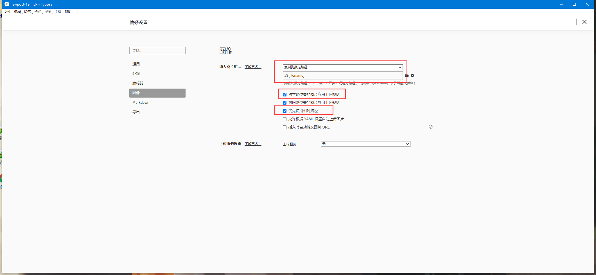
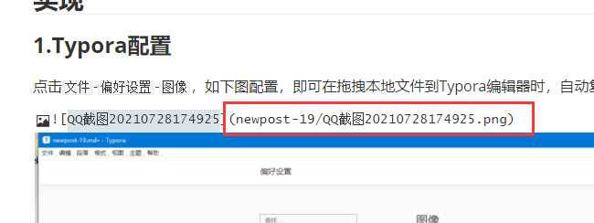

## 目标

1.使用Typora编写Hexo博客时，可以直接本地拖拽图片(或复制图片粘贴，后同不赘述)到Typora编辑器，并且能正常预览；

2.部署Hexo时图片也能正常显示；

3.图片放在hexo目录里，不依赖其他平台。

<!--more-->

## 实现

### 1.Typora配置

点击`文件`-`偏好设置`-`图像`，如下图配置，即可在拖拽本地文件到Typora编辑器时，自动复制图片到`文章.md`所在目录与文件同名目录下，请勾选`优先使用相对路径`，然后点击右上角`X`关闭`偏好设置`



此操作完成后，拖拽图片可以看到路径变成类似下图



### 2.Hexo配置

终端中切换到hexo目录，通过以下命令安装`hexo-image-link`

```sh
npm install hexo-image-link --save
```

打开`_config.yml`，配置`post_asset_folder`为`true`

```yml
post_asset_folder: true
```


参考[hexo-image-link](https://github.com/cocowool/hexo-image-link)
