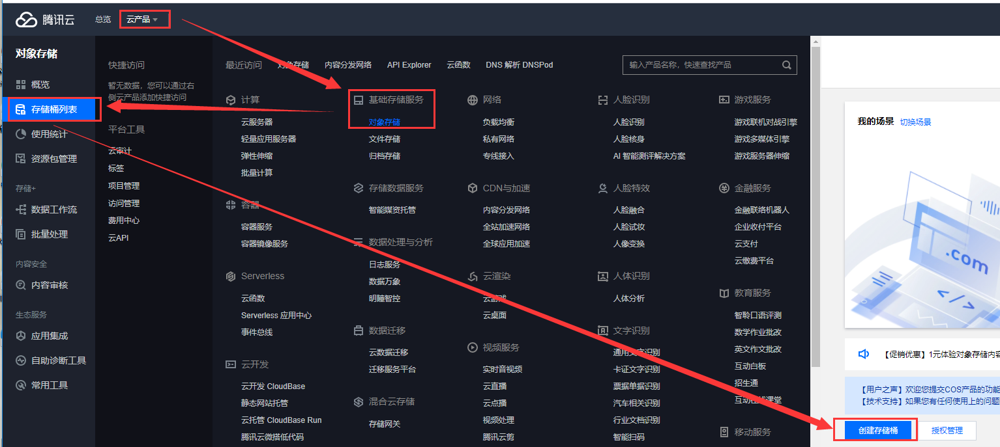
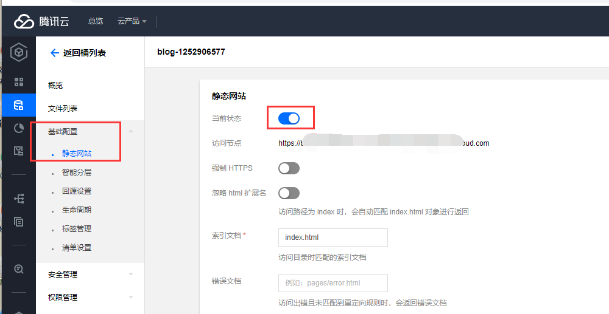
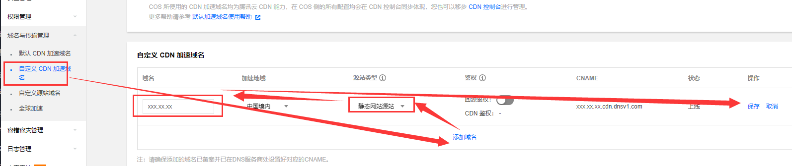
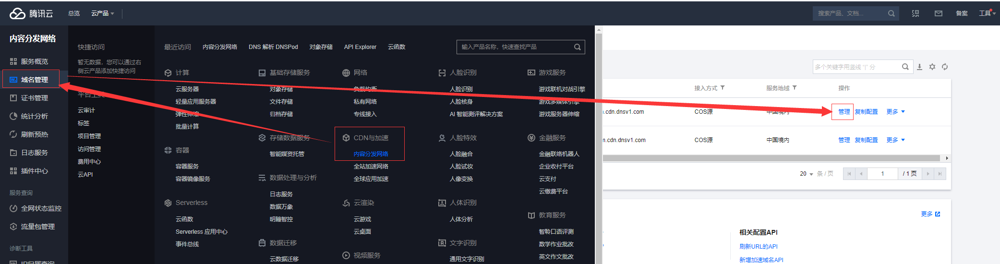
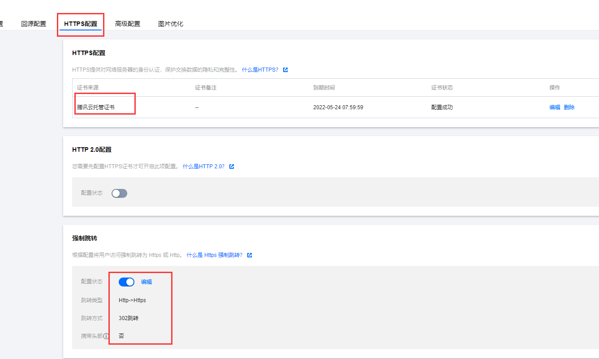
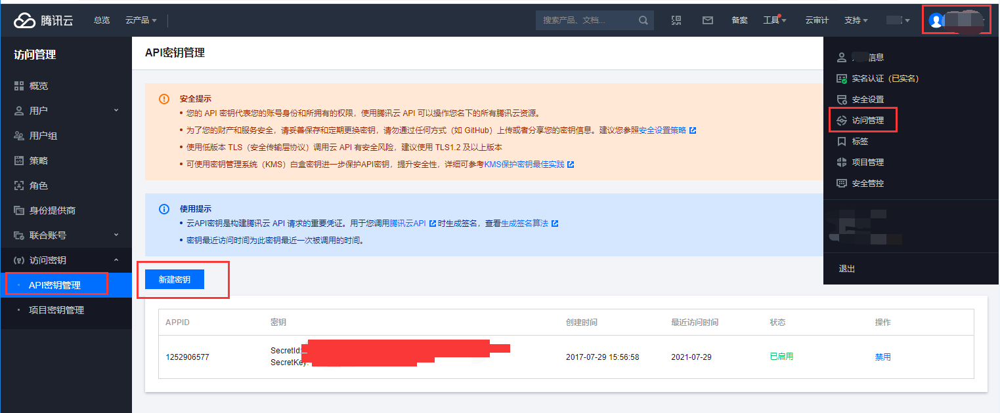
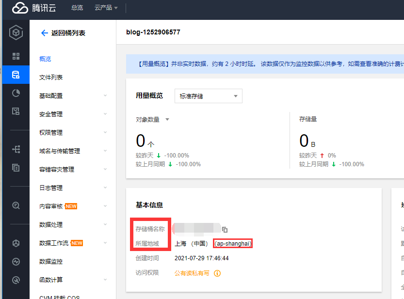

## 一、腾讯云操作

* 进入腾讯云控制台-云产品-基础存储服务-对象存储-存储桶列表-创建存储桶

<!--more-->



* 进入新建的存储桶-基础配置-静态网站-开启



* 自定义CDN加速域名，添加域名，并把自定义的域名解析到后边的CNAME



* 进入CDN与加速-内容分发网络-域名管理-找到刚刚的域名-管理



* 然后HTTPS配置-配置证书，按提示输入自有证书，或者申请腾讯云证书，推荐开启强制跳转



* 进入个人-访问管理-访问秘钥-API秘钥管理-新建秘钥，**注意，这个秘钥权限极高，务必妥善保管！**



至此，腾讯云相关配置全部完成，下一步需要用到的有：刚刚创建API秘钥SecretId与SecretKey，存储桶名称和所属地域、之前配置的域名（这三个不属于机密数据）。



## 二、Github操作

* 首先有个仓库用来存储静态网页数据，也可存储类似于hexo源码之类的通过actions自动部署(参考[Hexo + Github Actions 实现提交代码自动部署并通过FTP传到云服务器](https://blog.ctftools.com/2021/07/newpost-18/))，此步不详解。

* 进入仓库-Settings-Secrets-New secret，分别新建两条名为`TCLOUD_API_ID`和`TCLOUD_API_KEY`，值为上边获取到的API秘钥`SecretId`与`SecretKey`，存储在Secrets里的内容是很安全的，只有仓库所有者和协作者有权使用，但也仅限于使用，没有人可以查看其内容。


* 进入仓库Actions-new workflow


* set up a workflow yourself


* 编辑如下，将其中的`blog-1252906577`和`ap-shanghai`改为你自己的存储桶名称和地域，`https://blog.ctftools.com/`改为自己的域名，`./public/`该为自己需要上传的本地路径，如`./`，注意如果传根目录建议把`.git`加入忽略目录，例如`coscmd upload -rfs --delete ./ / --ignore "./.git/*"`

```yml
name: 静态网站持续集成

on: 
  push:
    branches:
      - master

jobs:
  build:
    runs-on: ubuntu-latest
        
    steps:
    - name: 检出仓库代码
      uses: actions/checkout@master

    - name: 安装腾讯云依赖
      run: |
        sudo pip install coscmd
        sudo pip install tccli

    - name: 配置腾讯云依赖
      env:
        SECRET_ID: ${{ secrets.TCLOUD_API_ID }}
        SECRET_KEY: ${{ secrets.TCLOUD_API_KEY }}
        BUCKET: blog-1252906577 #改为自己的存储桶名称
        REGION: ap-shanghai #改为自己的地域
      run: |
        coscmd config -a $SECRET_ID -s $SECRET_KEY -b $BUCKET -r $REGION
        tccli configure set secretId $SECRET_ID
        tccli configure set secretKey $SECRET_KEY
        tccli configure set region $REGION

    - name: 上传到腾讯云COS并刷新CDN
      run: |
        coscmd upload -rfs --delete ./public/ /
        tccli cdn PurgePathCache --cli-unfold-argument --Paths https://blog.ctftools.com/ --FlushType flush
```

上边的代码通过`tccli`刷新CDN，也可参考[这篇文章](https://www.ioiox.com/archives/69.html)通过`腾讯云SCF云函数`刷新CDN
