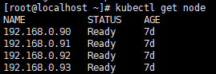

## 准备机器

准备机器，本次以虚拟机示范，实际应用中如果使用虚拟机，可以先创建一台，然后完成master和node都需要的配置之后，再克隆出多台。本次演示的机器ip分别为：master：192.168.0.89；node1：192.168.0.90；node2：192.168.0.91；node3：192.168.0.92；node4：192.168.0.93；

系统都是CentOS7，以root用户的登录

<!--more-->

## 所有机器配置

### 1.关闭防火墙服务和selinx，避免与docker容器的防火墙规则冲突

```sh
systemctl stop firewalld
systemctl disable firewalld
setenforce 0
```

### 2.安装epel-release源

```sh
yum -y install epel-release
```

## master机器配置

### 1.安装etcd和kubernetes-master

```sh
yum -y install etcd kubernetes-master
```

### 2.编辑etcd配置`/etc/etcd/etcd.conf`

```ini
ETCD_NAME=default
ETCD_DATA_DIR="/var/lib/etcd/default.etcd"
ETCD_LISTEN_CLIENT_URLS="http://0.0.0.0:2379"
ETCD_ADVERTISE_CLIENT_URLS="http://localhost:2379"
```

### 3.编辑kubernetes的apiserver配置`/etc/kubernetes/apiserver`

```ini
KUBE_API_ADDRESS="--insecure-bind-address=0.0.0.0"
KUBE_API_PORT="--port=8080"
KUBELET_PORT="--kubelet-port=10250"
KUBE_ETCD_SERVERS="--etcd-servers=http://127.0.0.1:2379"
KUBE_SERVICE_ADDRESSES="--service-cluster-ip-range=10.254.0.0/16"
KUBE_ADMISSION_CONTROL="--admission-control=NamespaceLifecycle,NamespaceExists,LimitRanger,SecurityContextDeny,ResourceQuota"
KUBE_API_ARGS=""
```

### 4.启动etcd、kube-apiserver、kube-controller-manager、kube-scheduler服务，并设置开机启动

```sh
for SERVICES in etcd kube-apiserver kube-controller-manager kube-scheduler; do systemctl restart $SERVICES;systemctl enable $SERVICES;systemctl status $SERVICES ; done
```

### 5.在etcd中定义flannel网络

```sh
etcdctl mk /atomic.io/network/config '{"Network":"172.17.0.0/16"}'
```

## 所有node机器配置

### 1.安装flannel和kubernetes-node

```sh
yum -y install flannel kubernetes-node
```

### 2.为flannel网络指定etcd服务，修改`/etc/sysconfig/flanneld`文件

```ini
FLANNEL_ETCD="http://192.168.0.89:2379"
FLANNEL_ETCD_KEY="/atomic.io/network"
```

* 其中`192.168.0.89`改为你真实master机器ip

### 3.修改`/etc/kubernetes/config`文件

```ini
KUBE_LOGTOSTDERR="--logtostderr=true"
KUBE_LOG_LEVEL="--v=0"
KUBE_ALLOW_PRIV="--allow-privileged=false"
KUBE_MASTER="--master=http://192.168.0.89:8080"
```

* 其中`192.168.0.89`改为你真实master机器ip

### 4.修改node配置文件`/etc/kubernetes/kubelet`

```ini
KUBELET_ADDRESS="--address=0.0.0.0"
KUBELET_PORT="--port=10250"
KUBELET_HOSTNAME="--hostname-override=192.168.0.80"
KUBELET_API_SERVER="--api-servers=http://192.168.0.89:8080" #指定Master节点的API Server
KUBELET_POD_INFRA_CONTAINER="--pod-infra-container-image=registry.access.redhat.com/rhel7/pod-infrastructure:latest"
KUBELET_ARGS=""
```

* 其中`192.168.0.89`改为你真实master机器ip
* 其中`192.168.0.80`改为当前node自己的ip

### 5.在所有Node节点上启动kube-proxy,kubelet,docker,flanneld服务，并设置开机启动

```sh
for SERVICES in kube-proxy kubelet docker flanneld;do systemctl restart $SERVICES;systemctl enable $SERVICES;systemctl status $SERVICES; done
```

## 验证集群是否成功

在master机器上执行`kubectl get node`，成功如下：




参考：[k8s入门系列之集群安装篇](https://www.cnblogs.com/xkops/p/6169034.html)，[CENTOS部署K8S](https://blog.csdn.net/weixin_40538774/article/details/104842345)
