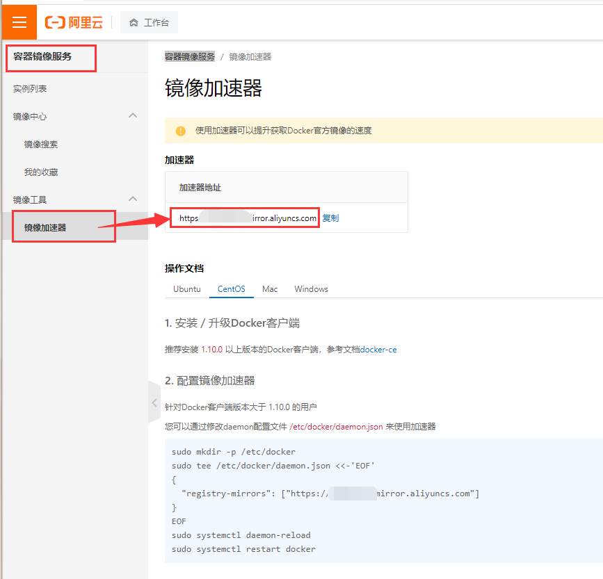
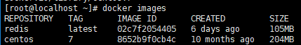
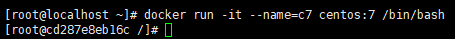
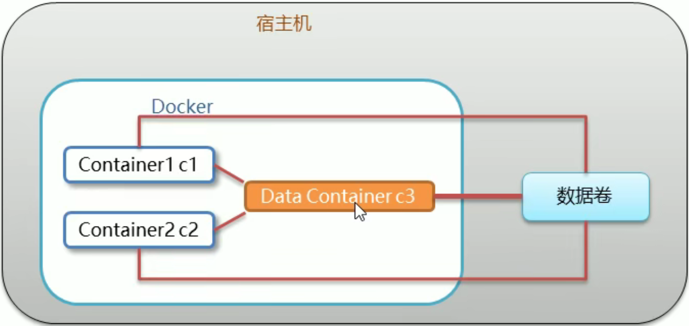

**基于centos7，root登录**

## 一、安装docker-ce并配置自启动

### 1.安装

```sh
yum install -y yum-utils device-mapper-persistent-data lvm2
yum-config-manager --add-repo https://download.docker.com/linux/centos/docker-ce.repo
yum -y install docker-ce docker-ce-cli containerd.io
```

<!--more-->

### 2.启动并设置开机自启

```sh
systemctl enable docker && systemctl start docker
```

### 3.查看docker版本

```
docker -v
```

### 4.配置镜像加速

```sh
sudo mkdir -p /etc/docker
sudo tee /etc/docker/daemon.json <<-'EOF'
{
  "registry-mirrors": ["https://xxxxx.mirror.aliyuncs.com"]
}
EOF
sudo systemctl daemon-reload
sudo systemctl restart docker
```

* 其中`https://xxxxx.mirror.aliyuncs.com`改为你自己的镜像地址，可通过阿里云-控制台-容器镜像服务-镜像工具-镜像加速器得到地址，如下图



## 二、常用命令

#### 1.服务相关命令

```sh
systemctl start docker # 启动
systemctl stop docker # 停止
systemctl restart docker # 重启
systemctl status docker # 状态
systemctl enable docker # 开机启动
```

#### 2.镜像相关命令



* 查看本地镜像`docker images`
  * REPOSITORY 仓库（镜像名称）
  * TAG 版本
  * IMAGE ID 镜像ID
  * CREATED 创建时间
  * SIZE 大小

* 搜索镜像，以redis为例`docker search redis`
* 下载镜像，以redis为例`docker pull redis`
  * 查找版本[dockerHub](https://hub.docker.com/)
  * 下载指定版本，以redis为例`docker pull redis:5.0`
* 删除镜像`docker rmi xxxx`
  * 通过名称加版本，以redis为例`docker rmi docker:latest`
  * 通过镜像id，`docker rmi 02c7f2054405`
  * 删除所有镜像**docker rmi \`docker images -q\`**

#### 3.容器相关命令



* 创建容器`docker run -it --name=c7 centos:7 /bin/bash`
  * `-i`表示一直运行
  * `-t`表示分配终端
  * `-d`后台运行`docker run -id --name=c72 centos:7`
  * `--name` 起名
  * `exit`退出容器
  * `-it`创建的一般称为交互式容器，`-id`为守护式容器

* 查看容器
  * 正在运行`docker ps`
  * 所有`docker ps -a`

* 进入容器`docker exec -it c72 /bin/bash`

* 启停删容器

  ```sh
  docker start c72 # 启动容器
  docker stop c72 # 停止容器
  docker rm c72 # 删除容器
  ```

* 查看容器信息`docker inspect c72`

## 三、数据卷

#### 概念

* 数据卷是宿主机中的一个目录或者文件
* 一个数据卷可被多个容器挂载，一个容器也可以挂载多个数据卷

#### 作用

* 容器数据持久化
* 数据交换

### 配置数据卷

* 创建时

  ```
  docker run ... -v 宿主机目录(文件):容器内目录(文件) ...
  ```

  * 目录必须是绝对路径
  * 目录不存在会自动创建
  * 可以挂载多个数据卷，多个`-v 宿主机目录(文件):容器内目录(文件)`

### 数据卷容器




# 未完待续


