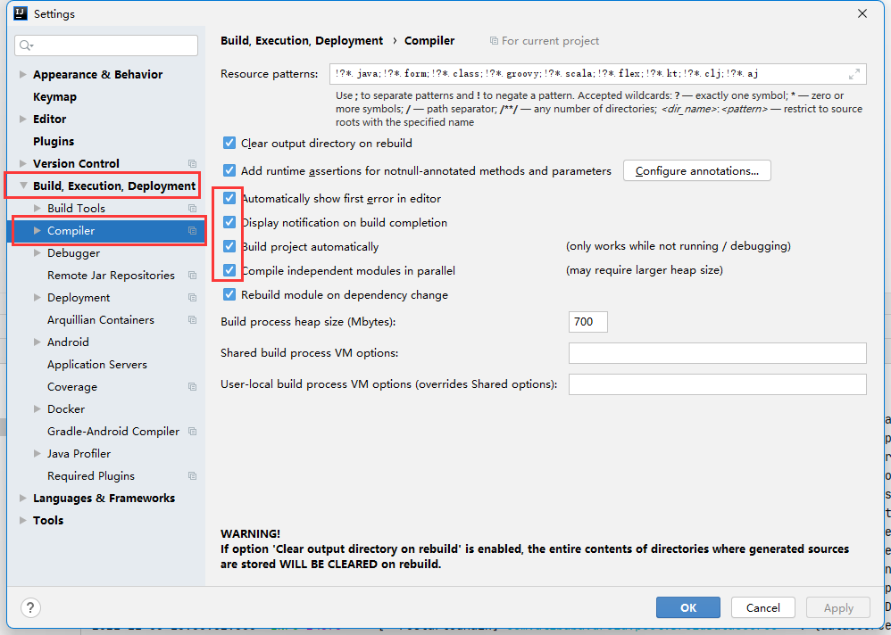
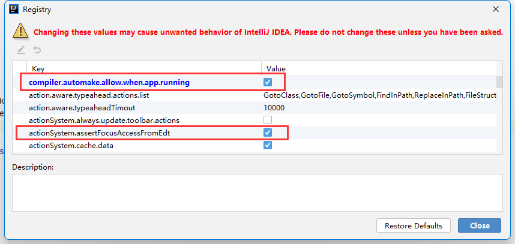

## 一、目标

在用idea开发spring项目过程中，修改代码自动热重启，无需手动操作。

<!--more-->

## 二、实现

### 1、添加依赖

在pom文件中添加以下依赖：

```xml
<dependency>
    <groupId>org.springframework.boot</groupId>
    <artifactId>spring-boot-devtools</artifactId>
    <scope>runtime</scope>
    <optional>true</optional>
</dependency>
```

### 2、开启maven插件

在pom文件中开启maven插件：

```xml
<build>
  <plugins>
    <plugin>
      <groupId>org.springframework.boot</groupId>
      <artifactId>spring-boot-maven-plugin</artifactId>
      <configuration>
        <fork>true</fork>
        <addResources>true</addResources>
      </configuration>
    </plugin>
  </plugins>
</build>
```

如果使用父工程，只需在父工程pom文件开启maven插件即可

### 3、idea配置

#### 1.如下4个全部打勾后保存



#### 2.更新值

按快捷键`Ctrl+Shift+Alt+/`，得到下图，选择第一个


找到下图中两个勾上



### 4、重启idea

### 5、多项目解决

如果有多个项目，可能热重启被占用，导致后起的项目热重启不生效，可以通过改默认端口解决，在配置文件`application.xml`中添加如下，其中端口默认是`35729`，只要改成和`35729`不一样，且不和别的项目重复就可以

```yml
spring:
  devtools:
    livereload:
      port: 35730
```
