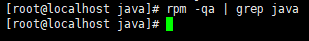
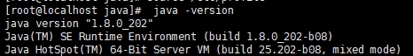

### 一、检查是否已安装

```shell
rpm -qa | grep java
```

<!--more-->

如果没有安装java不会有任何返回，如下图



### 二、下载JDK并解压

可以使用华为的镜像

`https://repo.huaweicloud.com/java/jdk/`

```shell
mkdir /usr/local/java
cd /usr/local/java
wget https://repo.huaweicloud.com/java/jdk/8u202-b08/jdk-8u202-linux-x64.tar.gz
tar -zxvf jdk-8u202-linux-x64.tar.gz
```

### 三、配置环境变量

```shell
vi /etc/profile
```

在末尾添加以下后保存

```ini
export JAVA_HOME=/usr/local/java/jdk1.8.0_202
export CLASSPATH=.:$JAVA_HOME/jre/lib/rt.jar:$JAVA_HOME/lib/dt.jar:$JAVA_HOME/lib/tools.jar
export PATH=$PATH:$JAVA_HOME/bin
```

刷新配置文件

```shell
source /etc/profile
```

检查是否成功

```
 java -version
```


