本文基于B站视频教程[2022最新黑马程序员大数据Hadoop入门视频教程，最适合零基础自学的大数据Hadoop教程](https://www.bilibili.com/video/BV1CU4y1N7Sh)，p19-p50，本文软件版本，行文顺序等可能与视频略有不同

<!--more-->

所需安装包等可以关注【黑马程序员】公众号，回复【hadoop】获取

# 一、开始前准备(机器与环境)

## 机器

本机（windows）用来操作，加上三台机器（CentOS7 x64，都要开启SSH）用来搭建集群，分别取名node1、node2、node3，并配置hosts方便连接

本机（windows）打开**C:\Windows\System32\drivers\etc\hosts**文件，并追加以下内容，其中IP地址改为你自己的三台机器，可以不改，但是改了后操作更方便

```ini
###hadoop###
192.168.0.46 node1 node1.ifnxs.cn
192.168.0.49 node2 node2.ifnxs.cn
192.168.0.48 node3 node3.ifnxs.cn
###hadoop-end###
```

## 环境

### 三台机器共同操作：

#### 1. 安装**vim**、**ntpdate**

```shell
yum -y install vim
yum -y install ntpdate
```

#### 2. 关闭防火墙（生产环境请不要这样）

```shell
systemctl stop firewalld.service
systemctl disable firewalld.service
```

#### 3. 配置本机名

```shell
vim /etc/hostname
```

分别改为【node1.ifnxs.cn】、【node2.ifnxs.cn】、【node3.ifnxs.cn】

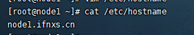

**配置完建议每台机器都重启一下，不然后面会遇到一个坑**

#### 4. 修改hosts

```shell
vim /etc/hosts
```

追加以下内容，其中IP地址改为你自己的三台机器

```ini
192.168.0.46 node1 node1.ifnxs.cn
192.168.0.49 node2 node2.ifnxs.cn
192.168.0.48 node3 node3.ifnxs.cn
```

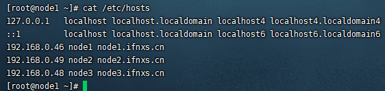

#### 5. 同步时间

```shell
ntpdate ntp5.aliyun.com
```

#### 6. 创建统一工作目录

```shell
mkdir -p /export/data # 数据
mkdir -p /export/server # 服务
mkdir -p /export/software # 软件
```

#### 7. node1->node1/node2/node3免密登录

```shell
ssh-keygen # 四个回车
ssh-copy-id node1 # yes 密码
ssh-copy-id node2 # yes 密码
ssh-copy-id node3 # yes 密码
```

#### 8. 安装JDK1.8

##### 8.1 下载jdk-8u311-linux-x64

官方下载链接(需要注册，可能网速慢)：

[https://www.oracle.com/java/technologies/downloads/](https://www.oracle.com/java/technologies/downloads/)

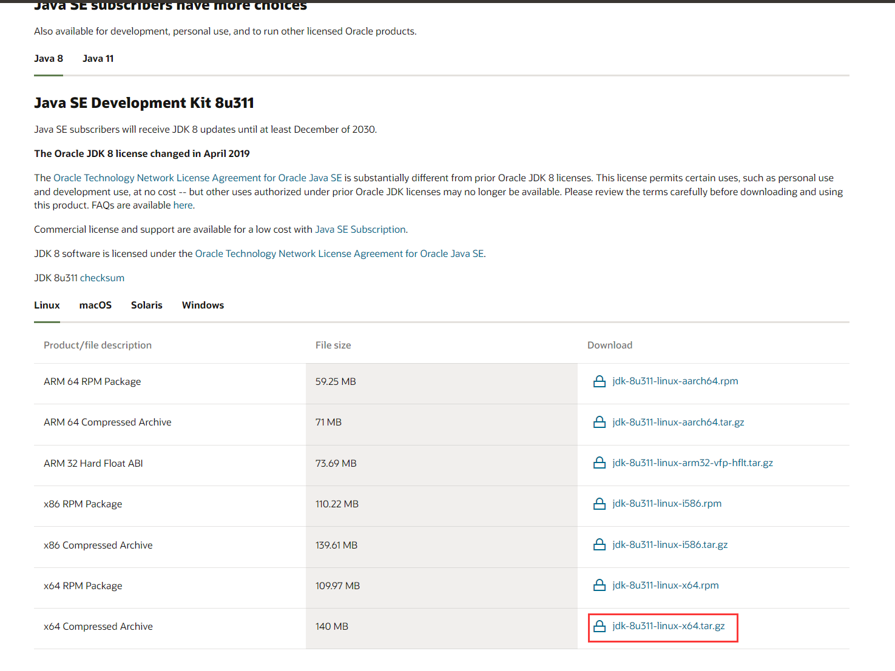

百度网盘：

链接：[https://pan.baidu.com/s/176N837BQXyUoIt7HvF0c0A](https://pan.baidu.com/s/176N837BQXyUoIt7HvF0c0A)
提取码：0ld6

##### 8.2 安装

上传安装包到**/export/server/**，然后解压

```shell
cd /export/server/
tar -zxvf jdk-8u311-linux-x64.tar.gz
```

编辑环境变量

```shell
vim /etc/profile
```

结尾追加

```sh
export JAVA_HOME=/export/server/jdk1.8.0_311
export PATH=$PATH:$JAVA_HOME/bin
export CALSSPATH=.:$JAVA_HOME/lib/dt.jar:$JAVA_HOME/lib/tools.jar
```

拷贝到另外两台机器

```shell
scp -r /export/server/jdk1.8.0_311/ root@node2:/export/server/
scp /etc/profile root@node2:/etc/
scp -r /export/server/jdk1.8.0_311/ root@node3:/export/server/
scp /etc/profile root@node3:/etc/
```

使生效

```shell
source /etc/profile
```

# 二、开始

## (一)、安装配置

### 1. 安装hadoop

复制安装包(本文用的是视频里的安装包)到node1的/export/server/目录下，解压并删除压缩包

```shell
tar -zxvf hadoop-3.3.0-Centos7-64-with-snappy.tar.gz
rm -f hadoop-3.3.0-Centos7-64-with-snappy.tar.gz
```

### 2. 修改配置文件

配置文件操作都在这个目录下

```shell
cd /export/server/hadoop-3.3.0/etc/hadoop/
```

#### 2.1 第1类

##### hadoop-env.sh

```shell
vim hadoop-env.sh
```

在文件结尾追加以下并保存

```sh
export JAVA_HOME=/export/server/jdk1.8.0_311
export HDFS_NAMENODE_USER=root
export HDFS_DATANODE_USER=root
export HDFS_SECONDARYNAMENODE_USER=root
export YARN_RESOURCEMANAGER_USER=root
export YARN_NODEMANAGER_USER=root 
```

#### 2.2 第2类

##### core-site.xml

```shell
vim core-site.xml
```

在**configuration**标签中间添加以下

```xml
<!-- 设置默认使用的文件系统 Hadoop支持file、HDFS、GFS、ali|Amazon云等文件系统 -->
<property>
    <name>fs.defaultFS</name>
    <value>hdfs://node1:8020</value>
</property>

<!-- 设置Hadoop本地保存数据路径 -->
<property>
    <name>hadoop.tmp.dir</name>
    <value>/export/data/hadoop-3.3.0</value>
</property>

<!-- 设置HDFS web UI用户身份 -->
<property>
    <name>hadoop.http.staticuser.user</name>
    <value>root</value>
</property>

<!-- 整合hive 用户代理设置 -->
<property>
    <name>hadoop.proxyuser.root.hosts</name>
    <value>*</value>
</property>

<property>
    <name>hadoop.proxyuser.root.groups</name>
    <value>*</value>
</property>

<!-- 文件系统垃圾桶保存时间 -->
<property>
    <name>fs.trash.interval</name>
    <value>1440</value>
</property>
```

##### hdfs-site.xml

```shell
vim hdfs-site.xml
```

在**configuration**标签中间添加以下

```xml
<!-- 设置SNN进程运行机器位置信息 -->
<property>
    <name>dfs.namenode.secondary.http-address</name>
    <value>node2:9868</value>
</property>
```

##### mapred-site.xml

```shell
vim mapred-site.xml
```

在**configuration**标签中间添加以下

```xml
<!-- 设置MR程序默认运行模式： yarn集群模式 local本地模式 -->
<property>
  <name>mapreduce.framework.name</name>
  <value>yarn</value>
</property>

<!-- MR程序历史服务地址 -->
<property>
  <name>mapreduce.jobhistory.address</name>
  <value>node1:10020</value>
</property>
 
<!-- MR程序历史服务器web端地址 -->
<property>
  <name>mapreduce.jobhistory.webapp.address</name>
  <value>node1:19888</value>
</property>

<property>
  <name>yarn.app.mapreduce.am.env</name>
  <value>HADOOP_MAPRED_HOME=${HADOOP_HOME}</value>
</property>

<property>
  <name>mapreduce.map.env</name>
  <value>HADOOP_MAPRED_HOME=${HADOOP_HOME}</value>
</property>

<property>
  <name>mapreduce.reduce.env</name>
  <value>HADOOP_MAPRED_HOME=${HADOOP_HOME}</value>
</property>
```

##### yarn-site.xml

```shell
vim yarn-site.xml
```

在**configuration**标签中间添加以下

```xml
<!-- 设置YARN集群主角色运行机器位置 -->
<property>
	<name>yarn.resourcemanager.hostname</name>
	<value>node1</value>
</property>

<property>
    <name>yarn.nodemanager.aux-services</name>
    <value>mapreduce_shuffle</value>
</property>

<!-- 是否将对容器实施物理内存限制 -->
<property>
    <name>yarn.nodemanager.pmem-check-enabled</name>
    <value>false</value>
</property>

<!-- 是否将对容器实施虚拟内存限制。 -->
<property>
    <name>yarn.nodemanager.vmem-check-enabled</name>
    <value>false</value>
</property>

<!-- 开启日志聚集 -->
<property>
  <name>yarn.log-aggregation-enable</name>
  <value>true</value>
</property>

<!-- 设置yarn历史服务器地址 -->
<property>
    <name>yarn.log.server.url</name>
    <value>http://node1:19888/jobhistory/logs</value>
</property>

<!-- 历史日志保存的时间 7天 -->
<property>
  <name>yarn.log-aggregation.retain-seconds</name>
  <value>604800</value>
</property>
```

#### 2.3 第3类

##### workers

```shell
vim workers
```

删除原有，添加以下

```
node1.ifnxs.cn
node2.ifnxs.cn
node3.ifnxs.cn
```

### 3. 修改环境变量

```shell
vim /etc/profile
```

结尾追加以下

```shell
export HADOOP_HOME=/export/server/hadoop-3.3.0
export PATH=$PATH:$HADOOP_HOME/bin:$HADOOP_HOME/sbin
```

### 4. 同步到另外两台机器

```shell
cd /export/server
scp -r hadoop-3.3.0 root@node2:$PWD
scp -r hadoop-3.3.0 root@node3:$PWD
scp /etc/profile root@node2:/etc/
scp /etc/profile root@node3:/etc/
```

最后在所有机器执行

```shell
source /etc/profile
```

### 5. 集群启动(node1执行)

#### 5.1 （==首次启动==）格式化namenode

```sh
hdfs namenode -format
```

#### 5.2 脚本一键启动

```shell
start-dfs.sh
start-yarn.sh
```

日志目录**/export/server/hadoop-3.3.0/logs/**

启动成功后

* node1

  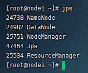

* node2

  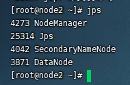

* node3

  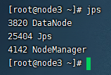

Web  UI页面

- HDFS集群：http://node1:9870/
- YARN集群：http://node1:8088/

这里我遇到了一个坑，应该是配置本机名那一步，配置完没有重启导致的

##### 坑：

**Overview**显示【Live Nodes】有3个，点进去只能看到一个

经过确认，三台机器的【Cluster ID】一样，可能【Cluster ID】是通过主机名生成的，如果是通过一台虚拟机克隆多台也可能遇到这样的坑，解决方法都是一样的

##### 解决：

###### 1、停止服务（node1）

```sh
stop-dfs.sh
stop-yarn.sh
```

###### 2、确认三个主机名不一样（三台）

```sh
cat /etc/hostname
```

###### 3、删除data（三台）

```sh
rm -rf /export/data/hadoop-3.3.0/
```

###### 4、重启机器（三台）

```sh
reboot
```

###### 5、初始化（node1）

```sh
hdfs namenode -format
```

###### 6、启动（node1）

```sh
start-dfs.sh
start-yarn.sh
```

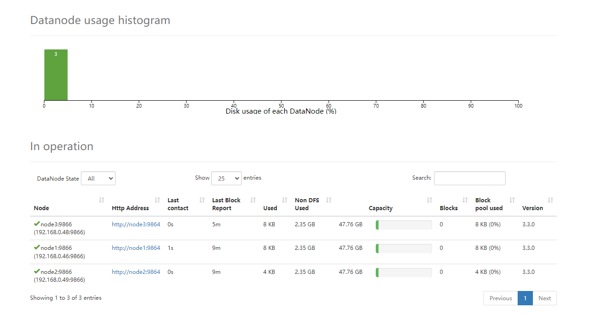

## (二)、使用

### MapReduce体验

计算圆周率

```sh
cd /export/server/hadoop-3.3.0/share/hadoop/mapreduce/
hadoop jar hadoop-mapreduce-examples-3.3.0.jar pi 2 2
```

### HDFS常用命令

#### 1. 创建文件夹

**hadoop fs -mkdir [-p] &#60;path&#62;  ... **

path 为待创建的目录

-p选项的行为与Unix mkdir -p非常相似，它会沿着路径创建父目录

```sh
hadoop fs -mkdir /ifnxs
```

#### 2. 查看指定目录下内容

**hadoop fs -ls [-h] [-R] [&#60;path&#62; ...]**

path 指定目录路径

-h 人性化显示文件size

-R 递归查看指定目录及其子目录

```sh
hadoop fs -ls -h /
```

#### 3. 上传文件到HDFS指定目录下

**hadoop fs -put [-f] [-p]  &#60;localsrc&#62; ... &#60;dst&#62;**

-f 覆盖目标文件（已存在下）

-p 保留访问和修改时间，所有权和权限

localsrc 本地文件系统（客户端所在机器）

dst 目标文件系统（HDFS）

```sh
echo 1 > 1.txt
hadoop fs -put 1.txt /ifnxs
```

#### 4. 查看HDFS文件内容

**hadoop fs -cat  &#60;src&#62;  ...**

读取指定文件全部内容，显示在标准输出控制台

注意：对于大文件内容读取，慎重

```sh
hadoop fs -cat /ifnxs/1.txt
```

#### 5. 下载HDFS文件

**hadoop fs -get [-f] [-p]   &#60;src&#62; ... &#60;localdst&#62;**

下载文件到本地文件系统指定目录，localdst必须是目录

-f 覆盖目标文件（已存在下）

-p 保留访问和修改时间，所有权和权限

```sh
hadoop fs -get /ifnxs/1.txt ./2.txt
```

#### 6. 拷贝HDFS文件

**hadoop fs -cp [-f] &#60;src&#62; ... &#60;dst&#62; **

-f 覆盖目标文件（已存在下）

```sh
hadoop fs -cp /ifnxs/1.txt /ifnxs/3.txt
```

#### 7. 追加数据到HDFS文件中

**hadoop fs -appendToFile  &#60;localsrc&#62; ... &#60;dst&#62;**

将所有给定本地文件的内容追加到给定dst文件

dst如果文件不存在，将创建该文件

如果&#60;localSrc&#62;为-，则输入为从标准输入中读取

```sh
hadoop fs -appendToFile 1.txt 2.txt /ifnxs/1.txt
```

#### 8. HDFS数据移动操作

**hadoop fs -mv &#60;src&#62; ... &#60;dst&#62; **

移动文件到指定文件夹下

可以使用该命令移动数据，重命名文件的名称

```sh
hadoop fs -mv /ifnxs/1.txt /ifnxs/333.txt
```

[其他命令](https://hadoop.apache.org/docs/r3.3.0/hadoop-project-dist/hadoop-common/FileSystemShell.html)

### HDFS

#### 官方架构图

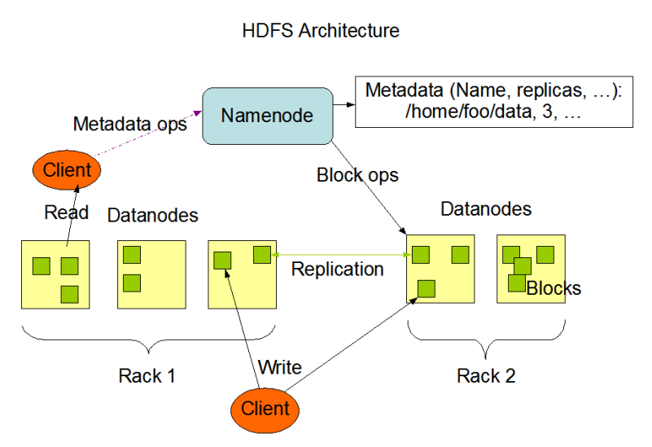

#### namenode职责

* NameNode仅**存储HDFS的元数据**：文件系统中所有文件的目录树，并跟踪整个集群中的文件，不存储实际数据。

* NameNode知道HDFS中任何**给定文件的块列表及其位置**。使用此信息NameNode知道如何从块中构建文件。

* NameNode**不持久化存储每个文件中各个块所在的datanode的位置信息**，这些信息会在系统启动时从DataNode 重建。

* NameNode是Hadoop集群中的**单点故障**。

* NameNode所在机器通常会配置有**大量内存**（RAM）。

#### datanode职责

* DataNode负责**最终数据块block的存储**。是集群的**从角色**，也称为Slave。

* DataNode启动时，会将自己**注册**到NameNode并**汇报**自己负责持有的块列表。

* 当某个DataNode关闭时，不会影响数据的可用性。 NameNode将安排由其他DataNode管理的块进行副本复制 。

* DataNode所在机器通常配置有大量的**硬盘**空间，因为实际数据存储在DataNode中。

#### Pipeline管道

数据以管道的方式，顺序的沿着一个方向传输，这样能够**充分利用**每个机器的**带宽**，避免网络瓶颈和高延迟时的连接，最小化推送所有数据的延时。

#### ACK应答响应

在HDFS pipeline管道传输数据的过程中，传输的反方向会进行ACK校验，确保数据传输安全。

#### 默认3副本存储策略

默认副本存储策略是由`BlockPlacementPolicyDefault`指定

* 第一块副本：优先客户端本地，否则随机

* 第二块副本：不同于第一块副本的不同机架

* 第三块副本：第二块副本相同机架不同机器

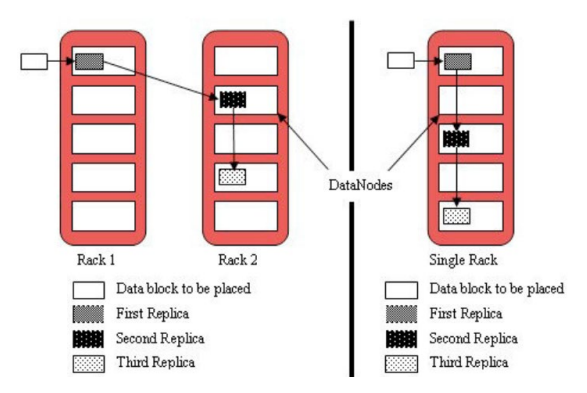

#### 写

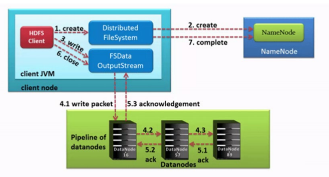

#### 读

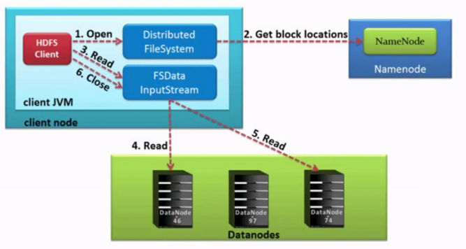

### MapReduce

#### 思想

**先分再合，分而治之**

**不可拆分的计算任务或相互间有依赖关系的数据无法进行并行计算**

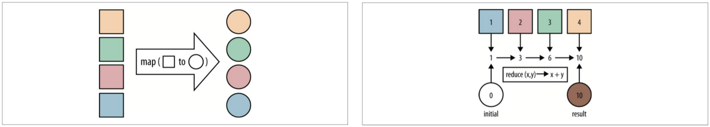

#### 示例

```sh
cd /export/server/hadoop-3.3.0/share/hadoop/mapreduce/
hadoop jar hadoop-mapreduce-examples-3.3.0.jar pi 10 50
hadoop jar hadoop-mapreduce-examples-3.3.0.jar wordcount /input /output
```

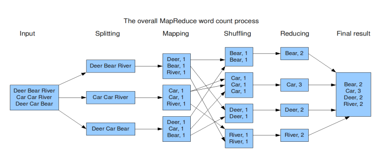

#### MapReduce整体执行流程图

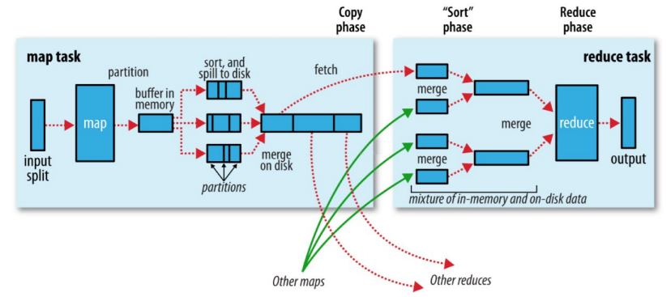

#### Map阶段执行流程

1. **逻辑切片**，默认Split size = Block size（128M）
2. 对切片中的数据按照一定的规则读取解析返回[key,value]对。默认是**按行读取数据**。key是每一行的起始位置偏移量，value是本行的文本内容
3. 调用Mapper类中的**map方法处理数据**
4. 按照一定的规则对Map输出的键值对进行**分区partition**。默认不分区，因为只有一个reducetask。分区的数量就是reducetask运行的数量
5. Map输出数据写入**内存缓冲区**，达到比例溢出到磁盘上。**溢出spill**的时候根据key进行**排序sort**。默认根据key字典序排序
6. 对所有溢出文件进行最终的**merge合并**，成为一个文件

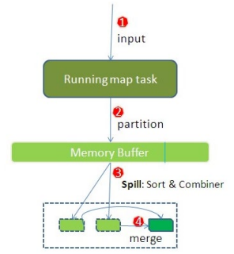

#### Reduce阶段执行过程

1. ReduceTask会**主动**从MapTask复制拉取属于需要自己处理的数据

2. 把拉取来数据，全部进行**合并merge**，即把分散的数据合并成一个大的数据。再对合并后的数据排序

3. 对排序后的键值对**调用reduce方法**。**键相等**的键值对调用一次reduce方法。最后把这些输出的键值对 写入到HDFS文件中


#### shuffle概念

将map端的无规则输出按指定的规则“打乱”成具有**一定规则**的数据，以便reduce端接收处理

一般把从Map产生输出开始到Reduce取得数据作为输入之前的过程称作shuffle

**Shuffle是MapReduce程序的核心与精髓，也是慢的原因**

### YARN

YARN是一个通用**资源管理系统**和**调度平台**

#### 架构图


#### 三大组件

##### ResourceManager（RM）

YARN集群中的主角色，决定系统中所有应用程序之间资源分配的**最终权限，即最终仲裁者**。接收用户的作业提交，并通过NM分配、管理各个机器上的计算资源。

##### NodeManager（NM）

YARN中的从角色，一台机器上一个，负责**管理本机器上的计算资源**。根据RM命令，启动Container容器、监视容器的资源使用情况。并且向RM主角色汇报资源使用情况。

##### ApplicationMaster（AM）

用户提交的每个应用程序均包含一个AM。**应用程序内的“老大”**，负责程序内部各阶段的资源申请，监督程序的执行情况。

#### 交互流程

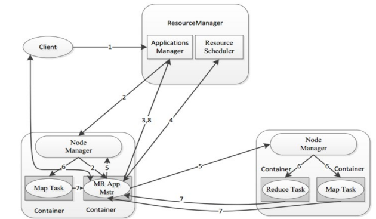

1. 用户通过客户端向YARN中ResourceManager提交应用程序（比如hadoop jar提交MR程序）；
2. ResourceManager为该应用程序分配第一个Container（容器），并与对应的NodeManager通信，要求 它在这个Container中启动这个应用程序的ApplicationMaster；
3. ApplicationMaster启动成功之后，首先向ResourceManager注册并保持通信，这样用户可以直接通过 ResourceManager查看应用程序的运行状态（处理了百分之几）；
4. AM为本次程序内部的各个Task任务向RM申请资源，并监控它的运行状态；
5. 一旦 ApplicationMaster 申请到资源后，便与对应的 NodeManager 通信，要求它启动任务；
6. NodeManager 为任务设置好运行环境后，将任务启动命令写到一个脚本中，并通过运行该脚本启动任务；
7. 各个任务通过某个 RPC 协议向 ApplicationMaster 汇报自己的状态和进度，以让ApplicationMaster 随 时掌握各个任务的运行状态，从而可以在任务失败时重新启动任务。在应用程序运行过程中，用户可随时通过 RPC 向 ApplicationMaster 查询应用程序的当前运行状态；
8. 应用程序运行完成后，ApplicationMaster 向 ResourceManager 注销并关闭自己。

#### 调度器策略

##### FIFO Scheduler 先进先出调度器

FIFO Scheduler是一个先进先出的思想，即先提交的应用先运行。

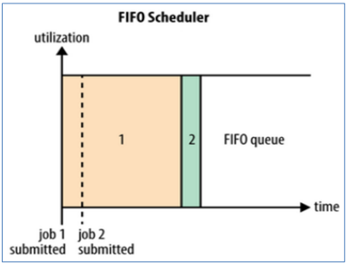

##### Capacity Scheduler 容量调度器

Capacity Scheduler容量调度是**Apache Hadoop3.x默认调度策略**。该策略允许**多个组织共享整个集群资源**，每个组织可以获得集群的一部分计算能力。通过为每个组织分配专门的队列，然后再为每个队列分配一定的集群资源，这样整个集群就可以通过设置多个队列的方式给多个组织提供服务了。

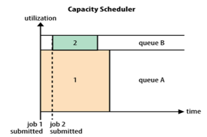

* 层次化的队列设计

  层次化的管理，可以更容易、更合理分配和限制资源的使用

* 容量保证

  每个队列上都可以设置一个资源的占比，保证每个队列都不会占用整个集群的资源

* 安全

  每个队列有严格的访问控制。用户只能向自己的队列里面提交任务，而且不能修改或者访问其他队列的任务

* 弹性分配

  空闲的资源可以被分配给任何队列。当多个队列出现争用的时候，则会按照权重比例进行平衡

##### Fair Scheduler 公平调度器

使所有应用在平均情况下随着时间的流逝可以获得相等的资源份额。

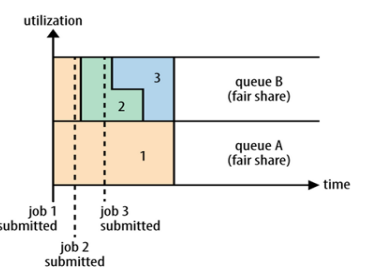

* **分层队列**

  队列可以按层次结构排列以划分资源，并可以配置权重以按特定比例共享集群。

* 基于用户或组的队列映射

  可以根据提交任务的用户名或组来分配队列。如果任务指定了一个队列,则在该队列中提交任务

* **资源抢占**

  根据应用的配置，抢占和分配资源可以是友好的或是强制的。默认不启用资源抢占

* 保证最小配额

  可以设置队列最小资源，允许将保证的最小份额分配给队列，保证用户可以启动任务。当队列不能满足最小资源时,可以从其它队列抢占。当队列资源使用不完时,可以给其它队列使用。这对于确保某些用户、组或生产应用始终获得足够的资源

* **允许资源共享**

  即当一个应用运行时,如果其它队列没有任务执行,则可以使用其它队列,当其它队列有应用需要资源时再将占用的队列释放出来。所有的应用都从资源队列中分配资源

* 默认不限制每个队列和用户可以同时运行应用的数量

  可以配置来限制队列和用户并行执行的应用数量。限制并行执行应用数量不会导致任务提交失败,超出的应用会在队列中等待

