本文基于B站视频教程[2022最新黑马程序员大数据Hadoop入门视频教程，最适合零基础自学的大数据Hadoop教程](https://www.bilibili.com/video/BV1CU4y1N7Sh)，p51-p83，本文软件版本，行文顺序等可能与视频略有不同

<!--more-->

所需安装包等可以关注【黑马程序员】公众号，回复【hadoop】获取

# 一. Hive理解

* Hive能将数据文件映射成为一张表
  * 映射指文件和表之间的对应关系

* 功能职责
  * SQL语法解析编译成MapReduce

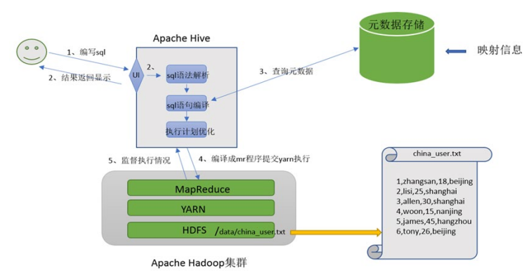

## 架构图

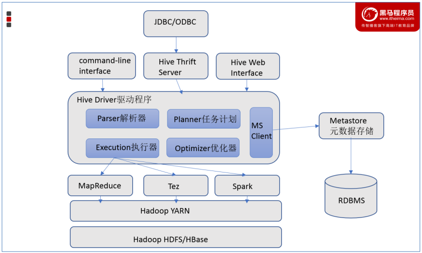

# 二、 安装

## 1.安装MySQL

### 1.1 卸载mariadb

卸载Centos7自带的mariadb，先查找已经安装的mariadb

```sh
rpm -qa|grep mariadb
```

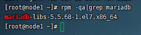

卸载

```sh
rpm -e mariadb-libs-5.5.68-1.el7.x86_64 --nodeps
```

### 1.2 安装MySQL

```sh
mkdir /export/software/mysql
#上传mysql-5.7.29-1.el7.x86_64.rpm-bundle.tar 到上述文件夹下  解压
cd /export/software/mysql
tar xvf mysql-5.7.29-1.el7.x86_64.rpm-bundle.tar
yum -y install libaio
yum -y install net-tools
rpm -ivh mysql-community-common-5.7.29-1.el7.x86_64.rpm mysql-community-libs-5.7.29-1.el7.x86_64.rpm mysql-community-client-5.7.29-1.el7.x86_64.rpm mysql-community-server-5.7.29-1.el7.x86_64.rpm
```

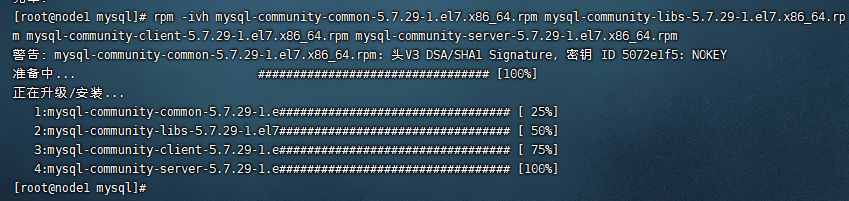

### 1.3 MySQL初始化设置

```sh
#初始化
mysqld --initialize

#更改所属组
chown mysql:mysql /var/lib/mysql -R

#启动mysql
systemctl start mysqld.service

#查看生成的临时root密码
cat  /var/log/mysqld.log
# [Note] A temporary password is generated for root@localhost: !?cp.!nG,8e/
```

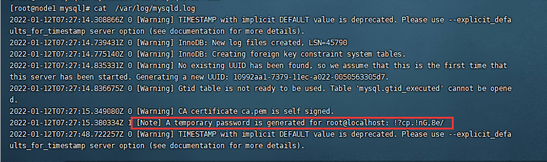

### 1.4 准备使用

修改root密码 授权远程访问 设置开机自启动

```sh
mysql -u root -p
```

然后输入上边生成的密码，回车，通过下边的命令修改root密码为`hadoop`

```sql
alter user user() identified by "hadoop";
```

授权

```sql
use mysql;
GRANT ALL PRIVILEGES ON *.* TO 'root'@'%' IDENTIFIED BY 'hadoop' WITH GRANT OPTION;
FLUSH PRIVILEGES;
```

`Ctrl`+`D`退出MySQL命令界面。

MySQL启、停、状态命令

```sh
systemctl stop mysqld
systemctl status mysqld
systemctl start mysqld
```

设置开机启动

```sh
systemctl enable mysqld
```

### 1.5 干净卸载

CentOS7 干净卸载MySQL 5.7

```shell
#关闭mysql服务
systemctl stop mysqld.service

#查找安装mysql的rpm包
[root@node3 ~]# rpm -qa | grep -i mysql    
mysql-community-libs-5.7.29-1.el7.x86_64
mysql-community-common-5.7.29-1.el7.x86_64
mysql-community-client-5.7.29-1.el7.x86_64
mysql-community-server-5.7.29-1.el7.x86_64

#卸载
[root@node3 ~]# yum remove mysql-community-libs-5.7.29-1.el7.x86_64 mysql-community-common-5.7.29-1.el7.x86_64 mysql-community-client-5.7.29-1.el7.x86_64 mysql-community-server-5.7.29-1.el7.x86_64

#查看是否卸载干净
rpm -qa | grep -i mysql

#查找mysql相关目录 删除
[root@node1 ~]# find / -name mysql
/var/lib/mysql
/var/lib/mysql/mysql
/usr/share/mysql

[root@node1 ~]# rm -rf /var/lib/mysql
[root@node1 ~]# rm -rf /var/lib/mysql/mysql
[root@node1 ~]# rm -rf /usr/share/mysql

#删除默认配置 日志
rm -rf /etc/my.cnf
rm -rf /var/log/mysqld.log
```

## 2. 安装Hive

### 2.1 上传安装包

上传Hive安装包到【/export/server/】目录下，然后解压

```sh
cd /export/server/
tar zxvf apache-hive-3.1.2-bin.tar.gz
```

解决Hive与Hadoop之间guava版本差异

```sh
cd /export/server/apache-hive-3.1.2-bin/
rm -f lib/guava-19.0.jar
cp /export/server/hadoop-3.3.0/share/hadoop/common/lib/guava-27.0-jre.jar ./lib/
```

### 2.2 修改配置文件

* hive-env.sh

  ```sh
  cd /export/server/apache-hive-3.1.2-bin/conf
  mv hive-env.sh.template hive-env.sh
  vim hive-env.sh
  ```

  结尾追加

  ```sh
  export HADOOP_HOME=/export/server/hadoop-3.3.0
  export HIVE_CONF_DIR=/export/server/apache-hive-3.1.2-bin/conf
  export HIVE_AUX_JARS_PATH=/export/server/apache-hive-3.1.2-bin/lib
  ```

* hive-site.xml

  直接vim打开新文件

  ```sh
  vim hive-site.xml
  ```

  编辑如下

<details>
<summary>点击展开配置内容</summary>
  ```xml
  <configuration>
  <!-- 存储元数据mysql相关配置 -->
  <property>
  	<name>javax.jdo.option.ConnectionURL</name>
  	<value>jdbc:mysql://node1:3306/hive3?createDatabaseIfNotExist=true&amp;useSSL=false&amp;useUnicode=true&amp;characterEncoding=UTF-8</value>
  </property>
  
  <property>
  	<name>javax.jdo.option.ConnectionDriverName</name>
  	<value>com.mysql.jdbc.Driver</value>
  </property>
  
  <property>
  	<name>javax.jdo.option.ConnectionUserName</name>
  	<value>root</value>
  </property>
  
  <property>
  	<name>javax.jdo.option.ConnectionPassword</name>
  	<value>hadoop</value>
  </property>
  
  <!-- H2S运行绑定host -->
  <property>
      <name>hive.server2.thrift.bind.host</name>
      <value>node1</value>
  </property>
  
  <!-- 远程模式部署metastore metastore地址 -->
  <property>
      <name>hive.metastore.uris</name>
      <value>thrift://node1:9083</value>
  </property>
  
  <!-- 关闭元数据存储授权  --> 
  <property>
      <name>hive.metastore.event.db.notification.api.auth</name>
      <value>false</value>
  </property>
  </configuration>
  ```
</details>

### 2.3 上传驱动

上传MySQL jdbc驱动到Hive安装包lib下


### 2.4 初始化元数据

```sh
cd /export/server/apache-hive-3.1.2-bin/
bin/schematool -initSchema -dbType mysql -verbos
#初始化成功会在mysql中创建74张表
```

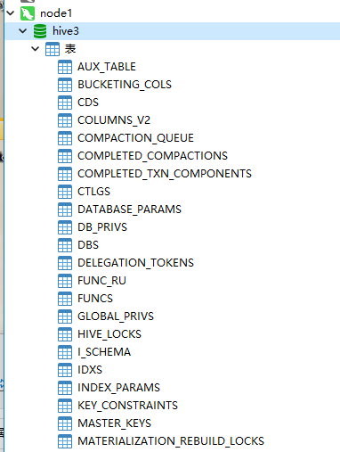

### 2.5 解决注释信息中文乱码

**MySQL**中执行以下语句

```sql
use hive3;
alter table hive3.COLUMNS_V2 modify column COMMENT varchar(256) character set utf8;
alter table hive3.TABLE_PARAMS modify column PARAM_VALUE varchar(4000) character set utf8;
alter table hive3.PARTITION_PARAMS modify column PARAM_VALUE varchar(4000) character set utf8;
alter table hive3.PARTITION_KEYS modify column PKEY_COMMENT varchar(4000) character set utf8;
alter table hive3.INDEX_PARAMS modify column PARAM_VALUE varchar(4000) character set utf8;
```

### 2.6 创建Hive存储目录

在HDFS创建Hive存储目录（如存在则不用操作）

```sh
hadoop fs -mkdir /tmp
hadoop fs -mkdir -p /user/hive/warehouse
hadoop fs -chmod g+w /tmp
hadoop fs -chmod g+w /user/hive/warehouse
```

# 三、 使用

## 1. 启动Hive

### 1.1 启动metastore服务

```sh
#前台启动  关闭ctrl+c
/export/server/apache-hive-3.1.2-bin/bin/hive --service metastore

#前台启动开启debug日志
/export/server/apache-hive-3.1.2-bin/bin/hive --service metastore --hiveconf hive.root.logger=DEBUG,console  
#后台启动 进程挂起  关闭使用jps+ kill -9
nohup /export/server/apache-hive-3.1.2-bin/bin/hive --service metastore &
```

### 1.2 启动hiveserver2服务

```sh
nohup /export/server/apache-hive-3.1.2-bin/bin/hive --service hiveserver2 &
#注意 启动hiveserver2需要一定的时间  不要启动之后立即beeline连接 可能连接不上
```

## 2. beeline客户端连接

拷贝node1安装包到node3上

```sh
scp -r /export/server/apache-hive-3.1.2-bin/ node3:/export/server/
```

连接

```sh
/export/server/apache-hive-3.1.2-bin/bin/beeline

beeline> ! connect jdbc:hive2://node1:10000
beeline> root
beeline> 直接回车
```

## 3. DataGrip连接Hive（略）

## 4. 库表语法

### 4.1 库

* 查看库

  ```sql
  show databases;
  ```

* 创建库

    ```sql
    create database [if not exists] ifnxs [comment "库描述"] [with dbproperties ('createdBy'='dr34m')];
    ```

    * with dbproperties 用于指定一些数据库的属性配置

    * location 可以指定数据库在HDFS存储位置，默认/user/hive/warehouse/dbname.db

    * 例

        ```sql
        create database test;
        ```

* 使用库

    ```sql
    use ifnxs;
    ```

* 删除库

    ```sql
    drop database [if exists] test [cascade];
    ```
    
    * cascade表示强制删除，默认为restrict，这意味着仅在数据库为空时才删除它

### 4.2 表

* 查看表

  ```sql
  show tables [in xxx];
  ```

* 创建表

  ```sql
  create table [if not exists] [xxx.]zzz (col_name data_type [comment "字段描述"], ...)
  [comment "表描述"]
  [row format delimited ...];
  ```

  * 数据类型

    * 最常用`string`和`int`
    * 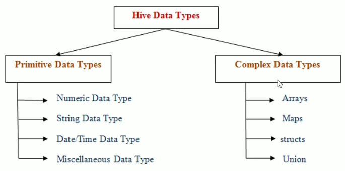

  * 分隔符

    

  * 例

    * ```sql
      create table ifnxs.t_user (
          id int comment "编号",
          name string comment "姓名"
      ) comment "用户表"
      row format delimited
      fields terminated by "\t"; -- 字段之间的分隔符
      ```

    * 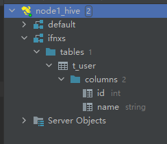

  * 从select创建表

    ```sql
    create table xxx as select id,name from ifnxs.t_user;
    ```

* 查看表结构

  ```sql
  desc formatted xxx;
  ```


* 删除表

  ```sql
  drop table [if exists] xxx;
  ```

## 5. DML语法与函数

### 5.1 Load语法规则

```sql
LOAD DATA [LOCAL] INPATH 'filepath' [OVERWRITE] INTO TABLE tablename;
```

* **LOCAL指Hiveserver2服务所在机器的本地Linux文件系统**

* 例-本地（复制操作）

  ```sql
  load data local inpath '/root/hivedata/students.txt' into table itheima.student_local;
  ```

  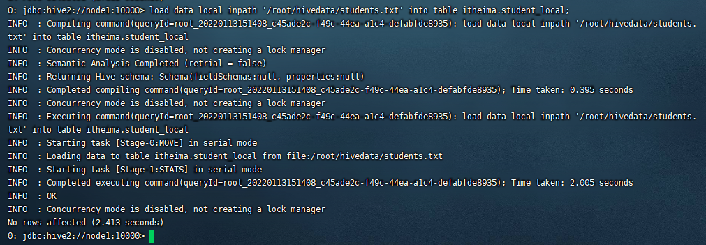

* 例-HDFS（移动操作）

  ```sql
  load data inpath '/students.txt' into table itheima.student_hdfs;
  ```

  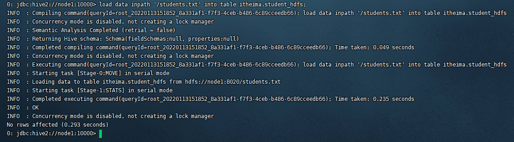

### 5.2 Insert语法

Hive推荐**清洗数据成为结构化文件，再使用Load语法加载数据到表中**

#### insert+select例

```sql
insert into user select id,name from student;
```

### 5.3 select语法

```sql
SELECT [ALL|DISTINCT] select_expr, select_expr, ...
FROM table_reference
[WHERE where_condition]
[GROUP BY col_list]
[ORDER BY col_list]
[LIMIT [offset,] rows];
```

* 例

```sql
-- 查询所有字段或者指定字段
select * from t_usa_covid19;
select county, cases, deaths from t_usa_covid19;

-- 查询常数返回 此时返回的结果和表中字段无关
select 1 from t_usa_covid19;

-- 查询当前所属数据库
select current_database(); -- 省去from关键字

-- 返回所有匹配的行 去除重复的结果
select distinct state from t_usa_covid19;

-- 多个字段distinct 整体去重
select distinct county,state from t_usa_covid19;
```

#### 5.3.1 where条件

  * 比较运算符 `=` `>` `<` `<=` `>=` `!=` `<>`(不等于)

    ```sql
    -- 找出来自于California州的疫情数据
    select * from t_usa_covid19 where state = 'California';
    
    -- where条件中使用函数 找出州名字母长度超过10位的有哪些
    select * from t_usa_covid19 where length(state) >10;
    ```

  * 逻辑运算 `and` `or`

    ```sql
    select * from t_usa_covid19 where length(state)>10 and length(state)<20;
    ```

  * 空值判断 `is null`

    ```sql
    select * from t_usa_covid19 where fips is null;
    ```

  * `between...and`

    ```sql
    select * from t_usa_covid19 where length(state) between 10 and 20;
    ```

  * `in`

    ```sql
    select * from t_usa_covid19 where length(state) in (10,11,13);
    ```


#### 5.3.2 聚合操作

`count` `sum` `max` `min` `avg`


```sql
-- 统计美国总共有多少个县county
-- 学会使用as 给查询返回的结果起个别名
select count(county) as county_cnts from t_usa_covid19;

-- 去重distinct
select count(distinct county) as county_cnts from t_usa_covid19;

-- 统计美国加州有多少个县
select count(county) from t_usa_covid19 where state = "California";

-- 统计德州总死亡病例数
select sum(deaths) from t_usa_covid19 where state = "Texas";

-- 统计出美国最高确诊病例数是哪个县
select max(cases) from t_usa_covid19;
```

#### 5.3.3 GROUP BY

GROUP BY语句用于结合聚合函数，**根据一个或多个列对结果集进行分组**

```sql
-- 根据state州进行分组 统计每个州有多少个县county
select count(county) from t_usa_covid19 where count_date = "2021-01-28" group by state;

-- 想看一下统计的结果是属于哪一个州的
select state,count(county) as county_nums from t_usa_covid19 where count_date = "2021-01-28" group by state;

-- 被聚合函数应用
select state,count(county),sum(deaths) from t_usa_covid19 where count_date = "2021-01-28" group by state;
```

#### 5.3.4 HAVING

由于SQL执行顺序决定where在分组前执行，所以where中不能使用聚合函数，比如下边的错误示范

```sql
-- 错误示范-统计2021-01-28死亡病例数大于10000的州
select state,sum(deaths) from t_usa_covid19 where count_date = "2021-01-28" and sum(deaths) >10000 group by state;
```

例

```sql
-- 先where分组前过滤，再进行group by分组， 分组后每个分组结果集确定 再使用having过滤
select state,sum(deaths) from t_usa_covid19 where count_date = "2021-01-28" group by state having sum(deaths) > 10000;

-- 这样写更好 即在group by的时候聚合函数已经作用得出结果 having直接引用结果过滤 不需要再单独计算一次了
select state,sum(deaths) as cnts from t_usa_covid19 where count_date = "2021-01-28" group by state having cnts> 10000;
```

#### 5.3.6 ORDER BY

```sql
-- 根据确诊病例数升序排序 查询返回结果
select * from t_usa_covid19 order by cases;

-- 不写排序规则 默认就是asc升序
select * from t_usa_covid19 order by cases asc;

-- 根据死亡病例数倒序排序 查询返回加州每个县的结果
select * from t_usa_covid19 where state = "California" order by cases desc;
```

#### 5.3.7 LIMIT

```sql
-- 没有限制返回2021.1.28 加州的所有记录
select * from t_usa_covid19 where count_date = "2021-01-28" and state ="California";

-- 返回结果集的前5条
select * from t_usa_covid19 where count_date = "2021-01-28" and state ="California" limit 5;

-- 返回结果集从第1行开始 共3行
select * from t_usa_covid19 where count_date = "2021-01-28" and state ="California" limit 2,3;
-- 注意 第一个参数偏移量是从0开始的
```

#### 5.3.8 执行顺序

* `from` > `where` > `group`（含聚合）> `having`  > `order` > `select`

* 聚合语句(sum,min,max,avg,count)要比having子句优先执行
* where子句在查询过程中执行优先级别优先于聚合语句(sum,min,max,avg,count)

### 5.4 JOIN

* join_table

  ```sql
  table_reference [INNER] JOIN table_factor [join_condition]
  
  | table_reference {LEFT} [OUTER] JOIN table_reference join_condition
  ```

* join_condition:

  ```sql
  ON expression
  ```

#### 5.4.1 inner join 内连接

其中inner可以省略：inner join == join


```sql
select e.id,e.name,e_a.city,e_a.street
from employee e inner join employee_address e_a
on e.id =e_a.id;

-- 等价于 inner join=join
select e.id,e.name,e_a.city,e_a.street
from employee e join employee_address e_a
on e.id =e_a.id;


-- 等价于 隐式连接表示法
select e.id,e.name,e_a.city,e_a.street
from employee e, employee_address e_a
where e.id =e_a.id;
```

#### 5.4.2 left join 左连接

左外连接(Left Outer Join)或者左连接，其中outer可以省略


```sql
select e.id,e.name,e_conn.phno,e_conn.email
from employee e left join employee_connection e_conn
on e.id =e_conn.id;

-- 等价于 left outer join
select e.id,e.name,e_conn.phno,e_conn.email
from employee e left outer join employee_connection e_conn
on e.id =e_conn.id;
```

### 5.5 函数

#### 5.5.1 概述

* 查看所有可用函数

  ```sql
  show functions;
  ```

* 描述函数用法

  ```sql
  describe function extended xxxx;
  ```

  例

  ```sql
  describe function extended count;
  ```

* 分类

  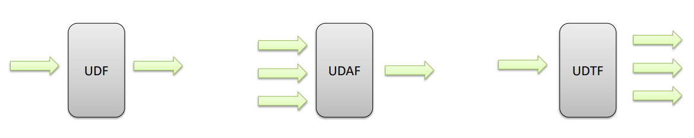

#### 5.5.2 常用内置函数

[官网](https://cwiki.apache.org/confluence/display/Hive/LanguageManual+UDF)

##### String Functions 字符串函数

```sql
select length("itcast");
select reverse("itcast");

select concat("angela","baby");
-- 带分隔符字符串连接函数：concat_ws(separator, [string | array(string)]+)
select concat_ws('.', 'www', array('itcast', 'cn'));

-- 字符串截取函数：substr(str, pos[, len]) 或者  substring(str, pos[, len])
select substr("angelababy",-2); -- pos是从1开始的索引，如果为负数则倒着数
select substr("angelababy",2,2);
-- 分割字符串函数: split(str, regex)
-- split针对字符串数据进行切割  返回是数组array  可以通过数组的下标取内部的元素 注意下标从0开始的
select split('apache hive', ' ');
select split('apache hive', ' ')[0];
select split('apache hive', ' ')[1];
```

##### Date Functions 日期函数

```sql
-- 获取当前日期: current_date
select current_date();

-- 获取当前UNIX时间戳函数: unix_timestamp
select unix_timestamp();

-- 日期转UNIX时间戳函数: unix_timestamp
select unix_timestamp("2011-12-07 13:01:03");

-- 指定格式日期转UNIX时间戳函数: unix_timestamp
select unix_timestamp('20111207 13:01:03','yyyyMMdd HH:mm:ss');

-- UNIX时间戳转日期函数: from_unixtime
select from_unixtime(1618238391);
select from_unixtime(0, 'yyyy-MM-dd HH:mm:ss');

-- 日期比较函数: datediff  日期格式要求'yyyy-MM-dd HH:mm:ss' or 'yyyy-MM-dd'
select datediff('2012-12-08','2012-05-09');

-- 日期增加函数: date_add
select date_add('2012-02-28',10);

-- 日期减少函数: date_sub
select date_sub('2012-01-1',10);
```

相比视频额外扩展，工作中常用

```sql
-- 日期格式化
select date_format(current_date(), 'yyyy-MM');
-- 筛选在2022年1月创建的用户
select * from userlist where date_format(create_time, 'yyyy-MM') = '2022-01';
```

##### Mathematical Functions 数学函数

```sql
-- 取整函数: round  返回double类型的整数值部分 （遵循四舍五入）
select round(3.1415926);
-- 指定精度取整函数: round(double a, int d) 返回指定精度d的double类型
select round(3.1415926,4);
-- 取随机数函数: rand 每次执行都不一样 返回一个0到1范围内的随机数
select rand();
-- 指定种子取随机数函数: rand(int seed) 得到一个稳定的随机数序列
select rand(3);
```

##### Conditional Functions 条件函数

```sql
-- if条件判断: if(boolean testCondition, T valueTrue, T valueFalseOrNull)
select if(1=2,100,200);
select if(sex ='男','M','W') from student limit 3;

-- 条件转换函数: CASE a WHEN b THEN c [WHEN d THEN e]* [ELSE f] END
select case 100 when 50 then 'tom' when 100 then 'mary' else 'tim' end;
select case sex when '男' then 'male' else 'female' end from student limit 3;

-- 空值转换函数: nvl(T value, T default_value)
select nvl("allen","itcast");
select nvl(null,"itcast");
```

