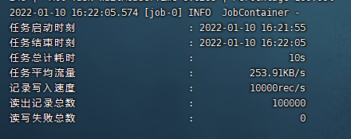
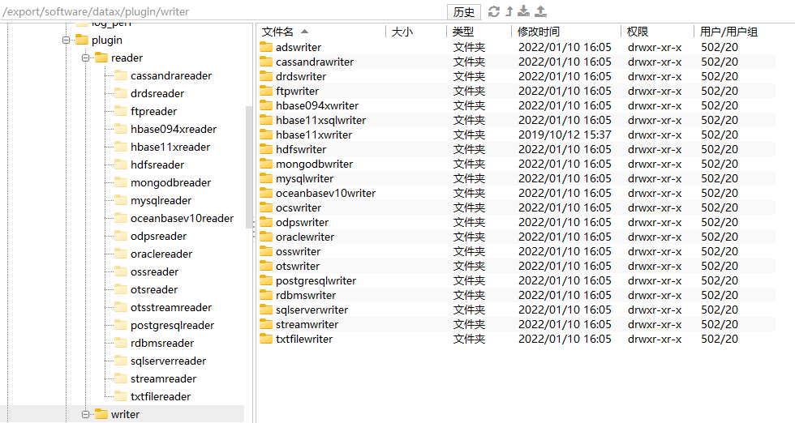
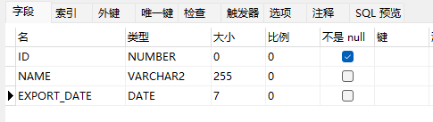
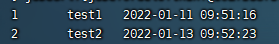
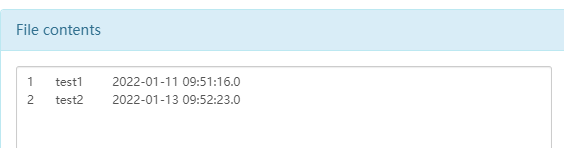
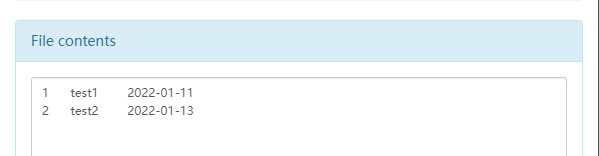

# 目标

安装、测试与简单使用dataX，本文基于CentOS7 x64实现

<!--more-->

# 框架设计


# 实现

 ## 一、环境准备

### 1. Python

CentOS7 x64自带Python2环境，不需要额外安装，查看Python版本：`python -V`，这里V大写

* 如果需要可以选装pip

    ```sh
    yum -y install epel-release
    yum install python-pip
    ```

### 2. JDK1.8

#### 2.1 下载jdk-8u311-linux-x64

官方下载链接(需要注册，可能网速慢)：

[https://www.oracle.com/java/technologies/downloads/](https://www.oracle.com/java/technologies/downloads/)


百度网盘：

链接：[https://pan.baidu.com/s/176N837BQXyUoIt7HvF0c0A](https://pan.baidu.com/s/176N837BQXyUoIt7HvF0c0A)
提取码：0ld6

#### 2.2 安装

```shell
mkdir -p /export/server
```

把下载的jdk上传到该目录，然后解压

```shell
cd /export/server/
tar -zxvf jdk-8u311-linux-x64.tar.gz
rm -f jdk-8u311-linux-x64.tar.gz # 可以不删
```

编辑环境变量

```shell
yum -y install vim # 如果已经有了就不用了
vim /etc/profile
```

结尾追加

```shell
export JAVA_HOME=/export/server/jdk1.8.0_311
export PATH=$PATH:$JAVA_HOME/bin
export CALSSPATH=.:$JAVA_HOME/lib/dt.jar:$JAVA_HOME/lib/tools.jar
```

使生效

```shell
source /etc/profile
```

查看JDK版本

```shell
java -version
```

## 二、安装dataX

### 1. 下载安装

```shell
yum -y install wget # 如果已经有了就不用了
mkdir -p /export/software
cd /export/software/
wget http://datax-opensource.oss-cn-hangzhou.aliyuncs.com/datax.tar.gz
tar -zxvf datax.tar.gz
rm -rf datax/plugin/*/._* # 这里不删的话，运行会报错，请自行斟酌，新版可能已经解决这个问题
rm -f datax.tar.gz # 可以不删
```

### 2. 测试

```shell
cd /export/software/datax/
python bin/datax.py job/job.json
```

运行结果



## 三、简单使用

### 1. 支持

dataX支持数据如下图（来自[官方](https://github.com/alibaba/DataX#support-data-channels)）

| 类型               | 数据源                          | Reader(读) | Writer(写) |                             文档                             |
| ------------------ | ------------------------------- | :--------: | :--------: | :----------------------------------------------------------: |
| RDBMS 关系型数据库 | MySQL                           |     √      |     √      | [读](https://github.com/alibaba/DataX/blob/master/mysqlreader/doc/mysqlreader.md) 、[写](https://github.com/alibaba/DataX/blob/master/mysqlwriter/doc/mysqlwriter.md) |
|                    | Oracle                          |     √      |     √      | [读](https://github.com/alibaba/DataX/blob/master/oraclereader/doc/oraclereader.md) 、[写](https://github.com/alibaba/DataX/blob/master/oraclewriter/doc/oraclewriter.md) |
|                    | OceanBase                       |     √      |     √      | [读](https://open.oceanbase.com/docs/community/oceanbase-database/V3.1.0/use-datax-to-full-migration-data-to-oceanbase) 、[写](https://open.oceanbase.com/docs/community/oceanbase-database/V3.1.0/use-datax-to-full-migration-data-to-oceanbase) |
|                    | SQLServer                       |     √      |     √      | [读](https://github.com/alibaba/DataX/blob/master/sqlserverreader/doc/sqlserverreader.md) 、[写](https://github.com/alibaba/DataX/blob/master/sqlserverwriter/doc/sqlserverwriter.md) |
|                    | PostgreSQL                      |     √      |     √      | [读](https://github.com/alibaba/DataX/blob/master/postgresqlreader/doc/postgresqlreader.md) 、[写](https://github.com/alibaba/DataX/blob/master/postgresqlwriter/doc/postgresqlwriter.md) |
|                    | DRDS                            |     √      |     √      | [读](https://github.com/alibaba/DataX/blob/master/drdsreader/doc/drdsreader.md) 、[写](https://github.com/alibaba/DataX/blob/master/drdswriter/doc/drdswriter.md) |
|                    | 通用RDBMS(支持所有关系型数据库) |     √      |     √      | [读](https://github.com/alibaba/DataX/blob/master/rdbmsreader/doc/rdbmsreader.md) 、[写](https://github.com/alibaba/DataX/blob/master/rdbmswriter/doc/rdbmswriter.md) |
| 阿里云数仓数据存储 | ODPS                            |     √      |     √      | [读](https://github.com/alibaba/DataX/blob/master/odpsreader/doc/odpsreader.md) 、[写](https://github.com/alibaba/DataX/blob/master/odpswriter/doc/odpswriter.md) |
|                    | ADS                             |            |     √      | [写](https://github.com/alibaba/DataX/blob/master/adswriter/doc/adswriter.md) |
|                    | OSS                             |     √      |     √      | [读](https://github.com/alibaba/DataX/blob/master/ossreader/doc/ossreader.md) 、[写](https://github.com/alibaba/DataX/blob/master/osswriter/doc/osswriter.md) |
|                    | OCS                             |            |     √      | [写](https://github.com/alibaba/DataX/blob/master/ocswriter/doc/ocswriter.md) |
| NoSQL数据存储      | OTS                             |     √      |     √      | [读](https://github.com/alibaba/DataX/blob/master/otsreader/doc/otsreader.md) 、[写](https://github.com/alibaba/DataX/blob/master/otswriter/doc/otswriter.md) |
|                    | Hbase0.94                       |     √      |     √      | [读](https://github.com/alibaba/DataX/blob/master/hbase094xreader/doc/hbase094xreader.md) 、[写](https://github.com/alibaba/DataX/blob/master/hbase094xwriter/doc/hbase094xwriter.md) |
|                    | Hbase1.1                        |     √      |     √      | [读](https://github.com/alibaba/DataX/blob/master/hbase11xreader/doc/hbase11xreader.md) 、[写](https://github.com/alibaba/DataX/blob/master/hbase11xwriter/doc/hbase11xwriter.md) |
|                    | Phoenix4.x                      |     √      |     √      | [读](https://github.com/alibaba/DataX/blob/master/hbase11xsqlreader/doc/hbase11xsqlreader.md) 、[写](https://github.com/alibaba/DataX/blob/master/hbase11xsqlwriter/doc/hbase11xsqlwriter.md) |
|                    | Phoenix5.x                      |     √      |     √      | [读](https://github.com/alibaba/DataX/blob/master/hbase20xsqlreader/doc/hbase20xsqlreader.md) 、[写](https://github.com/alibaba/DataX/blob/master/hbase20xsqlwriter/doc/hbase20xsqlwriter.md) |
|                    | MongoDB                         |     √      |     √      | [读](https://github.com/alibaba/DataX/blob/master/mongodbreader/doc/mongodbreader.md) 、[写](https://github.com/alibaba/DataX/blob/master/mongodbwriter/doc/mongodbwriter.md) |
|                    | Hive                            |     √      |     √      | [读](https://github.com/alibaba/DataX/blob/master/hdfsreader/doc/hdfsreader.md) 、[写](https://github.com/alibaba/DataX/blob/master/hdfswriter/doc/hdfswriter.md) |
|                    | Cassandra                       |     √      |     √      | [读](https://github.com/alibaba/DataX/blob/master/cassandrareader/doc/cassandrareader.md) 、[写](https://github.com/alibaba/DataX/blob/master/cassandrawriter/doc/cassandrawriter.md) |
| 无结构化数据存储   | TxtFile                         |     √      |     √      | [读](https://github.com/alibaba/DataX/blob/master/txtfilereader/doc/txtfilereader.md) 、[写](https://github.com/alibaba/DataX/blob/master/txtfilewriter/doc/txtfilewriter.md) |
|                    | FTP                             |     √      |     √      | [读](https://github.com/alibaba/DataX/blob/master/ftpreader/doc/ftpreader.md) 、[写](https://github.com/alibaba/DataX/blob/master/ftpwriter/doc/ftpwriter.md) |
|                    | HDFS                            |     √      |     √      | [读](https://github.com/alibaba/DataX/blob/master/hdfsreader/doc/hdfsreader.md) 、[写](https://github.com/alibaba/DataX/blob/master/hdfswriter/doc/hdfswriter.md) |
|                    | Elasticsearch                   |            |     √      | [写](https://github.com/alibaba/DataX/blob/master/elasticsearchwriter/doc/elasticsearchwriter.md) |
| 时间序列数据库     | OpenTSDB                        |     √      |            | [读](https://github.com/alibaba/DataX/blob/master/opentsdbreader/doc/opentsdbreader.md) |
|                    | TSDB                            |     √      |     √      | [读](https://github.com/alibaba/DataX/blob/master/tsdbreader/doc/tsdbreader.md) 、[写](https://github.com/alibaba/DataX/blob/master/tsdbwriter/doc/tsdbhttpwriter.md) |

参考相关文档编写json即可实现，可以在【/export/software/datax/plugin】目录下找到名字



### 2. 获取模板

例如想要实现Oracle->HDFS，获取模板命令如下：

```shell
cd /export/software/datax/bin/
python datax.py -r oraclereader -w hdfswriter
```

得到如下模板

```json
{
    "job": {
        "content": [
            {
                "reader": {
                    "name": "oraclereader", 
                    "parameter": {
                        "column": [], 
                        "connection": [
                            {
                                "jdbcUrl": [], 
                                "table": []
                            }
                        ], 
                        "password": "", 
                        "username": ""
                    }
                }, 
                "writer": {
                    "name": "hdfswriter", 
                    "parameter": {
                        "column": [], 
                        "compress": "", 
                        "defaultFS": "", 
                        "fieldDelimiter": "", 
                        "fileName": "", 
                        "fileType": "", 
                        "path": "", 
                        "writeMode": ""
                    }
                }
            }
        ], 
        "setting": {
            "speed": {
                "channel": ""
            }
        }
    }
}
```

### 3. 从Oracle读取

新建用于测试的表如图，并造几条数据



参考[Oracle读-文档](https://open.oceanbase.com/docs/community/oceanbase-database/V3.1.0/use-datax-to-full-migration-data-to-oceanbase)编辑json文本如下，刚开始尝试可以先打印结果，确认成功之后再写HDFS

```json
{
    "job": {
        "content": [
            {
                "reader": {
                    "name": "oraclereader", 
                    "parameter": {
                        "column": ["ID","NAME","EXPORT_DATE"], 
                        "connection": [
                            {
                                "jdbcUrl": [
                                    "jdbc:oracle:thin:@localhost:1521:orcl"
                                ], 
                                "table": [
                                    "test"
                                ]
                            }
                        ], 
                        "password": "test", 
                        "username": "test"
                    }
                }, 
                "writer": {
                    "name": "streamwriter",
                    "parameter": {
                        "print": true
                    }
                }
            }
        ], 
        "setting": {
            "speed": {
                "channel": 1
            }
        }
    }
}
```

把上边的文本写入【/export/software/datax/job/oracle2stream.json】文件中，然后

```shell
cd /export/software/datax/
python bin/datax.py job/oracle2stream.json
```

可以在控制台看到成功打印之前造的数据



扩展：这里的【table】可以写多个表结构相同的表名，最后写入HDFS也会写入多个文件

### 4. 写入HDFS

在HDFS新建目录`datax`，用于接收数据，参考[HDFS写-文档](https://github.com/alibaba/DataX/blob/master/hdfswriter/doc/hdfswriter.md)继续编辑上边的json文本如下

```json
{
    "job": {
        "content": [
            {
                "reader": {
                    "name": "oraclereader", 
                    "parameter": {
                        "column": ["ID","NAME","EXPORT_DATE"], 
                        "connection": [
                            {
                                "jdbcUrl": [
                                    "jdbc:oracle:thin:@localhost:1521:orcl"
                                ], 
                                "table": [
                                    "test"
                                ]
                            }
                        ], 
                        "password": "test", 
                        "username": "test"
                    }
                }, 
                "writer": {
                    "name": "hdfswriter",
                    "parameter": {
                        "defaultFS": "hdfs://localhost:9000",
                        "fileType": "text",
                        "path": "/datax",
                        "fileName": "test",
                        "column": [
                            {
                                "name": "ID",
                                "type": "INT"
                            },
                            {
                                "name": "NAME",
                                "type": "VARCHAR"
                            },
                            {
                                "name": "EXPORT_DATE",
                                "type": "TIMESTAMP"
                            }
                        ],
                        "writeMode": "append",
                        "fieldDelimiter": "\t"
                    }
                }
            }
        ], 
        "setting": {
            "speed": {
                "channel": 1
            }
        }
    }
}
```

把上边的文本写入【/export/software/datax/job/oracle2hdfs.json】文件中，然后

```shell
cd /export/software/datax/
python bin/datax.py job/oracle2hdfs.json
```

可以在HDFS看到之前造的数据



如果在`writer`配置中【EXPORT_DATE】字段设置type为date，则日期后的时分秒会丢失，如下图



### 5. HDFS->Oracle

参考[HDFS读-文档](https://github.com/alibaba/DataX/blob/master/hdfsreader/doc/hdfsreader.md)和[Oracle写-文档](https://github.com/alibaba/DataX/blob/master/oraclewriter/doc/oraclewriter.md)编辑json文本如下

```json
{
	"job": {
		"content": [
			{
				"reader": {
					"name": "hdfsreader",
					"parameter": {
                        "path": "/datax/*",
                        "defaultFS": "hdfs://localhost:9000",
						"fileType": "text",
                        "column": [
                               {
                                "index": 0,
                                "type": "long"
                               },
                               {
                                "index": 1,
                                "type": "string"
                               },
                               {
                                "index": 2,
                                "type": "date"
                               }
                        ],
						"fieldDelimiter": "\t"
                    }
				},
				"writer": {
					"name": "oraclewriter",
					"parameter": {
						"column": [
							"ID",
							"NAME",
							"EXPORT_DATE"
						],
						"connection": [
							{
								"jdbcUrl": "jdbc:oracle:thin:@localhost:1521:orcl",
								"table": [
									"test"
								]
							}
						],
						"password": "test",
						"username": "test"
					}
				}
			}
		],
		"setting": {
			"speed": {
				"channel": 1
			}
		}
	}
}
```

* 这里有一个细节，在Oracle**读取**时，jdbcUrl参数是个**数组**，Oracle**写入**时就是**字符串**了，如果还写数组，就会报下边的错

	`java.sql.SQLException: No suitable driver found for ["jdbc:oracle:thin:@localhost:1521:orcl"]]`

把上边的文本写入【/export/software/datax/job/hdfs2oracle.json】文件中，然后

```shell
cd /export/software/datax/
python bin/datax.py job/hdfs2oracle.json
```

