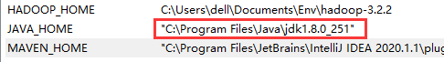
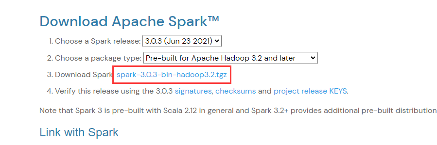
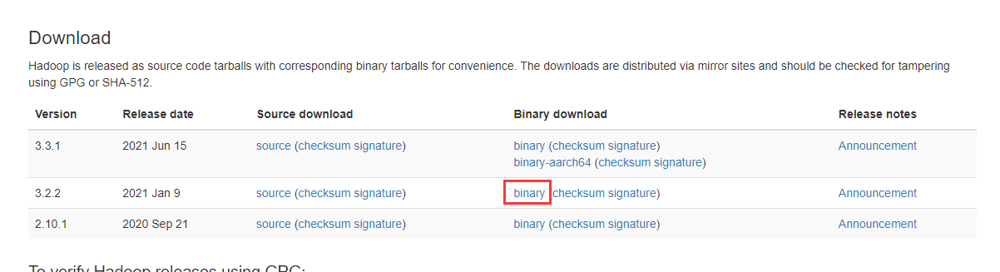

# 目标

在windows系统本地配置spark开发环境，能够通过idea开发spark项目

<!--more-->

# 实现

## 1. 安装JDK

不赘述，你能看到这必然已经装好了jdk并配置好了环境变量。

需要注意的是，如果jdk安装目录有**空格**，需要在配置环境变量的时候，把`JAVA_HOME`的配置地址用**双引号**引起来，不然后边的hadoop识别会有问题

## 2. 安装Spark

到官网[https://spark.apache.org/downloads.html](https://spark.apache.org/downloads.html)选择合适的版本下载，注意Spark与Hadoop版本选择要相对应，建议下载预编译（`Pre-built`）好的版本，省得麻烦

下载完成后解压到你喜欢的目录，然后配置环境变量，例如解压在`C:\Users\dell\Documents\Env\spark-3.0.3-bin-hadoop3.2`目录下，则环境变量如下配置

* 配置变量名为`SPARK_HOME`，值为`C:\Users\dell\Documents\Env\spark-3.0.3-bin-hadoop3.2`
* 在`Path`变量下新建`%SPARK_HOME%\bin`

## 3. 安装Hadoop

到官网[https://hadoop.apache.org/releases.html](https://hadoop.apache.org/releases.html)下载与上边的Spark对应的版本

下载完成后解压到你喜欢的目录，然后配置环境变量，例如解压在`C:\Users\dell\Documents\Env\hadoop-3.2.2`目录下，则环境变量如下配置

* 配置变量名为`HADOOP_HOME`，值为`C:\Users\dell\Documents\Env\hadoop-3.2.2`
* 在`Path`变量下新建`%HADOOP_HOME%\bin`

到这里[https://github.com/cdarlint/winutils](https://github.com/cdarlint/winutils)对应版本的bin目录下载`hadoop.dll`和`winutils.exe`，复制到hadoop目录的`bin`目录下

