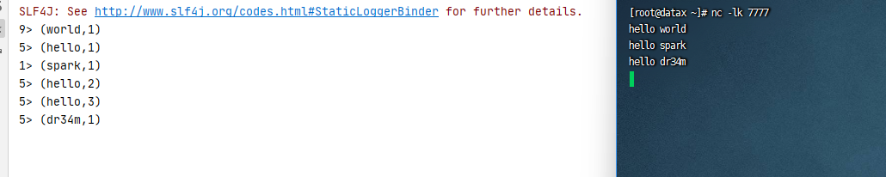

本文基于B站视频教程[尚硅谷Java版Flink（武老师清华硕士，原IBM-CDL负责人）](https://www.bilibili.com/video/BV1qy4y1q728)，本文软件版本，行文顺序等可能与视频略有不同

<!--more-->

# 一、概念

## 1. 是什么

*Apache Flink*是一个框架和分布式处理引擎，用于对*无界和有界*数据流进行状态计算。Flink 被设计为在*所有常见的集群环境中运行*，*以内存中的速度*和*任何规模*执行计算

## 2. 目标

* 低延时
* 高吞吐
* 结果的准确性和良好的容错性

# 二、使用

## 1. 使用前准备

pom依赖

```xml
<?xml version="1.0" encoding="UTF-8"?>
<project xmlns="http://maven.apache.org/POM/4.0.0"
         xmlns:xsi="http://www.w3.org/2001/XMLSchema-instance"
         xsi:schemaLocation="http://maven.apache.org/POM/4.0.0 http://maven.apache.org/xsd/maven-4.0.0.xsd">
    <modelVersion>4.0.0</modelVersion>

    <groupId>com.ifnxs.bigdata</groupId>
    <artifactId>FlinkTutorial</artifactId>
    <version>1.0-SNAPSHOT</version>

    <properties>
        <maven.compiler.source>8</maven.compiler.source>
        <maven.compiler.target>8</maven.compiler.target>
        <flink.version>1.12.1</flink.version>
        <scala.binary.version>2.12</scala.binary.version>
    </properties>

    <dependencies>
        <dependency>
            <groupId>org.apache.flink</groupId>
            <artifactId>flink-java</artifactId>
            <version>${flink.version}</version>
        </dependency>
        <dependency>
            <groupId>org.apache.flink</groupId>
            <artifactId>flink-streaming-scala_${scala.binary.version}</artifactId>
            <version>${flink.version}</version>
        </dependency>
        <dependency>
            <groupId>org.apache.flink</groupId>
            <artifactId>flink-clients_${scala.binary.version}</artifactId>
            <version>${flink.version}</version>
        </dependency>
    </dependencies>

</project>
```

> *flink-streaming-scala_2.12 => org.apache.flink:flink-runtime_2.12:1.12.1 => com.typesafe.akka:akka-actor_2.12:2.5.21，akka就是用scala实现的。即使这里我们用java语言，还是用到了scala实现的包*

hello.txt内容

```
hello world
hello spark
hello flink
how are you
fine thank you
and you
```

## 2. 批处理实现WordCount

实现代码

```java
package com.ifnxs.bigdata.wc;

import org.apache.flink.api.common.functions.FlatMapFunction;
import org.apache.flink.api.java.DataSet;
import org.apache.flink.api.java.ExecutionEnvironment;
import org.apache.flink.api.java.tuple.Tuple2;
import org.apache.flink.util.Collector;

// 批处理
public class WordCount {
    public static void main(String[] args) throws Exception {
        // 创建执行环境
        ExecutionEnvironment env = ExecutionEnvironment.getExecutionEnvironment();

        // 从文件中读取数据
        String inputPath = "D:\\learn\\bigdata\\FlinkTutorial\\src\\main\\resources\\hello.txt";
        DataSet<String> inputDataSet = env.readTextFile(inputPath);

        // 对数据集进行处理，按空格分词展开，转换成(word, 1)二元组进行统计
        DataSet<Tuple2<String, Integer>> resultSet = inputDataSet.flatMap(new MyFlatMapper())
                .groupBy(0) // 按照第一个位置的word分组
                .sum(1); // 按照第二个位置上的数据求和
        resultSet.print();
    }

    // 自定义类，实现FlatMapFunction接口
    public static class MyFlatMapper implements FlatMapFunction<String, Tuple2<String, Integer>> {

        @Override
        public void flatMap(String value, Collector<Tuple2<String, Integer>> out) throws Exception {
            // 按空格分词
            String[] words = value.split(" ");
            // 遍历所有word，包成二元组输出
            for (String word : words) {
                out.collect(new Tuple2<>(word, 1));
            }
        }
    }
}
```

输出

```
(flink,1)
(world,1)
(hello,3)
(and,1)
(fine,1)
(how,1)
(spark,1)
(you,3)
(are,1)
(thank,1)
```

## 3. 流处理实现WordCount

实现代码

```java
package com.ifnxs.bigdata.wc;

import org.apache.flink.api.java.tuple.Tuple2;
import org.apache.flink.client.program.StreamContextEnvironment;
import org.apache.flink.streaming.api.datastream.DataStream;
import org.apache.flink.streaming.api.environment.StreamExecutionEnvironment;

// 流处理WordCount
public class StreamWordCount {
    public static void main(String[] args) throws Exception {
        // 创建流处理执行环境
        StreamExecutionEnvironment env = StreamContextEnvironment.getExecutionEnvironment();

        // 设置并行度，默认值 = 当前计算机的CPU逻辑核数（设置成1即单线程处理）
        // env.setMaxParallelism(32);

        // 从文件中读取数据
        String inputPath = "D:\\learn\\bigdata\\FlinkTutorial\\src\\main\\resources\\hello.txt";
        DataStream<String> inputDataStream = env.readTextFile(inputPath);

        // 基于数据流进行转换计算
        DataStream<Tuple2<String, Integer>> resultStream = inputDataStream.flatMap(new WordCount.MyFlatMapper())
                .keyBy(item -> item.f0)
                .sum(1);
        resultStream.print();

        // 执行任务
        env.execute();
    }
}
```

输出

```
1> (spark,1)
8> (are,1)
11> (how,1)
10> (you,1)
9> (world,1)
13> (flink,1)
5> (hello,1)
5> (hello,2)
5> (hello,3)
9> (fine,1)
6> (thank,1)
10> (you,2)
10> (you,3)
15> (and,1)
```

每行开头的数字代表执行的线程，比如我的电脑是8核心16线程，默认并行度为16

> 同一个字符串，前面输出的编号是一样的，因为key => hashcode，同一个key的hash值固定，分配给相对应的线程处理

## 4. 模拟流实现

linux系统通过`nc -lk <port>`打开一个socket服务，用于模拟实时的流数据

```shell
nc -lk 7777
```

如果CentOS没有安装nc可以通过下边的命令安装

```shell
yum -y install nc
```

代码修改如下

```java
package com.ifnxs.bigdata.wc;

import org.apache.flink.api.java.tuple.Tuple2;
import org.apache.flink.client.program.StreamContextEnvironment;
import org.apache.flink.streaming.api.datastream.DataStream;
import org.apache.flink.streaming.api.environment.StreamExecutionEnvironment;

// 流处理WordCount
public class StreamWordCount {
    public static void main(String[] args) throws Exception {
        // 创建流处理执行环境
        StreamExecutionEnvironment env = StreamContextEnvironment.getExecutionEnvironment();

        // 设置并行度，默认值 = 当前计算机的CPU逻辑核数（设置成1即单线程处理）
        // env.setMaxParallelism(32);

        // 从文件中读取数据
        // String inputPath = "D:\\learn\\bigdata\\FlinkTutorial\\src\\main\\resources\\hello.txt";
        // DataStream<String> inputDataStream = env.readTextFile(inputPath);

        // 从socket文本流读取数据
        DataStream<String> inputDataStream = env.socketTextStream("localhost", 7777);

        // 基于数据流进行转换计算
        DataStream<Tuple2<String, Integer>> resultStream = inputDataStream.flatMap(new WordCount.MyFlatMapper())
                .keyBy(item -> item.f0)
                .sum(1);
        resultStream.print();

        // 执行任务
        env.execute();
    }
}
```

执行代码，然后发送socket消息，查看运行情况



因工作不需要笔记暂停

> 参考：[尚硅谷Flink入门到实战-学习笔记](https://ashiamd.github.io/docsify-notes/#/study/BigData/Flink/尚硅谷Flink入门到实战-学习笔记?id=尚硅谷flink入门到实战-学习笔记)

