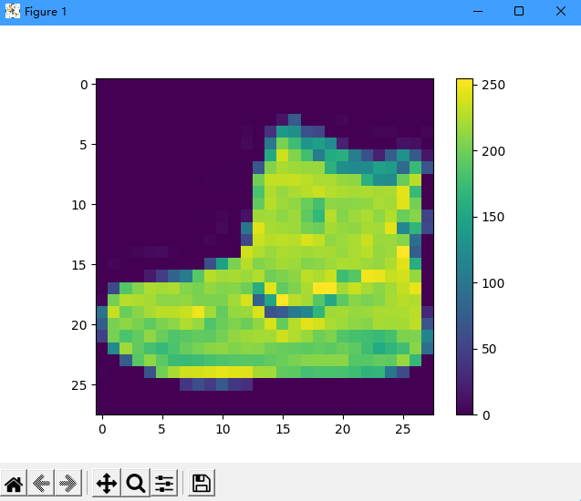
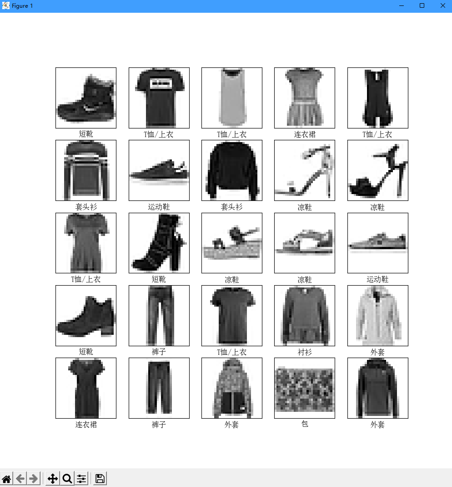
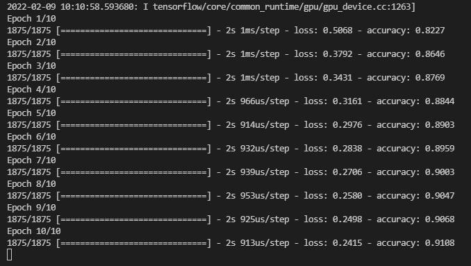
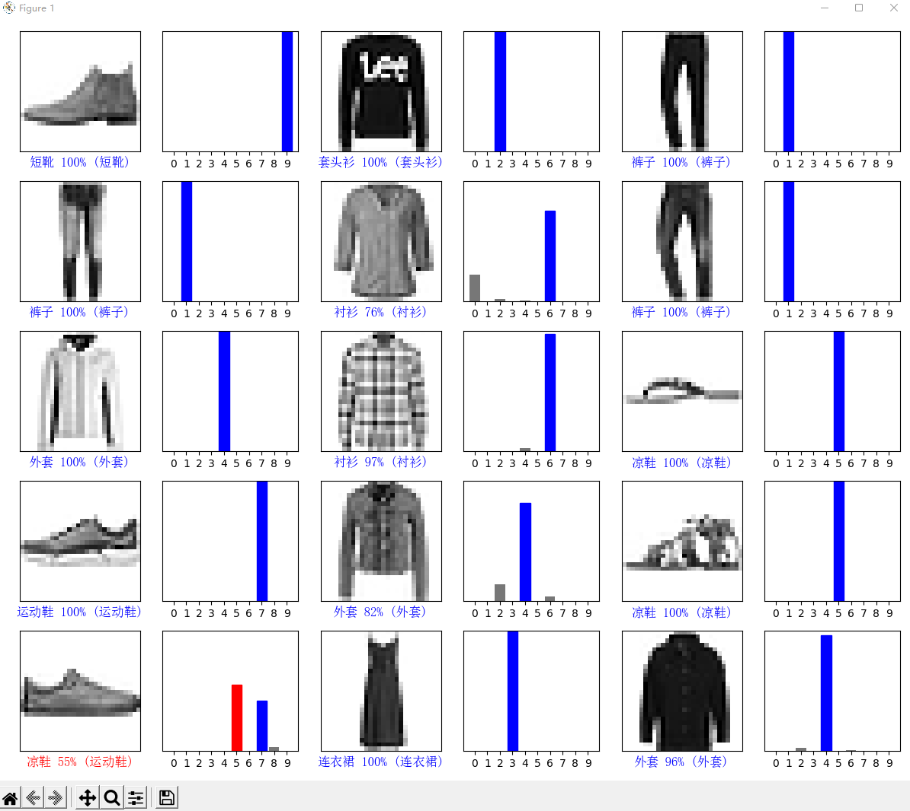

# 目标

实现[官方案例](https://www.tensorflow.org/tutorials/keras/classification?hl=zh_cn)，训练一个神经网络模型，对运动鞋和衬衫等服装图像进行分类，数据集来自[Fashion-MNIST 样本](https://github.com/zalandoresearch/fashion-mnist)

本文环境为Python3 x64，windows系统

<!--more-->

# 实现

## 一、使用前准备

### 1. 安装依赖

```shell
pip install numpy==1.18.5
pip install tensorflow==2.3.0
```

会自动安装相关依赖

> Successfully installed tensorboard-2.8.0 tensorboard-data-server-0.6.1 tensorflow-2.3.0 tensorflow-estimator-2.3.0

### 2. 在项目中引用

```python
# TensorFlow and tf.keras
import tensorflow as tf
from tensorflow import keras

# Helper libraries
import numpy as np
import matplotlib.pyplot as plt
```

如果需要在matplotlib显示中文，可以添加如下

```python
# 解决中文乱码问题需要用到的
from matplotlib.font_manager import FontProperties
font_set = FontProperties(fname=r"C:\windows\fonts\simsun.ttc", size=12)
```

之后再需要显示中文的地方加上`fontproperties=font_set`参数

## 二、使用

### 1. 导入 Fashion MNIST 数据集

*  直接从 TensorFlow 中导入和加载 Fashion MNIST 数据

```python
fashion_mnist = keras.datasets.fashion_mnist
(train_images, train_labels), (test_images, test_labels) = fashion_mnist.load_data()
```

* 定义类名，方便后边使用

```python
class_names = ['T恤/上衣', '裤子', '套头衫', '连衣裙', '外套',
               '凉鞋', '衬衫', '运动鞋', '包', '短靴']
```

### 2. 浏览数据

```python
print(train_images.shape)
```

> (60000, 28, 28)

可知train_images中有60000个28x28像素的图片

```python
print(len(train_labels))
print(train_labels)
```

> 60000
>
> [9 0 0 ... 3 0 5]

可知train_labels是一个数组，由60000个0-9之间的数字组成

同理可知test_images中有10000个28x28像素的图片，test_labels是一个数组，由10000个0-9之间的数字组成

### 3. 预处理数据

在训练网络之前，必须对数据进行预处理。如果您检查训练集中的第一个图像，您会看到像素值处于 0 到 255 之间

```python
plt.figure()
plt.imshow(train_images[0])
plt.colorbar()
plt.grid(False)
plt.show()
```



将其除以 255，可使值范围在0-1之间

```python
train_images = train_images / 255.0
test_images = test_images / 255.0
```

可通过以下方式验证

```python
plt.figure(figsize=(10,10))
for i in range(25):
    plt.subplot(5,5,i+1)
    plt.xticks([])
    plt.yticks([])
    plt.grid(False)
    plt.imshow(train_images[i], cmap=plt.cm.binary)
    plt.xlabel(class_names[train_labels[i]], fontproperties=font_set)
plt.show()
```



###  完整代码

```python
# TensorFlow and tf.keras
import tensorflow as tf
from tensorflow import keras

from matplotlib.font_manager import FontProperties
font_set = FontProperties(fname=r"C:\windows\fonts\simsun.ttc", size=12)

# Helper libraries
import numpy as np
import matplotlib.pyplot as plt

# 直接从 TensorFlow 中导入和加载 Fashion MNIST 数据
fashion_mnist = keras.datasets.fashion_mnist
(train_images, train_labels), (test_images, test_labels) = fashion_mnist.load_data()
# 定义类名，方便后边使用
class_names = ['T恤/上衣', '裤子', '套头衫', '连衣裙', '外套',
               '凉鞋', '衬衫', '运动鞋', '包', '短靴']

# print(train_images.shape)
# print(len(train_labels))
# print(train_labels)

# plt.figure()
# plt.imshow(train_images[0])
# plt.colorbar()
# plt.grid(False)
# plt.show()

train_images = train_images / 255.0
test_images = test_images / 255.0

# plt.figure(figsize=(10,10))
# for i in range(25):
#     plt.subplot(5,5,i+1)
#     plt.xticks([])
#     plt.yticks([])
#     plt.grid(False)
#     plt.imshow(train_images[i], cmap=plt.cm.binary)
#     plt.xlabel(class_names[train_labels[i]], fontproperties=font_set)
# plt.show()

# 模型配置
model = keras.Sequential([
    keras.layers.Flatten(input_shape=(28, 28)),
    keras.layers.Dense(128, activation='relu'),
    keras.layers.Dense(10)
])

model.compile(optimizer='adam',
              loss=tf.keras.losses.SparseCategoricalCrossentropy(from_logits=True),
              metrics=['accuracy'])

# 训练
model.fit(train_images, train_labels, epochs=10)

# test_loss, test_acc = model.evaluate(test_images,  test_labels, verbose=2)

# print('\nTest accuracy:', test_acc)

probability_model = tf.keras.Sequential([model, 
                                         tf.keras.layers.Softmax()])

predictions = probability_model.predict(test_images)

# print(predictions[0])

# 图片与标签
def plot_image(i, predictions_array, true_label, img):
  predictions_array, true_label, img = predictions_array, true_label[i], img[i]
  plt.grid(False)
  plt.xticks([])
  plt.yticks([])

  plt.imshow(img, cmap=plt.cm.binary)

  predicted_label = np.argmax(predictions_array)
  if predicted_label == true_label:
    color = 'blue'
  else:
    color = 'red'

  plt.xlabel("{} {:2.0f}% ({})".format(class_names[predicted_label],
                                100*np.max(predictions_array),
                                class_names[true_label]),
                                color=color,
                                fontproperties=font_set)

# 表
def plot_value_array(i, predictions_array, true_label):
  predictions_array, true_label = predictions_array, true_label[i]
  plt.grid(False)
  plt.xticks(range(10))
  plt.yticks([])
  thisplot = plt.bar(range(10), predictions_array, color="#777777")
  plt.ylim([0, 1])
  predicted_label = np.argmax(predictions_array)

  thisplot[predicted_label].set_color('red')
  thisplot[true_label].set_color('blue')


# Plot the first X test images, their predicted labels, and the true labels.
# Color correct predictions in blue and incorrect predictions in red.
num_rows = 5
num_cols = 3
num_images = num_rows*num_cols
plt.figure(figsize=(2*2*num_cols, 2*num_rows))
for i in range(num_images):
  plt.subplot(num_rows, 2*num_cols, 2*i+1)
  plot_image(i, predictions[i], test_labels, test_images)
  plt.subplot(num_rows, 2*num_cols, 2*i+2)
  plot_value_array(i, predictions[i], test_labels)
plt.tight_layout()
plt.show()
```

训练结果



预测结果



