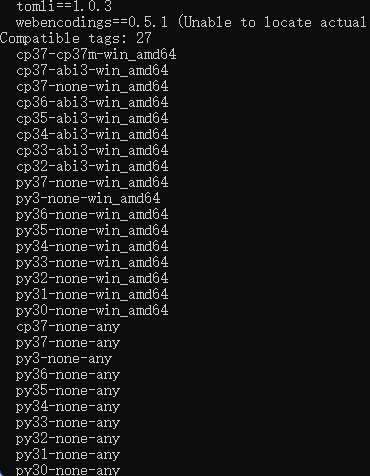
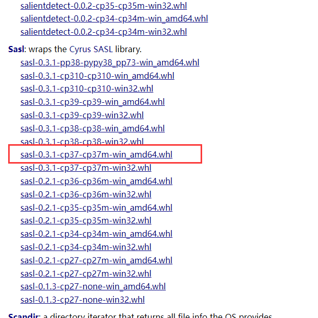

# 目标

windows下python安装sasl

<!--more-->

# 实现

直接pip安装可能失败，这里采用官网下载whl文件本地安装的方法（在此之前先安装pip install wheel）。

1. 执行下边的命令查看pip能够支持的文件版本及类型

   ```shell
    python -m pip debug --verbose
   ```

    

2. 去[官网https://www.lfd.uci.edu/~gohlke/pythonlibs/#sasl]([https://www.lfd.uci.edu/~gohlke/pythonlibs/#sasl)下载支持的版本

    

3. 下载到Python安装目录的`Scripts`文件夹下，然后cmd到该目录，执行

   ```shell
   pip install sasl-0.3.1-cp37-cp37m-win_amd64.whl
   ```

   找不到python安装目录的可以在cmd执行`where python`

> 参考 [Windows下安装sasl](https://www.jianshu.com/p/c67657db5a93)