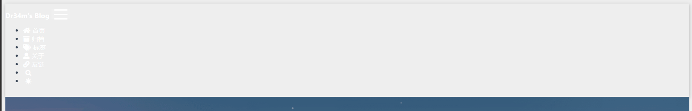
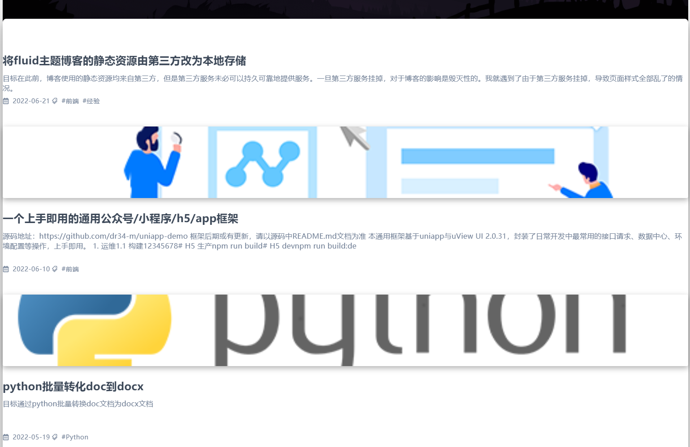

# 目标

将fluid主题博客的静态资源由第三方改为本地存储，以防止第三方服务挂掉导致博客无法正常运行。

<!--more-->

# 原因

在此前，博客使用的静态资源均来自第三方，但是第三方服务未必可以持久可靠地提供服务。一旦第三方服务挂掉，对于博客的影响是毁灭性的。我就遇到了由于第三方服务挂掉，导致页面样式全部乱了的情况。这与我使用hexo的初衷相违背，使用hexo的一个最重要的原因，就是因为其是纯静态的，只需部署到可靠服务商，就可以几乎永久地、低成本地提供服务。但是第三方这个不稳定因素，严重威胁了本人博客的稳定性。因此在权衡利（速度快，省自己流量）弊（未必可靠）后决定将静态资源存储在本地。

乱了之后如下图：




# 实现

## 一、静态资源上传

在`source`文件夹下新建`/assets/static/`目录，复制[https://github.com/dr34-m/hexo/tree/master/source/assets/static](https://github.com/dr34-m/hexo/tree/master/source/assets/static)下所有文件和文件夹没到你本地的`/source/assets/static/`目录下。

## 二、配置修改

找到fluid的配置文件，翻到文件末尾，修改如下

```yml
static_prefix:
  # 内部静态
  # Internal static
  internal_js: /js
  internal_css: /css
  internal_img: /img

  anchor: /assets/static/

  github_markdown: /assets/static/

  jquery: /assets/static/

  bootstrap: /assets/static/

  prismjs: /assets/static/

  tocbot: /assets/static/

  typed: /assets/static/

  fancybox: /assets/static/

  nprogress: /assets/static/

  mathjax: /assets/static/

  katex: /assets/static/

  busuanzi: /assets/static/

  clipboard: /assets/static/

  mermaid: /assets/static/

  valine: /assets/static/
  
  waline: /assets/static/

  gitalk: /assets/static/

  disqusjs: /assets/static/

  twikoo: /assets/static/

  hint: /assets/static/
```

需要注意的是，个别js文件包含两个大括号的关键字，会导致hexo编译报错，在我的文件中已经修改，如果是你自行从官网下载，需要手动调整。