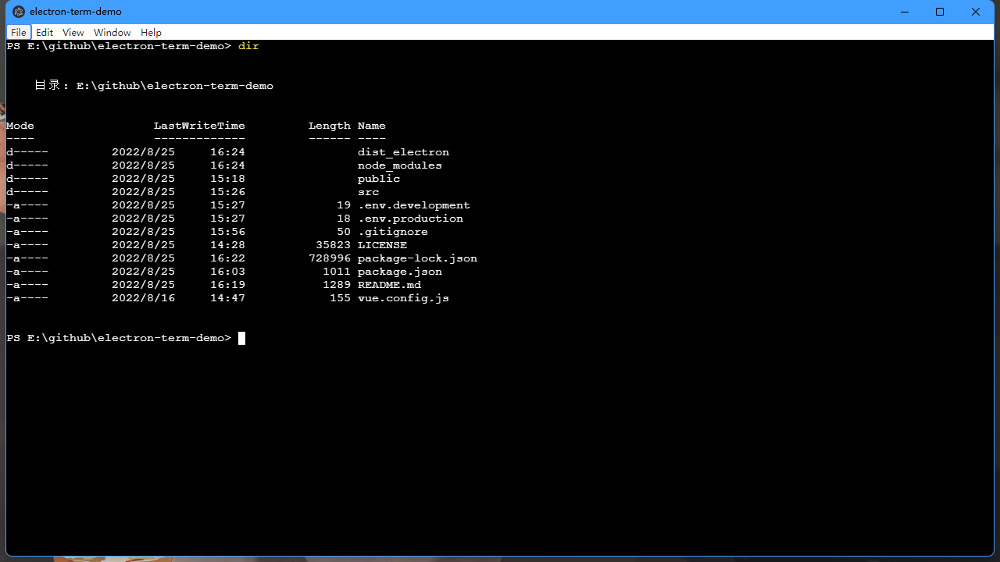

本文介绍一种简单方法，实现本地终端程序。

<!--more-->

项目已上传Github [https://github.com/dr34-m/electron-term-demo](https://github.com/dr34-m/electron-term-demo)

### 核心代码

#### 服务提供处：`background.js`

```js
...

import {
    app,
    protocol,
    BrowserWindow,
    ipcMain
} from 'electron'

const pty = require("node-pty");
const os = require("os");
const shell = os.platform() === "win32" ? "powershell.exe" : "bash";

...

// 创建终端
ipcMain.handle("terminal-create", (event) => {
    let term = pty.spawn(shell, [], {
        name: "xterm-color",
        cwd: process.env.PWD,
        env: process.env
    });
    const pid = term.pid;
    const channels = ["terminal-incomingData-" + pid, "terminal-keystroke-" + pid, "terminal-resize-" + pid, "terminal-close-" + pid];
    // 命令反馈
    term.onData(function(data) {
            win.webContents.send(channels[0], data);
        })
        // 命令输入
    ipcMain.on(channels[1], (event, key) => {
        term.write(key);
    });
    // 尺寸调整
    ipcMain.on(channels[2], (event, cols, rows) => {
        term.resize(cols, rows);
    });
    // 终端关闭
    ipcMain.on(channels[3], (event) => {
        term.kill();
        ipcMain.removeAllListeners([channels[1], channels[2], channels[3]]);
    });
    return pid;
});

```

#### 封装处：`term.vue`

```html
<template>
	<div class="term" :id="'terminal' + id">
	</div>
</template>
<script>
	import 'xterm/css/xterm.css';
	const ipc = require("electron").ipcRenderer;
	import {
		Terminal
	} from 'xterm';
	import {
		FitAddon
	} from 'xterm-addon-fit';
	export default {
		props: {
			id: {
				type: Number
			},
			showFlag: {
				type: Boolean
			}
		},
		watch: {
			showFlag: {
				handler: function(newVal, oldVal) {
					this.fitSize();
				},
				immediate: true
			}
		},
		name: 'Term',
		data() {
			return {
				xterm: null,
				fitAddon: null,
				channels: null
			};
		},
		beforeDestroy() {
			this.destoryTerm();
		},
		mounted() {
			this.initConnect();
		},
		methods: {
			initConnect() {
				this.destoryTerm();
				let that = this;
				ipc.invoke('terminal-create').then(res => {
					let pid = res;
					let xterm = new Terminal();
					let fitAddon = new FitAddon();
					xterm.loadAddon(fitAddon);
					xterm.open(document.getElementById('terminal' + this.id));
					that.xterm = xterm;
					that.fitAddon = fitAddon;
					that.channels = ["terminal-incomingData-" + pid, "terminal-keystroke-" + pid, "terminal-resize-" + pid, "terminal-close-" + pid];
					xterm.onData((data) => {
						ipc.send(that.channels[1], data);
					})
					xterm.onResize((size) => {
						ipc.send(that.channels[2], size.cols, size.rows);
					})
					ipc.on(that.channels[0], (event, data) => {
						xterm.write(data);
					});
					window.onresize = function() {
						that.fitSize();
					}
					that.fitSize();
					xterm.focus();
				})
			},
			destoryTerm() {
				if (this.xterm) {
					this.xterm.dispose();
					this.xterm = null;
				}
				if (this.fitAddon) {
					this.fitAddon.dispose();
					this.fitAddon = null;
				}
				if (this.channels) {
					ipc.send(this.channels[3]);
					ipc.removeAllListeners(this.channels[0]);
					this.channels = null;
				}
			},
			fitSize() {
				if (this.showFlag && this.fitAddon) {
					this.fitAddon.fit();
				}
			}
		}
	}
</script>
<style>
</style>
```

#### 调用处：`App.vue`

```html
<template>
	<div id="app">
		<term :id="1" :showFlag="true" class="term"></term>
	</div>
</template>
<script>
	import term from '@/components/term'
	export default {
		name: 'App',
		components: {
			term
		},
		data() {
			return {};
		},
		created() {},
		methods: {}
	}
</script>
<style>
body {
	margin: 0;
	padding: 0;
	background: #000000;
}
.term {
	width: 100vw;
	height: 100vh;
}
::-webkit-scrollbar {
	/*滚动条整体样式*/
	width: 10px;
	/*高宽分别对应横竖滚动条的尺寸*/
	height: 10px;
}

::-webkit-scrollbar-thumb {
	background-color: #FFF;
}

::-webkit-scrollbar-track {
	/*滚动条里面轨道*/
	background: #000;
}
</style>
```

#### 推荐版本nodejs 14.X

需要满足[node-pty使用依赖](https://github.com/microsoft/node-pty#dependencies)，摘录在最后

### 启动方式：

#### 首次

```shell
npm install
npm run rebuild
npm run serve
```

#### 之后

```shell
npm run serve
```

### 效果如下



### [node-pty使用依赖](https://github.com/microsoft/node-pty#dependencies)摘录如下

> ## Dependencies
> Node.JS 12+ or Electron 8+ is required to use `node-pty`.
> ### Linux (apt)
> ```sh
> sudo apt install -y make python build-essential
> ```
> ### macOS
> Xcode is needed to compile the sources, this can be installed from the App Store.
> ### Windows
> `npm install` requires some tools to be present in the system like Python and C++ compiler. Windows users can easily install them by running the following command in PowerShell as administrator. For more information see https://github.com/felixrieseberg/windows-build-tools:
> ```sh
> npm install --global --production windows-build-tools
> ```
> The following are also needed:
> - [Windows SDK](https://developer.microsoft.com/en-us/windows/downloads/windows-10-sdk) - only the "Desktop C++ Apps" components are needed to be installed