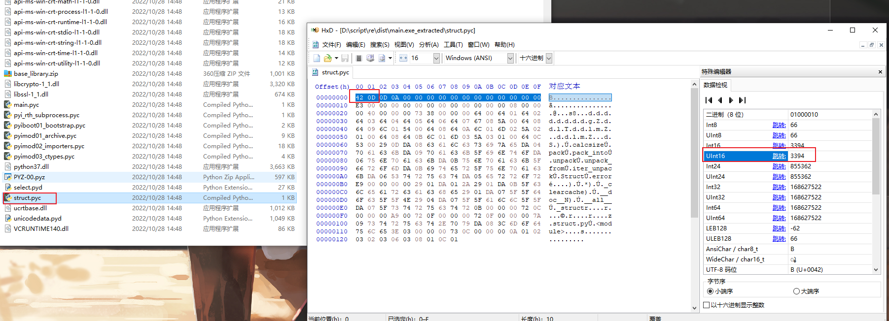
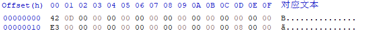
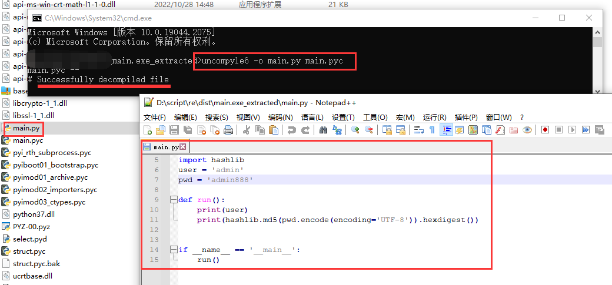

# 目标

在Windows下，逆向由Pyinstaller打包的exe文件，获取源码

本次仅考虑无`-key`参数的打包

# 环境

待逆向文件`main.exe`，当前电脑已经安装`Python 3.7`环境

<!--more-->

# 实现

## 一、解包

首先通过[PyInstaller Extractor](https://github.com/extremecoders-re/pyinstxtractor)将exe文件解包，具体方法为：

* 从上边的github链接，下载`pyinstxtractor.py`，并放到`main.exe`文件同一目录

* cmd进入文件所在目录，执行`python pyinstxtractor.py main.exe`，得到`main.exe_extracted`文件夹

## 二、逆向pyc

打开`main.exe_extracted`文件夹，即可轻易看到`main.pyc`文件（部分程序解包后只有类似`main`或者其他文件名的无后缀文件，这时候需要找到最有可能是主程序的无后缀文件手动添加`.pyc`后缀）；

但是使用pyinstaller打包的python程序，可能会去掉`.pyc`文件的`Magic Number`与时间戳信息，其中时间戳信息不重要，全部填充0即可，但是`Magic Number`与Python 版本挂钩，需要正确恢复。

### 2.1 pyc文件修复

#### 2.1.1 `Magic Number`获取

可查看`main.exe_extracted`文件夹下的类似于`python37.dll`文件，猜测本程序打包所使用的Python版本为`Python 3.7`，通过查找`Magic Number`与Python版本对照表（文末附录），可知其`Magic Number`可能为`3390`到`3394`之间；也可通过查找同目录下其他`.pyc`文件的`Magic Number`，最终得到其`Magic Number`确实为3394，16进制值为`42 0D`，如下图为`struct.pyc`文件的16进制值（通过HxD或其他Hex查看器）



而且通过观察发现，许多`.pyc`文件的第二行都是以`E3 00`开头。

#### 2.2.2 `main.pyc`修复

通过HxD工具打开`main.pyc`文件，惊奇的发现其并未缺失信息，因此不用修复；之前的几次逆向都是缺失的，如有缺失，只需要在`E3 00`前插入`42 0D 00 00 00 00 00 00 00 00 00 00 00 00`，确保第一行就是这个值，并且第二行以`E3 00`开头即可，如下图



### 2.2 逆向pyc

cmd到`main.pyc`文件所在目录，执行

```shell
pip install uncompyle6
uncompyle6 -o main.py main.pyc
```

即可得到如图，可知所有信息一览无余，千万别把密码写在客户端代码里哇



提示，如果项目有多个python文件，通常都在`PYZ-00.pyz_extracted`文件夹下，找到对应的`.pyc`文件，按照上边的方式逆向即可

# 附录

```
#     Python 1.5:   20121
#     Python 1.5.1: 20121
#     Python 1.5.2: 20121
#     Python 1.6:   50428
#     Python 2.0:   50823
#     Python 2.0.1: 50823
#     Python 2.1:   60202
#     Python 2.1.1: 60202
#     Python 2.1.2: 60202
#     Python 2.2:   60717
#     Python 2.3a0: 62011
#     Python 2.3a0: 62021
#     Python 2.3a0: 62011 (!)
#     Python 2.4a0: 62041
#     Python 2.4a3: 62051
#     Python 2.4b1: 62061
#     Python 2.5a0: 62071
#     Python 2.5a0: 62081 (ast-branch)
#     Python 2.5a0: 62091 (with)
#     Python 2.5a0: 62092 (changed WITH_CLEANUP opcode)
#     Python 2.5b3: 62101 (fix wrong code: for x, in ...)
#     Python 2.5b3: 62111 (fix wrong code: x += yield)
#     Python 2.5c1: 62121 (fix wrong lnotab with for loops and
#                          storing constants that should have been removed)
#     Python 2.5c2: 62131 (fix wrong code: for x, in ... in listcomp/genexp)
#     Python 2.6a0: 62151 (peephole optimizations and STORE_MAP opcode)
#     Python 2.6a1: 62161 (WITH_CLEANUP optimization)
#     Python 2.7a0: 62171 (optimize list comprehensions/change LIST_APPEND)
#     Python 2.7a0: 62181 (optimize conditional branches:
#                          introduce POP_JUMP_IF_FALSE and POP_JUMP_IF_TRUE)
#     Python 2.7a0  62191 (introduce SETUP_WITH)
#     Python 2.7a0  62201 (introduce BUILD_SET)
#     Python 2.7a0  62211 (introduce MAP_ADD and SET_ADD)
#     Python 3000:   3000
#                    3010 (removed UNARY_CONVERT)
#                    3020 (added BUILD_SET)
#                    3030 (added keyword-only parameters)
#                    3040 (added signature annotations)
#                    3050 (print becomes a function)
#                    3060 (PEP 3115 metaclass syntax)
#                    3061 (string literals become unicode)
#                    3071 (PEP 3109 raise changes)
#                    3081 (PEP 3137 make __file__ and __name__ unicode)
#                    3091 (kill str8 interning)
#                    3101 (merge from 2.6a0, see 62151)
#                    3103 (__file__ points to source file)
#     Python 3.0a4: 3111 (WITH_CLEANUP optimization).
#     Python 3.0b1: 3131 (lexical exception stacking, including POP_EXCEPT
                          #3021)
#     Python 3.1a1: 3141 (optimize list, set and dict comprehensions:
#                         change LIST_APPEND and SET_ADD, add MAP_ADD #2183)
#     Python 3.1a1: 3151 (optimize conditional branches:
#                         introduce POP_JUMP_IF_FALSE and POP_JUMP_IF_TRUE
                          #4715)
#     Python 3.2a1: 3160 (add SETUP_WITH #6101)
#                   tag: cpython-32
#     Python 3.2a2: 3170 (add DUP_TOP_TWO, remove DUP_TOPX and ROT_FOUR #9225)
#                   tag: cpython-32
#     Python 3.2a3  3180 (add DELETE_DEREF #4617)
#     Python 3.3a1  3190 (__class__ super closure changed)
#     Python 3.3a1  3200 (PEP 3155 __qualname__ added #13448)
#     Python 3.3a1  3210 (added size modulo 2**32 to the pyc header #13645)
#     Python 3.3a2  3220 (changed PEP 380 implementation #14230)
#     Python 3.3a4  3230 (revert changes to implicit __class__ closure #14857)
#     Python 3.4a1  3250 (evaluate positional default arguments before
#                        keyword-only defaults #16967)
#     Python 3.4a1  3260 (add LOAD_CLASSDEREF; allow locals of class to override
#                        free vars #17853)
#     Python 3.4a1  3270 (various tweaks to the __class__ closure #12370)
#     Python 3.4a1  3280 (remove implicit class argument)
#     Python 3.4a4  3290 (changes to __qualname__ computation #19301)
#     Python 3.4a4  3300 (more changes to __qualname__ computation #19301)
#     Python 3.4rc2 3310 (alter __qualname__ computation #20625)
#     Python 3.5a1  3320 (PEP 465: Matrix multiplication operator #21176)
#     Python 3.5b1  3330 (PEP 448: Additional Unpacking Generalizations #2292)
#     Python 3.5b2  3340 (fix dictionary display evaluation order #11205)
#     Python 3.5b3  3350 (add GET_YIELD_FROM_ITER opcode #24400)
#     Python 3.5.2  3351 (fix BUILD_MAP_UNPACK_WITH_CALL opcode #27286)
#     Python 3.6a0  3360 (add FORMAT_VALUE opcode #25483)
#     Python 3.6a1  3361 (lineno delta of code.co_lnotab becomes signed #26107)
#     Python 3.6a2  3370 (16 bit wordcode #26647)
#     Python 3.6a2  3371 (add BUILD_CONST_KEY_MAP opcode #27140)
#     Python 3.6a2  3372 (MAKE_FUNCTION simplification, remove MAKE_CLOSURE
#                         #27095)
#     Python 3.6b1  3373 (add BUILD_STRING opcode #27078)
#     Python 3.6b1  3375 (add SETUP_ANNOTATIONS and STORE_ANNOTATION opcodes
#                         #27985)
#     Python 3.6b1  3376 (simplify CALL_FUNCTIONs & BUILD_MAP_UNPACK_WITH_CALL
                          #27213)
#     Python 3.6b1  3377 (set __class__ cell from type.__new__ #23722)
#     Python 3.6b2  3378 (add BUILD_TUPLE_UNPACK_WITH_CALL #28257)
#     Python 3.6rc1 3379 (more thorough __class__ validation #23722)
#     Python 3.7a1  3390 (add LOAD_METHOD and CALL_METHOD opcodes #26110)
#     Python 3.7a2  3391 (update GET_AITER #31709)
#     Python 3.7a4  3392 (PEP 552: Deterministic pycs #31650)
#     Python 3.7b1  3393 (remove STORE_ANNOTATION opcode #32550)
#     Python 3.7b5  3394 (restored docstring as the first stmt in the body;
#                         this might affected the first line number #32911)
#     Python 3.8a1  3400 (move frame block handling to compiler #17611)
#     Python 3.8a1  3401 (add END_ASYNC_FOR #33041)
#     Python 3.8a1  3410 (PEP570 Python Positional-Only Parameters #36540)
#     Python 3.8b2  3411 (Reverse evaluation order of key: value in dict
#                         comprehensions #35224)
#     Python 3.8b2  3412 (Swap the position of positional args and positional
#                         only args in ast.argumehttps://blog.csdn.net/zheng__huang/article/details/112380221nts #37593)
#     Python 3.8b4  3413 (Fix "break" and "continue" in "finally" #37830)
```

> 参考1 [Python Uncompyle6 反编译工具使用 与 Magic Number 详解](https://blog.csdn.net/zheng__huang/article/details/112380221)