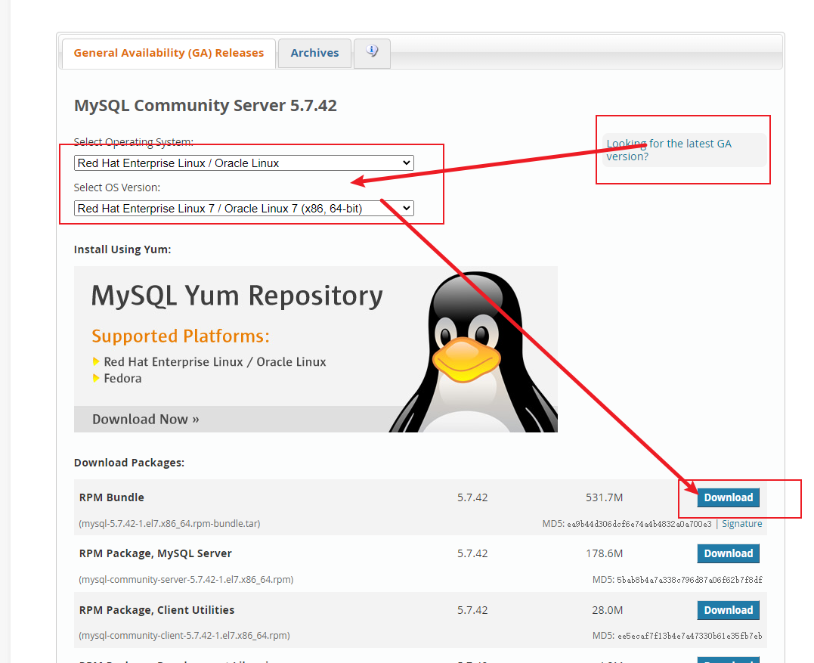

注意：以下环境基于CentOS 7.9 最小化（`Minimal`）系统（镜像文件名称为`CentOS-7-x86_64-Minimal-2207-02.iso`，988MB），其他系统或版本可能略有不同

系统下载链接：[CentOS Mirrors List](http://isoredirect.centos.org/centos/7/isos/x86_64/)

<!--more-->

所用安装包以及系统，如果不方便在官网下载，可通过下边的方式下载

* 百度网盘
  
  链接：[https://pan.baidu.com/s/1pAKhFt5kEfHmflH1d8z1Lw?pwd=yink](https://pan.baidu.com/s/1pAKhFt5kEfHmflH1d8z1Lw?pwd=yink) 
  
  提取码：yink

* 迅雷云盘
  
  链接：[https://pan.xunlei.com/s/VNV3oKC6Tsmy9sC2hKVaDTgPA1#](https://pan.xunlei.com/s/VNV3oKC6Tsmy9sC2hKVaDTgPA1#)
  
  提取码：xb9a

## 1、JDK 8

下载链接：[Java Downloads | Oracle](https://www.oracle.com/java/technologies/downloads/#java8)

下载rpm版，安装：

```shell
rpm -ivh jdk-8u371-linux-x64.rpm
```

安装后jdk路径为`/usr/java/jdk1.8.0-x64`

如无特别需要，通过rpm方式安装的jdk无需额外配置环境变量

## 2、MySQL 5.7

yum安装可以参考[centos7 安装 Mysql 5.7.28，详细完整教程-腾讯云开发者社区-腾讯云](https://cloud.tencent.com/developer/beta/article/1886339)，以下为普通安装，使用yum安装可以跳到2.3

下载链接：[MySQL :: Download MySQL Community Server](https://dev.mysql.com/downloads/mysql/)

**推荐5.7.42版本**



### 2.1 卸载已有mariadb

首先检查下系统是否有`mariadb`，有则卸载（注意把`mariadb-libs`换成自己搜索到的包名）

```shell
rpm -qa |grep mariadb

rpm -e --nodeps mariadb-libs
```

### 2.2 安装

下载后解压得到一堆rpm文件，用到其中的common、libs、client、server，先后安装如下：

```shell
rpm -ivh mysql-community-common-5.7.42-1.el7.x86_64.rpm
rpm -ivh mysql-community-libs-5.7.42-1.el7.x86_64.rpm
rpm -ivh mysql-community-client-5.7.42-1.el7.x86_64.rpm
yum -y install perl.x86_64 # 如果已安装，无需此步
yum -y install net-tools.x86_64 # 如果已安装，无需此步
rpm -ivh mysql-community-server-5.7.42-1.el7.x86_64.rpm
```

### 2.3 设置开机自启并启动mysql

```shell
systemctl daemon-reload
systemctl enable mysqld
systemctl start mysqld
```

### 2.4 修改密码

获取安装时默认的密码，最后冒号之后的就是密码

```shell
grep 'temporary password' /var/log/mysqld.log
```

登录并修改密码（初始密码不能进行其他操作）

```shell
mysql -uroot -p
# 然后输入初始密码后回车
# 下边的操作解除密码规则限制
mysql> set global validate_password_policy=0;
mysql> set global validate_password_length=1;
# 设置密码为`yourpassword`，替换为自己的密码
set password for root@localhost=password("yourpassword");
# 允许其他机器远程登录，记得把密码改成自己的
GRANT ALL PRIVILEGES ON *.* TO 'root'@'%' IDENTIFIED BY 'yourpassword';
FLUSH PRIVILEGES;
# 退出mysql命令行
exit
```

### 2.5 修改配置文件

```shell
vim /etc/my.cnf
```

```cnf
[mysql]
default-character-set=utf8

[mysqld]
datadir=/var/lib/mysql
socket=/var/lib/mysql/mysql.sock
default-storage-engine=INNODB
character_set_server=utf8

symbolic-links=0

log-error=/var/log/mysqld.log
pid-file=/var/run/mysqld/mysqld.pid

sql_mode=STRICT_TRANS_TABLES,NO_ZERO_IN_DATE,NO_ZERO_DATE,ERROR_FOR_DIVISION_BY_ZERO,NO_AUTO_CREATE_USER,NO_ENGINE_SUBSTITUTION
lower_case_table_names=1
```

重启mysql

```shell
service mysqld restart
```

### 2.6 防火墙开放3306端口

```shell
# 查看状态
firewall-cmd --state
# 开放端口
firewall-cmd --zone=public --add-port=3306/tcp --permanent
# 重载
firewall-cmd --reload
```

### 2.7 创建用户

创建数据库并创建用户授权该数据库（先进入mysql命令行）

```sql
create database nacos;
# 改为自己的密码
CREATE USER 'nacos'@'%' IDENTIFIED BY 'yourpassword';
GRANT all privileges ON nacos.* TO 'nacos'@'%';
```

## 3、naocs

下载链接：[Releases · alibaba/nacos · GitHub](https://github.com/alibaba/nacos/releases)

**推荐2.1.1版本，2.2之后的版本需要额外的秘钥配置**

### 3.1 解压并移动

```shell
tar -zxvf nacos-server-2.1.1.tar.gz
mv nacos /usr/local/nacos
cd /usr/local/nacos
```

### 3.2 修改配置

`vi conf/application.properties`，把其中以下行解开注释，并配置自己的mysql信息

```shell
db.num=1

db.url.0=jdbc:mysql...
db.user.0=xxx
db.password.0=xxx
```

### 3.3 初始化nacos数据库

进入mysql命令行，sql文件在`/usr/local/nacos/conf/mysql-schema.sql`

```sql
use naocs;
source /usr/local/nacos/conf/mysql-schema.sql
exit
```

### 3.4 放开8848端口

```shell
# 开放端口
firewall-cmd --zone=public --add-port=8848/tcp --permanent
# 重载
firewall-cmd --reload
```

### 3.5 把nacos做成服务并开机自启

```shell
vim /lib/systemd/system/nacos.service
```

```systemd
[Unit]
Description=nacos
After=network.target

[Service]
Type=forking
ExecStart=/usr/local/nacos/bin/startup.sh -m standalone
ExecReload=/usr/local/nacos/bin/shutdown.sh
ExecStop=/usr/local/nacos/bin/shutdown.sh
PrivateTmp=true

[Install]  
WantedBy=multi-user.target
```

设置开机自启并启动

```shell
systemctl daemon-reload
systemctl enable nacos.service
systemctl start nacos.service
```

## 4、redis

在线安装

```shell
yum install -y epel-release
yum -y update
yum install -y redis
# 常用命令 启动/停止/重启/设置开机自启
systemctl start/stop/restart/enable redis
```

配置文件在`/etc/redis.conf`

以下为普通安装，如果使用在线安装，只需要做4.3、4.5和4.6

下载链接：[Download | Redis](https://redis.io/download/)

**推荐5.0.14版本**

### 4.1 解压并移动

```shell
tar -zxvf redis-5.0.14.tar.gz
mv redis-5.0.14 /usr/local/redis
cd /usr/local/redis
```

### 4.2 安装依赖并编译

```shell
yum -y install gcc automake autoconf libtool make
make && make install
```

### 4.3 修改配置文件

`vim /usr/local/redis/redis.conf`，其他保持默认

```conf
daemonize yes
bind 0.0.0.0
protected-mode no
requirepass 你的密码
```

### 4.4 把redis做成服务

```shell
vim /usr/lib/systemd/system/redis.service
```

```systemd
[Unit]
Description=redis
After=network.target

[Service]
Type=forking
PIDFile=/var/run/redis_6379.pid
ExecStart=/usr/local/redis/src/redis-server /usr/local/redis/redis.conf
ExecReload=/bin/kill -s HUP $MAINPID
ExecStop=/bin/kill -s QUIT $MAINPID
PrivateTmp=true

[Install]
WantedBy=multi-user.target
```

### 4.5 设置开机自启并启动

```shell
systemctl daemon-reload
systemctl enable redis.service
systemctl start redis.service
```

### 4.6 放开6379端口

```shell
# 开放端口
firewall-cmd --zone=public --add-port=6379/tcp --permanent
# 重载
firewall-cmd --reload
```

## 5、nginx

### 5.1 安装

配置EPEL源

```shell
yum install -y epel-release
yum -y update
```

安装nginx

```shell
yum install -y nginx
```

安装完成后：

* 默认网站目录为`/usr/share/nginx/html`

* 默认配置文件在`/etc/nginx/nginx.conf`

* 自定义配置文件目录为`/etc/nginx/conf.d/`

### 5.2 设置开机自启并启动

```shell
systemctl enable nginx
systemctl start nginx
```

### 5.3 放开端口

```shell
# 开放端口
firewall-cmd --zone=public --add-port=80/tcp --permanent
firewall-cmd --zone=public --add-port=443/tcp --permanent
# 重载
firewall-cmd --reload
```