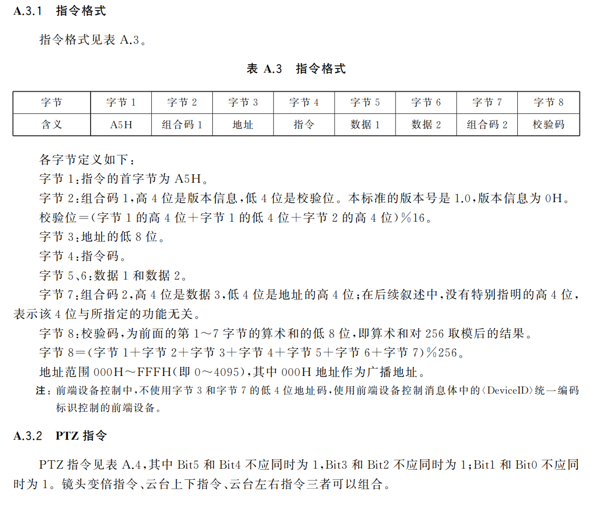
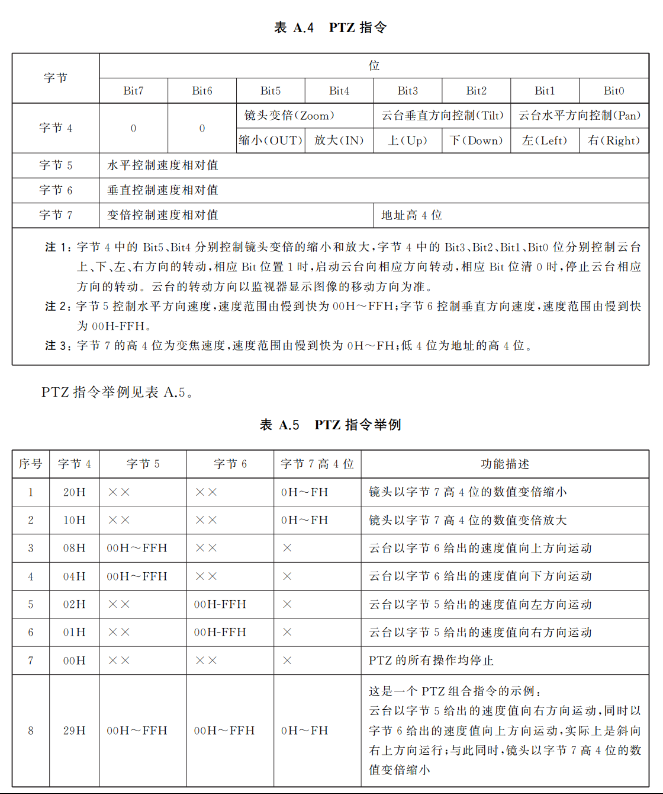
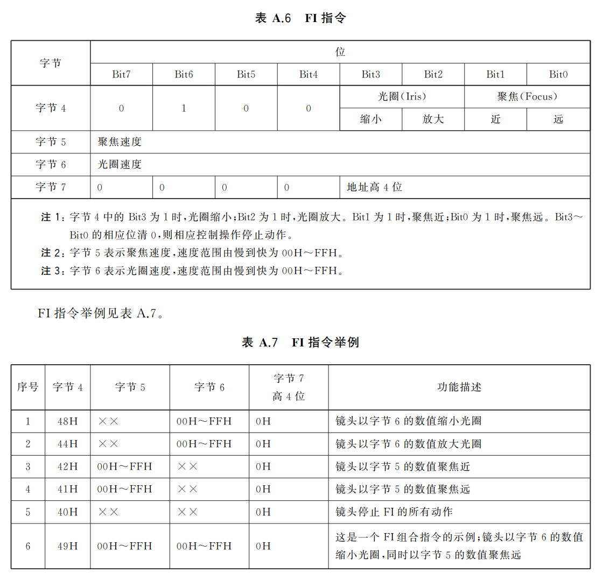
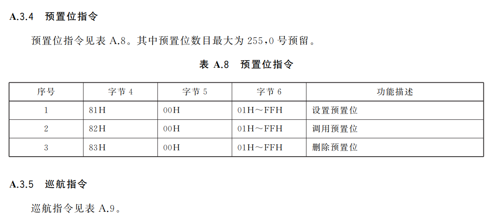
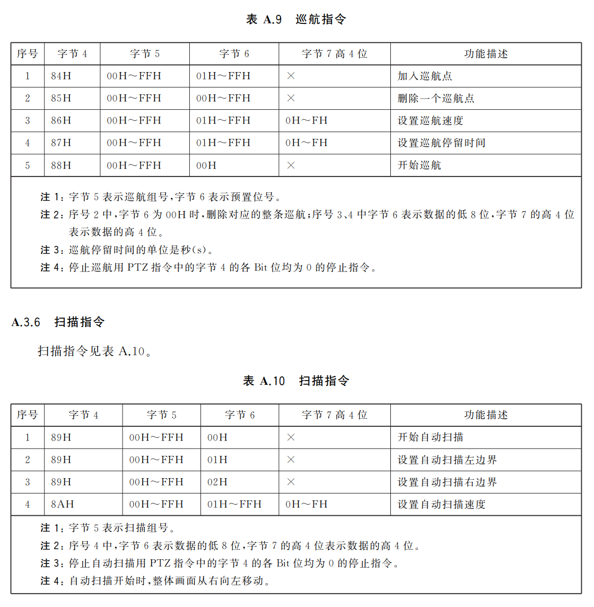
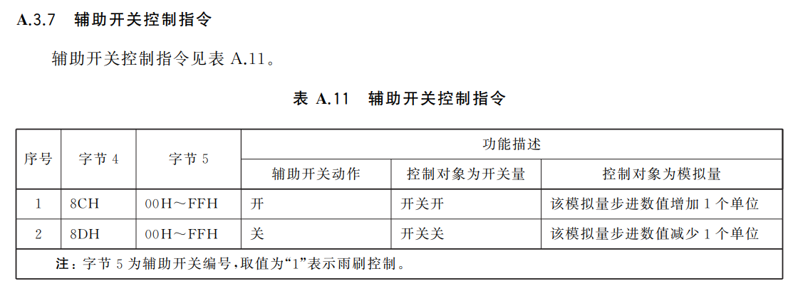

# 目标

记录GB28181交互过程，以便相关开发研究

<!--more-->

# 实现

## 一. 环境

#### 客户端

地址：192.168.6.71

端口：5060

编码：34020000001320000002

通道编号：34020000001310000001

报警通道编号：34020000001340000001

#### 服务端

地址：192.168.6.106

端口：5062

编码：34020000002000000010

域：3402000000

## 二、抓包报文

### 1. 注册相关

#### 1.1 注册

客户端->服务端

``````sip
REGISTER sip:34020000002000000010@192.168.6.106:5062 SIP/2.0
Via: SIP/2.0/UDP 192.168.6.71:5060;rport;branch=z9hG4bK1251336551
Route: <sip:34020000001320000002@192.168.6.106:5062;lr>
From: <sip:34020000001320000002@192.168.6.71:5060>;tag=2088733642
To: <sip:34020000001320000002@192.168.6.71:5060>
Call-ID: 1881196343@192.168.6.71
CSeq: 1 REGISTER
Contact: <sip:34020000001320000002@192.168.6.71:5060>
Max-Forwards: 70
User-Agent: SIP UAS V3.0.0.675168
Expires: 3600
Content-Length: 0


``````

服务端->客户端

```
SIP/2.0 401 Unauthorized
Via: SIP/2.0/UDP 192.168.6.71:5060;rport=5060;branch=z9hG4bK1251336551
From: <sip:34020000001320000002@192.168.6.71:5060>;tag=2088733642
To: <sip:34020000001320000002@192.168.6.71:5060>;tag=3241172924
Call-ID: 1881196343@192.168.6.71
CSeq: 1 REGISTER
User-Agent: eXosip/4.1.0
WWW-Authenticate: Digest realm="34020000",algorithm=MD5,nonce="1715926053"
Date: 2024-05-17T14:07:33.232
Content-Length: 0


```

客户端->服务端

```
Via: SIP/2.0/UDP 192.168.6.71:5060;rport;branch=z9hG4bK1442331620
Route: <sip:34020000001320000002@192.168.6.106:5062;lr>
From: <sip:34020000001320000002@192.168.6.71:5060>;tag=2088733642
To: <sip:34020000001320000002@192.168.6.71:5060>
Call-ID: 1881196343@192.168.6.71
CSeq: 2 REGISTER
Contact: <sip:34020000001320000002@192.168.6.71:5060>
Authorization: Digest username="34020000001320000002", realm="34020000", nonce="1715926053", uri="sip:34020000002000000010@192.168.6.106:5062", response="fa983ee8abd2b6ff36b857c660b06f67", algorithm=MD5
Max-Forwards: 70
User-Agent: SIP UAS V3.0.0.675168
Expires: 3600
Content-Length: 0


```

服务端->客户端

```
SIP/2.0 200 OK
Via: SIP/2.0/UDP 192.168.6.71:5060;rport=5060;branch=z9hG4bK1442331620
From: <sip:34020000001320000002@192.168.6.71:5060>;tag=2088733642
To: <sip:34020000001320000002@192.168.6.71:5060>;tag=3666500293
Call-ID: 1881196343@192.168.6.71
CSeq: 2 REGISTER
User-Agent: eXosip/4.1.0
Date: 2024-05-17T14:07:33.263
Content-Length: 0


```

#### 1.2 心跳

客户端->服务端

```
MESSAGE sip:34020000002000000010@192.168.6.106:5062 SIP/2.0
Via: SIP/2.0/UDP 192.168.6.71:5060;rport;branch=z9hG4bK677047196
From: <sip:34020000001320000002@192.168.6.71:5060>;tag=1166693770
To: <sip:34020000002000000010@192.168.6.106:5062>
Call-ID: 632317300@192.168.6.71
CSeq: 20 MESSAGE
Max-Forwards: 70
User-Agent: SIP UAS V3.0.0.675168
Content-Type: Application/MANSCDP+xml
Content-Length:   180

<?xml version="1.0" encoding="GB2312" ?>
<Notify>
    <CmdType>Keepalive</CmdType>
    <SN>539</SN>
    <DeviceID>34020000001320000002</DeviceID>
    <Status>OK</Status>
</Notify>

```

服务端->客户端

```
SIP/2.0 200 OK
Via: SIP/2.0/UDP 192.168.6.71:5060;rport=5060;branch=z9hG4bK677047196
From: <sip:34020000001320000002@192.168.6.71:5060>;tag=1166693770
To: <sip:34020000002000000010@192.168.6.106:5062>;tag=2798064128
Call-ID: 632317300@192.168.6.71
CSeq: 20 MESSAGE
User-Agent: eXosip/4.1.0
Content-Length: 0


```

### 2. 设备查询

#### 2.1 Catalog

服务端->客户端

```
MESSAGE sip:34020000001320000002@192.168.6.71:5060 SIP/2.0
Via: SIP/2.0/UDP 192.168.6.106:5062;rport;branch=z9hG4bK3012865820
From: <sip:34020000002000000010@192.168.6.106:5062>;tag=842983226
To: <sip:34020000001320000002@192.168.6.71:5060>
Call-ID: 2898046025
CSeq: 20 MESSAGE
Content-Type: application/MANSCDP+xml
Max-Forwards: 70
User-Agent: eXosip/4.1.0
Date: 2024-05-17T14:18:02.573
Content-Length:   125

<?xml version="1.0"?>
<Query>
<CmdType>Catalog</CmdType>
<SN>7</SN>
<DeviceID>34020000001320000002</DeviceID>
</Query>

```

客户端->服务端

```
SIP/2.0 200 OK
Via: SIP/2.0/UDP 192.168.6.106:5062;rport=5062;branch=z9hG4bK3012865820
From: <sip:34020000002000000010@192.168.6.106:5062>;tag=842983226
To: <sip:34020000001320000002@192.168.6.71:5060>;tag=1838534428
Call-ID: 2898046025
CSeq: 20 MESSAGE
User-Agent: SIP UAS V3.0.0.675168
Content-Length: 0


```

```
MESSAGE sip:34020000002000000010@192.168.6.106:5062 SIP/2.0
Via: SIP/2.0/UDP 192.168.6.71:5060;rport;branch=z9hG4bK1121513722
From: <sip:34020000001320000002@192.168.6.71:5060>;tag=616675198
To: <sip:34020000002000000010@192.168.6.106:5062>
Call-ID: 140588148@192.168.6.71
CSeq: 20 MESSAGE
Max-Forwards: 70
User-Agent: SIP UAS V3.0.0.675168
Content-Type: Application/MANSCDP+xml
Content-Length:   898

<?xml version="1.0" encoding="GB2312" ?>
<Response>
    <CmdType>Catalog</CmdType>
    <SN>7</SN>
    <DeviceID>34020000001320000002</DeviceID>
    <SumNum>1</SumNum>
    <DeviceList Num="1">
        <Item>
            <DeviceID>34020000001310000001</DeviceID>
            <Name>DH71</Name>
            <Manufacturer>Dahua</Manufacturer>
            <Model>DH-SD-6C3230UE-HN</Model>
            <Owner>0</Owner>
            <CivilCode>340200</CivilCode>
            <Address>axy</Address>
            <Parental>0</Parental>
            <ParentID>34020000001320000002</ParentID>
            <RegisterWay>1</RegisterWay>
            <Secrecy>0</Secrecy>
            <StreamNum>2</StreamNum>
            <Status>ON</Status>
            <Info>
                <PTZType>3</PTZType>
                <DownloadSpeed>1/2/4/8</DownloadSpeed>
            </Info>
        </Item>
    </DeviceList>
</Response>

```

服务端->客户端

```
SIP/2.0 200 OK
Via: SIP/2.0/UDP 192.168.6.71:5060;rport=5060;branch=z9hG4bK1121513722
From: <sip:34020000001320000002@192.168.6.71:5060>;tag=616675198
To: <sip:34020000002000000010@192.168.6.106:5062>;tag=1904472289
Call-ID: 140588148@192.168.6.71
CSeq: 20 MESSAGE
User-Agent: eXosip/4.1.0
Content-Length: 0


```

#### 2.2 DeviceInfo

服务端->客户端

```
MESSAGE sip:34020000001320000002@192.168.6.71:5060 SIP/2.0
Via: SIP/2.0/UDP 192.168.6.106:5062;rport;branch=z9hG4bK2342238638
From: <sip:34020000002000000010@192.168.6.106:5062>;tag=1499615989
To: <sip:34020000001320000002@192.168.6.71:5060>
Call-ID: 2283720204
CSeq: 20 MESSAGE
Content-Type: application/MANSCDP+xml
Max-Forwards: 70
User-Agent: eXosip/4.1.0
Date: 2024-05-17T14:22:30.292
Content-Length:   128

<?xml version="1.0"?>
<Query>
<CmdType>DeviceInfo</CmdType>
<SN>9</SN>
<DeviceID>34020000001320000002</DeviceID>
</Query>

```

客户端->服务端

```
SIP/2.0 200 OK
Via: SIP/2.0/UDP 192.168.6.106:5062;rport=5062;branch=z9hG4bK2342238638
From: <sip:34020000002000000010@192.168.6.106:5062>;tag=1499615989
To: <sip:34020000001320000002@192.168.6.71:5060>;tag=1276142286
Call-ID: 2283720204
CSeq: 20 MESSAGE
User-Agent: SIP UAS V3.0.0.675168
Content-Length: 0


```

```
MESSAGE sip:34020000002000000010@192.168.6.106:5062 SIP/2.0
Via: SIP/2.0/UDP 192.168.6.71:5060;rport;branch=z9hG4bK1885711354
From: <sip:34020000001320000002@192.168.6.71:5060>;tag=164383918
To: <sip:34020000002000000010@192.168.6.106:5062>
Call-ID: 107554108@192.168.6.71
CSeq: 20 MESSAGE
Max-Forwards: 70
User-Agent: SIP UAS V3.0.0.675168
Content-Type: Application/MANSCDP+xml
Content-Length:   559

<?xml version="1.0" encoding="GB2312" ?>
<Response>
    <CmdType>DeviceInfo</CmdType>
    <SN>9</SN>
    <DeviceID>34020000001320000002</DeviceID>
    <DeviceName>DH-SD-6C3230UE-HN</DeviceName>
    <Result>OK</Result>
    <DeviceType>SD</DeviceType>
    <Manufacturer>Dahua</Manufacturer>
    <Model>DH-SD-6C3230UE-HN</Model>
    <Firmware>2.623.0000000.17.R,2019-01-19</Firmware>
    <MaxCamera>1</MaxCamera>
    <MaxAlarm>2</MaxAlarm>
    <Channel>1</Channel>
    <Port>80</Port>
    <LoginName>admin</LoginName>
    <Password>******</Password>
</Response>

```

服务端->客户端

```
SIP/2.0 200 OK
Via: SIP/2.0/UDP 192.168.6.71:5060;rport=5060;branch=z9hG4bK1885711354
From: <sip:34020000001320000002@192.168.6.71:5060>;tag=164383918
To: <sip:34020000002000000010@192.168.6.106:5062>;tag=3627078230
Call-ID: 107554108@192.168.6.71
CSeq: 20 MESSAGE
User-Agent: eXosip/4.1.0
Content-Length: 0


```

#### 2.3 DeviceStatus

服务端->客户端

```
MESSAGE sip:34020000001320000002@192.168.6.71:5060 SIP/2.0
Via: SIP/2.0/UDP 192.168.6.106:5062;rport;branch=z9hG4bK1466769672
From: <sip:34020000002000000010@192.168.6.106:5062>;tag=793798457
To: <sip:34020000001320000002@192.168.6.71:5060>
Call-ID: 639275922
CSeq: 20 MESSAGE
Content-Type: application/MANSCDP+xml
Max-Forwards: 70
User-Agent: eXosip/4.1.0
Date: 2024-05-17T14:24:54.979
Content-Length:   131

<?xml version="1.0"?>
<Query>
<CmdType>DeviceStatus</CmdType>
<SN>10</SN>
<DeviceID>34020000001320000002</DeviceID>
</Query>

```

客户端->服务端

```
SIP/2.0 200 OK
Via: SIP/2.0/UDP 192.168.6.106:5062;rport=5062;branch=z9hG4bK1466769672
From: <sip:34020000002000000010@192.168.6.106:5062>;tag=793798457
To: <sip:34020000001320000002@192.168.6.71:5060>;tag=1375134481
Call-ID: 639275922
CSeq: 20 MESSAGE
User-Agent: SIP UAS V3.0.0.675168
Content-Length: 0


```

```
MESSAGE sip:34020000002000000010@192.168.6.106:5062 SIP/2.0
Via: SIP/2.0/UDP 192.168.6.71:5060;rport;branch=z9hG4bK1852218770
From: <sip:34020000001320000002@192.168.6.71:5060>;tag=2099459286
To: <sip:34020000002000000010@192.168.6.106:5062>
Call-ID: 1675775636@192.168.6.71
CSeq: 20 MESSAGE
Max-Forwards: 70
User-Agent: SIP UAS V3.0.0.675168
Content-Type: Application/MANSCDP+xml
Content-Length:   639

<?xml version="1.0" encoding="GB2312" ?>
<Response>
    <CmdType>DeviceStatus</CmdType>
    <SN>10</SN>
    <DeviceID>34020000001320000002</DeviceID>
    <Result>OK</Result>
    <Online>ONLINE</Online>
    <Status>OK</Status>
    <DeviceTime>2024-05-17T14:24:54</DeviceTime>
    <Encode>ON</Encode>
    <Record>OFF</Record>
    <Alarmstatus Num="2">
        <Item>
            <DeviceID>34020000001340000001</DeviceID>
            <DutyStatus>ONDUTY</DutyStatus>
        </Item>
        <Item>
            <DeviceID>34020000001340000002</DeviceID>
            <DutyStatus>ONDUTY</DutyStatus>
        </Item>
    </Alarmstatus>
</Response>

```

服务端->客户端

```
SIP/2.0 200 OK
Via: SIP/2.0/UDP 192.168.6.71:5060;rport=5060;branch=z9hG4bK1852218770
From: <sip:34020000001320000002@192.168.6.71:5060>;tag=2099459286
To: <sip:34020000002000000010@192.168.6.106:5062>;tag=3863402345
Call-ID: 1675775636@192.168.6.71
CSeq: 20 MESSAGE
User-Agent: eXosip/4.1.0
Content-Length: 0


```

### 3. 设备点播

#### 3.1 播放

服务端->客户端

```
INVITE sip:34020000001310000001@192.168.6.71:5060 SIP/2.0
Via: SIP/2.0/UDP 192.168.6.106:5062;rport;branch=z9hG4bK2420824424
From: <sip:34020000002000000010@192.168.6.106:5062>;tag=4086715875
To: <sip:34020000001310000001@192.168.6.71:5060>
Call-ID: 1316183468
CSeq: 20 INVITE
Contact: <sip:34020000002000000010@192.168.6.106:5062>
Content-Type: application/sdp
Max-Forwards: 70
User-Agent: eXosip/4.1.0
Date: 2024-05-17T14:32:48.919
Subject: 34020000001320000002:04020000001320000002,34020000002000000010:1002
Content-Length:   226

v=0
o=34020000002000000010 0 0 IN IP4 192.168.6.106
s=Play
c=IN IP4 192.168.6.106
t=0 0
m=video 45056 RTP/AVP 96 98 97
a=recvonly
a=rtpmap:96 PS/90000
a=rtpmap:98 H264/90000
a=rtpmap:97 MPEG4/90000
y=0000001002
f=

```

客户端->服务端

```
SIP/2.0 100 Trying
Via: SIP/2.0/UDP 192.168.6.106:5062;rport=5062;branch=z9hG4bK2420824424
From: <sip:34020000002000000010@192.168.6.106:5062>;tag=4086715875
To: <sip:34020000001310000001@192.168.6.71:5060>
Call-ID: 1316183468
CSeq: 20 INVITE
User-Agent: SIP UAS V3.0.0.675168
Content-Length: 0


```

```
SIP/2.0 101 Dialog Establishement
Via: SIP/2.0/UDP 192.168.6.106:5062;rport=5062;branch=z9hG4bK2420824424
From: <sip:34020000002000000010@192.168.6.106:5062>;tag=4086715875
To: <sip:34020000001310000001@192.168.6.71:5060>;tag=1504032660
Call-ID: 1316183468
CSeq: 20 INVITE
Contact: <sip:34020000001310000001@192.168.6.71:5060>
User-Agent: SIP UAS V3.0.0.675168
Content-Length: 0


```

```
SIP/2.0 200 OK
Via: SIP/2.0/UDP 192.168.6.106:5062;rport=5062;branch=z9hG4bK2420824424
From: <sip:34020000002000000010@192.168.6.106:5062>;tag=4086715875
To: <sip:34020000001310000001@192.168.6.71:5060>;tag=1504032660
Call-ID: 1316183468
CSeq: 20 INVITE
Contact: <sip:34020000001310000001@192.168.6.71:5060>
User-Agent: SIP UAS V3.0.0.675168
Content-Type: application/sdp
Content-Length:   224

v=0
o=34020000001310000001 0 0 IN IP4 192.168.6.71
s=Play
i=VCam Live Video
c=IN IP4 192.168.6.71
t=0 0
m=video 9712 RTP/AVP 96
a=sendonly
a=rtpmap:96 PS/90000
a=streamprofile:0
y=0000001002
f=v/0/0/0/0/0a/0/0/0

```

服务端->客户端

```
ACK sip:34020000001310000001@192.168.6.71:5060 SIP/2.0
Via: SIP/2.0/UDP 192.168.6.106:5062;rport;branch=z9hG4bK1703481534
From: <sip:34020000002000000010@192.168.6.106:5062>;tag=4086715875
To: <sip:34020000001310000001@192.168.6.71:5060>;tag=1504032660
Call-ID: 1316183468
CSeq: 20 ACK
Contact: <sip:34020000002000000010@192.168.6.106:5062>
Max-Forwards: 70
User-Agent: eXosip/4.1.0
Content-Length: 0


```

然后就是媒体推流

#### 3.2 停止播放

服务端->客户端

```
BYE sip:34020000001310000001@192.168.6.71:5060 SIP/2.0
Via: SIP/2.0/UDP 192.168.6.106:5062;rport;branch=z9hG4bK3131645526
From: <sip:34020000002000000010@192.168.6.106:5062>;tag=4086715875
To: <sip:34020000001310000001@192.168.6.71:5060>;tag=1504032660
Call-ID: 1316183468
CSeq: 21 BYE
Contact: <sip:34020000002000000010@192.168.6.106:5062>
Max-Forwards: 70
User-Agent: eXosip/4.1.0
Content-Length: 0


```

客户端->服务端

```
SIP/2.0 200 OK
Via: SIP/2.0/UDP 192.168.6.106:5062;rport=5062;branch=z9hG4bK3131645526
From: <sip:34020000002000000010@192.168.6.106:5062>;tag=4086715875
To: <sip:34020000001310000001@192.168.6.71:5060>;tag=1504032660
Call-ID: 1316183468
CSeq: 21 BYE
User-Agent: SIP UAS V3.0.0.675168
Content-Length: 0


```

### 4. 云台控制

#### 4.1 PTZ指令（上开始，速度100）

服务端->客户端

```
MESSAGE sip:34020000001320000002@192.168.6.71:5060 SIP/2.0
Via: SIP/2.0/UDP 192.168.6.106:5062;rport;branch=z9hG4bK3624414955
From: <sip:34020000002000000010@192.168.6.106:5062>;tag=3814588192
To: <sip:34020000001320000002@192.168.6.71:5060>
Call-ID: 1922970359
CSeq: 20 MESSAGE
Content-Type: application/MANSCDP+xml
Max-Forwards: 70
User-Agent: eXosip/4.1.0
Date: 2024-05-17T14:36:53.107
Content-Length:   171

<?xml version="1.0"?>
<Control>
<CmdType>DeviceControl</CmdType>
<SN>16</SN>
<DeviceID>34020000001310000001</DeviceID>
<PTZCmd>A50F000800640020</PTZCmd>
</Control>

```

客户端->服务端

```
SIP/2.0 200 OK
Via: SIP/2.0/UDP 192.168.6.106:5062;rport=5062;branch=z9hG4bK3624414955
From: <sip:34020000002000000010@192.168.6.106:5062>;tag=3814588192
To: <sip:34020000001320000002@192.168.6.71:5060>;tag=861562331
Call-ID: 1922970359
CSeq: 20 MESSAGE
User-Agent: SIP UAS V3.0.0.675168
Content-Length: 0


```

#### 4.2 PTZ指令（停止）

服务端->客户端

```
MESSAGE sip:34020000001320000002@192.168.6.71:5060 SIP/2.0
Via: SIP/2.0/UDP 192.168.6.106:5062;rport;branch=z9hG4bK653231184
From: <sip:34020000002000000010@192.168.6.106:5062>;tag=3593600802
To: <sip:34020000001320000002@192.168.6.71:5060>
Call-ID: 3688133832
CSeq: 20 MESSAGE
Content-Type: application/MANSCDP+xml
Max-Forwards: 70
User-Agent: eXosip/4.1.0
Date: 2024-05-17T14:36:54.107
Content-Length:   171

<?xml version="1.0"?>
<Control>
<CmdType>DeviceControl</CmdType>
<SN>17</SN>
<DeviceID>34020000001310000001</DeviceID>
<PTZCmd>A50F0000000000B4</PTZCmd>
</Control>

```

客户端->服务端

```
SIP/2.0 200 OK
Via: SIP/2.0/UDP 192.168.6.106:5062;rport=5062;branch=z9hG4bK653231184
From: <sip:34020000002000000010@192.168.6.106:5062>;tag=3593600802
To: <sip:34020000001320000002@192.168.6.71:5060>;tag=1071595393
Call-ID: 3688133832
CSeq: 20 MESSAGE
User-Agent: SIP UAS V3.0.0.675168
Content-Length: 0


```

#### 4.3 `PTZCmd`值的解释

摘自GB/T 28181-2016，以下为图片，不可复制





#### 4.4 FI指令（聚焦+）

服务端->客户端

```
MESSAGE sip:34020000001320000002@192.168.6.71:5060 SIP/2.0
Via: SIP/2.0/UDP 192.168.6.106:5062;rport;branch=z9hG4bK1893957204
From: <sip:34020000002000000010@192.168.6.106:5062>;tag=83028286
To: <sip:34020000001320000002@192.168.6.71:5060>
Call-ID: 3665056612
CSeq: 20 MESSAGE
Content-Type: application/MANSCDP+xml
Max-Forwards: 70
User-Agent: eXosip/4.1.0
Date: 2024-05-17T15:05:55.294
Content-Length:   171

<?xml version="1.0"?>
<Control>
<CmdType>DeviceControl</CmdType>
<SN>24</SN>
<DeviceID>34020000001310000001</DeviceID>
<PTZCmd>A50F004100640059</PTZCmd>
</Control>

```

客户端->服务端

```
SIP/2.0 200 OK
Via: SIP/2.0/UDP 192.168.6.106:5062;rport=5062;branch=z9hG4bK1893957204
From: <sip:34020000002000000010@192.168.6.106:5062>;tag=83028286
To: <sip:34020000001320000002@192.168.6.71:5060>;tag=1815986646
Call-ID: 3665056612
CSeq: 20 MESSAGE
User-Agent: SIP UAS V3.0.0.675168
Content-Length: 0


```

#### 4.5 FI指令（停止）

服务端->客户端

```
MESSAGE sip:34020000001320000002@192.168.6.71:5060 SIP/2.0
Via: SIP/2.0/UDP 192.168.6.106:5062;rport;branch=z9hG4bK1990600059
From: <sip:34020000002000000010@192.168.6.106:5062>;tag=2805834034
To: <sip:34020000001320000002@192.168.6.71:5060>
Call-ID: 3546884413
CSeq: 20 MESSAGE
Content-Type: application/MANSCDP+xml
Max-Forwards: 70
User-Agent: eXosip/4.1.0
Date: 2024-05-17T15:05:56.294
Content-Length:   171

<?xml version="1.0"?>
<Control>
<CmdType>DeviceControl</CmdType>
<SN>25</SN>
<DeviceID>34020000001310000001</DeviceID>
<PTZCmd>A50F0000000000B4</PTZCmd>
</Control>

```

客户端->服务端

```
SIP/2.0 200 OK
Via: SIP/2.0/UDP 192.168.6.106:5062;rport=5062;branch=z9hG4bK1990600059
From: <sip:34020000002000000010@192.168.6.106:5062>;tag=2805834034
To: <sip:34020000001320000002@192.168.6.71:5060>;tag=1218760507
Call-ID: 3546884413
CSeq: 20 MESSAGE
User-Agent: SIP UAS V3.0.0.675168
Content-Length: 0


```

#### 4.6 `FI`指令解释

摘自GB/T 28181-2016，以下为图片，不可复制




#### 4.7 其他指令解析

摘自GB/T 28181-2016，以下为图片，不可复制







### 5. 录像相关

前面的客户端不支持录像，故客户端更改如下

地址：192.168.6.60

端口：5060

编码：34020000001110000001

通道编号：34020000001310000001

#### 5.1 查询录像

服务端->客户端

```
MESSAGE sip:34020000001110000001@192.168.6.60:5060 SIP/2.0
Via: SIP/2.0/UDP 192.168.6.106:5062;rport;branch=z9hG4bK1014846848
From: <sip:34020000002000000010@192.168.6.106:5062>;tag=1030020984
To: <sip:34020000001110000001@192.168.6.60:5060>
Call-ID: 455132672
CSeq: 20 MESSAGE
Content-Type: application/MANSCDP+xml
Max-Forwards: 70
User-Agent: eXosip/4.1.0
Date: 2024-05-17T15:49:01.451
Content-Length:   324

<?xml version="1.0"?>
<Query>
<CmdType>RecordInfo</CmdType>
<SN>18</SN>
<DeviceID>34020000001310000001</DeviceID>
<StartTime>2024-05-01T00:00:00</StartTime>
<EndTime>2024-05-04T15:41:00</EndTime>
<FilePath></FilePath>
<Address></Address>
<Secrecy>0</Secrecy>
<Type>all</Type>
<RecorderID></RecorderID>
</Query>

```

客户端->服务端

```
SIP/2.0 200 OK
Via: SIP/2.0/UDP 192.168.6.106:5062;rport=5062;branch=z9hG4bK1014846848
From: <sip:34020000002000000010@192.168.6.106:5062>;tag=1030020984
To: <sip:34020000001110000001@192.168.6.60:5060>;tag=134054297
Call-ID: 455132672
CSeq: 20 MESSAGE
User-Agent: Embedded Net DVR/NVR/DVS
Content-Length: 0


```

```
MESSAGE sip:34020000002000000010@3402000000 SIP/2.0
Via: SIP/2.0/UDP 192.168.6.60:5060;rport;branch=z9hG4bK1849801968
From: <sip:34020000001110000001@3402000000>;tag=992677514
To: <sip:34020000002000000010@3402000000>
Call-ID: 2058944946
CSeq: 20 MESSAGE
Content-Type: Application/MANSCDP+xml
Max-Forwards: 70
User-Agent: Embedded Net DVR/NVR/DVS
Content-Length:   777

<?xml version="1.0" encoding="gb2312"?>
<Response>
<CmdType>RecordInfo</CmdType>
<SN>18</SN>
<DeviceID>34020000001310000001</DeviceID>
<Name>IPCamera 01</Name>
<SumNum>2</SumNum>
<RecordList Num="2">
<Item>
<DeviceID>34020000001310000001</DeviceID>
<Name>IPCamera 01</Name>
<FilePath>1714804996_1714806986</FilePath>
<Address>Address 1</Address>
<StartTime>2024-05-04T14:43:16</StartTime>
<EndTime>2024-05-04T15:16:26</EndTime>
<Secrecy>0</Secrecy>
<Type>time</Type>
</Item>
<Item>
<DeviceID>34020000001310000001</DeviceID>
<Name>IPCamera 01</Name>
<FilePath>1714806986_1714808977</FilePath>
<Address>Address 1</Address>
<StartTime>2024-05-04T15:16:26</StartTime>
<EndTime>2024-05-04T15:49:37</EndTime>
<Secrecy>0</Secrecy>
<Type>time</Type>
</Item>
</RecordList>
</Response>

```

服务端->客户端

```
SIP/2.0 200 OK
Via: SIP/2.0/UDP 192.168.6.60:5060;rport=5060;branch=z9hG4bK1849801968
From: <sip:34020000001110000001@3402000000>;tag=992677514
To: <sip:34020000002000000010@3402000000>;tag=2312042141
Call-ID: 2058944946
CSeq: 20 MESSAGE
User-Agent: eXosip/4.1.0
Content-Length: 0


```

#### 5.2 播放录像

##### 5.2.1 播放

服务端->客户端

```
INVITE sip:34020000001310000001@192.168.6.60:5060 SIP/2.0
Via: SIP/2.0/UDP 192.168.6.106:5062;rport;branch=z9hG4bK925030664
From: <sip:34020000002000000010@192.168.6.106:5062>;tag=1990264104
To: <sip:34020000001310000001@192.168.6.60:5060>
Call-ID: 2293065782
CSeq: 20 INVITE
Contact: <sip:34020000002000000010@192.168.6.106:5062>
Content-Type: application/sdp
Max-Forwards: 70
User-Agent: eXosip/4.1.0
Date: 2024-05-17T15:52:21.529
Subject: 34020000001110000001:10000000000000000041,34020000002000000010:2000
Content-Length:   272

v=0
o=34020000002000000010 0 0 IN IP4 192.168.6.106
s=Playback
u=34020000001310000001:3
c=IN IP4 192.168.6.106
t=1714804996 1714806986
m=video 45056 RTP/AVP 96 98 97
a=recvonly
a=rtpmap:96 PS/90000
a=rtpmap:98 H264/90000
a=rtpmap:97 MPEG4/90000
y=0000002000
f=
```

客户端->服务端

```
SIP/2.0 200 OK
Via: SIP/2.0/UDP 192.168.6.106:5062;rport=5062;branch=z9hG4bK925030664
From: <sip:34020000002000000010@192.168.6.106:5062>;tag=1990264104
To: <sip:34020000001310000001@192.168.6.60:5060>;tag=2049052006
Call-ID: 2293065782
CSeq: 20 INVITE
Contact: <sip:34020000001310000001@192.168.6.60:5060>
Content-Type: application/SDP
User-Agent: Embedded Net DVR/NVR/DVS
Content-Length:   282

v=0
o=34020000001110000001 0 0 IN IP4 192.168.6.60
s=Network Video Recorder
c=IN IP4 192.168.6.60
t=1714833796 1714835786
m=video 62000 RTP/AVP 96
a=sendonly
a=rtpmap:96 PS/90000
a=username:34020000001110000001
a=password:zzgd1234
a=filesize:2124794308
y=0000002000
f=

```

服务端->客户端

```
ACK sip:34020000001310000001@192.168.6.60:5060 SIP/2.0
Via: SIP/2.0/UDP 192.168.6.106:5062;rport;branch=z9hG4bK1836836056
From: <sip:34020000002000000010@192.168.6.106:5062>;tag=1990264104
To: <sip:34020000001310000001@192.168.6.60:5060>;tag=2049052006
Call-ID: 2293065782
CSeq: 20 ACK
Contact: <sip:34020000002000000010@192.168.6.106:5062>
Max-Forwards: 70
User-Agent: eXosip/4.1.0
Content-Length: 0


```

然后是推流播放

##### 5.2.2 暂停播放

服务端->客户端

```
INFO sip:34020000001310000001@192.168.6.60:5060 SIP/2.0
Via: SIP/2.0/UDP 192.168.6.106:5062;rport;branch=z9hG4bK1187559455
From: <sip:34020000002000000010@192.168.6.106:5062>;tag=1990264104
To: <sip:34020000001310000001@192.168.6.60:5060>;tag=2049052006
Call-ID: 2293065782
CSeq: 21 INFO
Contact: <sip:34020000002000000010@192.168.6.106:5062>
Content-Type: application/RTSP
Max-Forwards: 70
User-Agent: eXosip/4.1.0
Date: 2024-05-17T15:52:29.076
Content-Length:    40

PAUSE RTSP/1.0
CSeq: 20
PauseTime: 0

```

客户端->服务端

```
SIP/2.0 200 OK
Via: SIP/2.0/UDP 192.168.6.106:5062;rport=5062;branch=z9hG4bK1187559455
From: <sip:34020000002000000010@192.168.6.106:5062>;tag=1990264104
To: <sip:34020000001310000001@192.168.6.60:5060>;tag=2049052006
Call-ID: 2293065782
CSeq: 21 INFO
Contact: <sip:34020000001310000001@192.168.6.60:5060>
Content-Type: Application/RTSP
User-Agent: Embedded Net DVR/NVR/DVS
Content-Length:    66

RTSP/1.0 200 OK
CSeq: 20
RTP-Info: seq=9810092;rtptime=3450012

```

##### 5.2.3 继续播放

服务端->客户端

```
INFO sip:34020000001310000001@192.168.6.60:5060 SIP/2.0
Via: SIP/2.0/UDP 192.168.6.106:5062;rport;branch=z9hG4bK498785409
From: <sip:34020000002000000010@192.168.6.106:5062>;tag=1990264104
To: <sip:34020000001310000001@192.168.6.60:5060>;tag=2049052006
Call-ID: 2293065782
CSeq: 22 INFO
Contact: <sip:34020000002000000010@192.168.6.106:5062>
Content-Type: application/RTSP
Max-Forwards: 70
User-Agent: eXosip/4.1.0
Date: 2024-05-17T15:52:31.946
Content-Length:    57

PLAY RTSP/1.0
CSeq: 21
Scale: 1.000000
Range: npt=0-

```

客户端->服务端

```
SIP/2.0 200 OK
Via: SIP/2.0/UDP 192.168.6.106:5062;rport=5062;branch=z9hG4bK498785409
From: <sip:34020000002000000010@192.168.6.106:5062>;tag=1990264104
To: <sip:34020000001310000001@192.168.6.60:5060>;tag=2049052006
Call-ID: 2293065782
CSeq: 22 INFO
Contact: <sip:34020000001310000001@192.168.6.60:5060>
Content-Type: Application/RTSP
User-Agent: Embedded Net DVR/NVR/DVS
Content-Length:    66

RTSP/1.0 200 OK
CSeq: 21
RTP-Info: seq=9810092;rtptime=3450012
```

##### 5.2.4 调整倍速/时间

服务端->客户端

```
INFO sip:34020000001310000001@192.168.6.60:5060 SIP/2.0
Via: SIP/2.0/UDP 192.168.6.106:5062;rport;branch=z9hG4bK1720900866
From: <sip:34020000002000000010@192.168.6.106:5062>;tag=1990264104
To: <sip:34020000001310000001@192.168.6.60:5060>;tag=2049052006
Call-ID: 2293065782
CSeq: 23 INFO
Contact: <sip:34020000002000000010@192.168.6.106:5062>
Content-Type: application/RTSP
Max-Forwards: 70
User-Agent: eXosip/4.1.0
Date: 2024-05-17T15:52:36.954
Content-Length:    58

PLAY RTSP/1.0
CSeq: 22
Scale: 2.000000
Range: npt=11-

```

> 其中`Scale`是倍速，`Range`是距离该文件开始时间的相差时间

客户端->服务端

```
SIP/2.0 200 OK
Via: SIP/2.0/UDP 192.168.6.106:5062;rport=5062;branch=z9hG4bK1720900866
From: <sip:34020000002000000010@192.168.6.106:5062>;tag=1990264104
To: <sip:34020000001310000001@192.168.6.60:5060>;tag=2049052006
Call-ID: 2293065782
CSeq: 23 INFO
Contact: <sip:34020000001310000001@192.168.6.60:5060>
Content-Type: Application/RTSP
User-Agent: Embedded Net DVR/NVR/DVS
Content-Length:    66

RTSP/1.0 200 OK
CSeq: 22
RTP-Info: seq=9810092;rtptime=3450012

```

##### 5.2.5 结束播放

服务端->客户端

```
BYE sip:34020000001310000001@192.168.6.60:5060 SIP/2.0
Via: SIP/2.0/UDP 192.168.6.106:5062;rport;branch=z9hG4bK2449791157
From: <sip:34020000002000000010@192.168.6.106:5062>;tag=1990264104
To: <sip:34020000001310000001@192.168.6.60:5060>;tag=2049052006
Call-ID: 2293065782
CSeq: 24 BYE
Contact: <sip:34020000002000000010@192.168.6.106:5062>
Max-Forwards: 70
User-Agent: eXosip/4.1.0
Content-Length: 0


```

客户端->服务端

```
SIP/2.0 200 OK
Via: SIP/2.0/UDP 192.168.6.106:5062;rport=5062;branch=z9hG4bK2449791157
From: <sip:34020000002000000010@192.168.6.106:5062>;tag=1990264104
To: <sip:34020000001310000001@192.168.6.60:5060>;tag=2049052006
Call-ID: 2293065782
CSeq: 24 BYE
User-Agent: Embedded Net DVR/NVR/DVS
Content-Length: 0


```

### 5.3 下载录像

#### 5.3.1 下载

服务端->客户端

```
INVITE sip:34020000001310000001@192.168.6.60:5060 SIP/2.0
Via: SIP/2.0/UDP 192.168.6.106:5062;rport;branch=z9hG4bK1956839953
From: <sip:34020000002000000010@192.168.6.106:5062>;tag=2542309601
To: <sip:34020000001310000001@192.168.6.60:5060>
Call-ID: 2112998906
CSeq: 20 INVITE
Contact: <sip:34020000002000000010@192.168.6.106:5062>
Content-Type: application/sdp
Max-Forwards: 70
User-Agent: eXosip/4.1.0
Date: 2024-05-17T16:04:18.763
Subject: 34020000001110000001:10000000000000018467,34020000002000000010:3000
Content-Length:   272

v=0
o=34020000002000000010 0 0 IN IP4 192.168.6.106
s=Download
u=34020000001310000001:3
c=IN IP4 192.168.6.106
t=1714804996 1714806986
m=video 45056 RTP/AVP 96 98 97
a=recvonly
a=rtpmap:96 PS/90000
a=rtpmap:98 H264/90000
a=rtpmap:97 MPEG4/90000
y=0000003000
f=
```

客户端->服务端

```
SIP/2.0 200 OK
Via: SIP/2.0/UDP 192.168.6.106:5062;rport=5062;branch=z9hG4bK1956839953
From: <sip:34020000002000000010@192.168.6.106:5062>;tag=2542309601
To: <sip:34020000001310000001@192.168.6.60:5060>;tag=776353021
Call-ID: 2112998906
CSeq: 20 INVITE
Contact: <sip:34020000001310000001@192.168.6.60:5060>
Content-Type: application/SDP
User-Agent: Embedded Net DVR/NVR/DVS
Content-Length:   282

v=0
o=34020000001110000001 0 0 IN IP4 192.168.6.60
s=Network Video Recorder
c=IN IP4 192.168.6.60
t=1714833796 1714835786
m=video 62002 RTP/AVP 96
a=sendonly
a=rtpmap:96 PS/90000
a=username:34020000001110000001
a=password:zzgd1234
a=filesize:2124794308
y=0000003000
f=

```

服务端->客户端

```
ACK sip:34020000001310000001@192.168.6.60:5060 SIP/2.0
Via: SIP/2.0/UDP 192.168.6.106:5062;rport;branch=z9hG4bK4134523750
From: <sip:34020000002000000010@192.168.6.106:5062>;tag=2542309601
To: <sip:34020000001310000001@192.168.6.60:5060>;tag=776353021
Call-ID: 2112998906
CSeq: 20 ACK
Contact: <sip:34020000002000000010@192.168.6.106:5062>
Max-Forwards: 70
User-Agent: eXosip/4.1.0
Content-Length: 0


```

然后是推流

#### 5.3.2 停止下载

服务端->客户端

```
BYE sip:34020000001310000001@192.168.6.60:5060 SIP/2.0
Via: SIP/2.0/UDP 192.168.6.106:5062;rport;branch=z9hG4bK303163387
From: <sip:34020000002000000010@192.168.6.106:5062>;tag=2542309601
To: <sip:34020000001310000001@192.168.6.60:5060>;tag=776353021
Call-ID: 2112998906
CSeq: 21 BYE
Contact: <sip:34020000002000000010@192.168.6.106:5062>
Max-Forwards: 70
User-Agent: eXosip/4.1.0
Content-Length: 0


```

客户端->服务端

```
SIP/2.0 200 OK
Via: SIP/2.0/UDP 192.168.6.106:5062;rport=5062;branch=z9hG4bK303163387
From: <sip:34020000002000000010@192.168.6.106:5062>;tag=2542309601
To: <sip:34020000001310000001@192.168.6.60:5060>;tag=776353021
Call-ID: 2112998906
CSeq: 21 BYE
User-Agent: Embedded Net DVR/NVR/DVS
Content-Length: 0


```